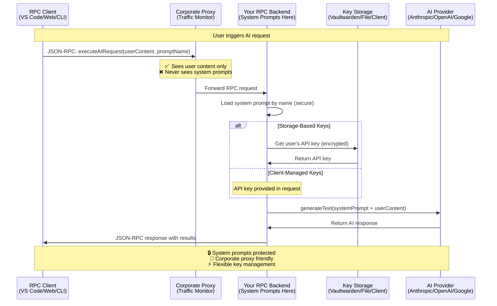
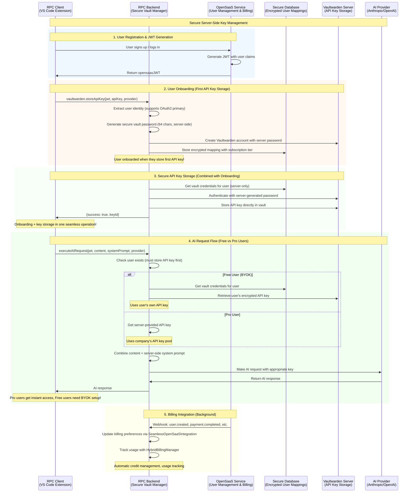

# Simple RPC AI Backend

> **🚀 Platform-agnostic RPC server for AI integration in VS Code extensions, web apps, and CLI tools.**

[](https://opensource.org/licenses/MIT)
[](https://www.typescriptlang.org/)
[](https://github.com/AWolf81/simple-rpc-ai-backend)
[](https://claude.ai/code)

## ⚠️ **Development Status**

**🔬 Alpha Software** - This package is in active development and not yet published to npm.

- ✅ **Core functionality working** - Basic RPC server, AI integration, authentication
- ✅ **Enterprise secret management** - Vaultwarden integration with PostgreSQL
- ✅ **OpenRPC documentation complete** - Full API specification available
- ✅ **Test coverage >80%** - Comprehensive test suite
- ⚠️ **API may change** - Breaking changes possible before v1.0
- 📦 **Not on npm yet** - Install directly from GitHub (see below)

### **Roadmap to v1.0**
- [x] PostgreSQL secret management with user isolation
- [x] Comprehensive audit logging for all secret operations
- [x] JSON-RPC CRUD operations for API key management
- [x] Security testing and user isolation validation
- [x] API token system for external access
- [x] Comprehensive health monitoring
- [ ] Performance optimization and load testing
- [ ] Additional AI provider integrations
- [ ] Production deployment guides
- [ ] Security audit and hardening
- [ ] **npm publication**

## 🔐 **Secret Management Options**

This package offers **flexible storage options** for API keys and system configuration:

### 🐘 **PostgreSQL Secret Manager (Recommended)**

**Simple, secure multi-tenant API key storage with PostgreSQL:**

```bash
# Setup PostgreSQL secret manager
pnpm run postgres:setup

# Start PostgreSQL service
pnpm run postgres:start

# Test user isolation security
pnpm test:postgres
```

**Benefits:**
- 🔒 **AES-256-GCM encryption** for all API keys
- 👥 **True user isolation** - each user has separate database rows
- 📊 **Comprehensive audit logging** of all secret operations
- 🚀 **Simple setup** - just PostgreSQL, no complex dependencies
- 🛡️ **Security-first design** - database-level access controls
- 🏢 **Corporate-friendly** - works behind firewalls and proxies

> **Why PostgreSQL over Infisical?** We chose PostgreSQL for simplicity and reliability. While Infisical offers enterprise features, our PostgreSQL implementation provides the same security guarantees (encryption, user isolation, audit logging) with a much simpler setup. No Docker orchestration complexity, no external services - just a reliable PostgreSQL database.

### 📁 **File Storage (Simple Development)**

**Simple file-based storage for development and small deployments:**

```javascript
const server = createAIServer({
  keyStorage: {
    type: 'file',
    path: './data/keys.json',    // Encrypted local storage
    masterKey: process.env.MASTER_KEY
  }
});
```

**Benefits:**
- 🚀 **Zero setup** - No external dependencies
- 🔒 **AES-256-GCM encryption** for local files  
- 💻 **Perfect for development** and single-user deployments
- 📦 **Portable** - Easy to backup and restore

### 🔑 **Direct Key Passing (Ultimate Flexibility)**

**Pass API keys directly in requests - ideal for VS Code secure storage integration:**

```javascript
// Client can pass API key per request
const result = await client.request('executeAIRequest', {
  content: code,
  systemPrompt: 'security_review',
  apiKey: vsCodeSecretStorage.get('anthropic-key')  // VS Code handles storage
});
```

**Benefits:**
- 🎯 **Zero backend storage** - Client manages keys entirely
- 🔐 **VS Code secure storage** integration
- 🏢 **Corporate policy compliance** - Keys never leave user's machine
- ⚡ **Instant setup** - No key management infrastructure needed

## 🔧 **Storage Configuration Examples**

### Option 1: PostgreSQL Secret Manager (Recommended)

```javascript
// server.js - Production setup with PostgreSQL
import { createAIServer } from 'simple-rpc-ai-backend';
import { PostgreSQLRPCMethods } from 'simple-rpc-ai-backend/auth/PostgreSQLRPCMethods';

const server = createAIServer({
  secretManager: {
    type: 'postgresql',
    host: process.env.SECRET_MANAGER_DB_HOST || 'localhost',
    port: process.env.SECRET_MANAGER_DB_PORT || 5433,
    database: process.env.SECRET_MANAGER_DB_NAME || 'secrets',
    user: process.env.SECRET_MANAGER_DB_USER || 'secret_manager',
    password: process.env.SECRET_MANAGER_DB_PASS,
    encryptionKey: process.env.SECRET_MANAGER_ENCRYPTION_KEY
  },
  systemPrompts: {
    security_review: "You are a senior security engineer...",
    code_quality: "You are a senior architect..."
  }
});

server.start();
```

**Environment setup:**
```bash
# .env.postgres
SECRET_MANAGER_DB_HOST=localhost
SECRET_MANAGER_DB_PORT=5433
SECRET_MANAGER_DB_NAME=secrets
SECRET_MANAGER_DB_USER=secret_manager
SECRET_MANAGER_DB_PASS=your-secure-password
SECRET_MANAGER_ENCRYPTION_KEY=your-32-character-key
```

### Option 2: File Storage (Simple Development)

```javascript
// server.js - Development/small deployment setup  
import { createAIServer } from 'simple-rpc-ai-backend';

const server = createAIServer({
  keyStorage: {
    type: 'file',
    path: './secure/keys.encrypted.json',
    masterKey: process.env.MASTER_KEY || 'dev-key-not-for-production'
  },
  prompts: {
    security_review: "You are a senior security engineer...",
    code_quality: "You are a senior architect..."
  }
});

server.start();
```

### Option 3: Client-Managed Keys (VS Code Integration)

```javascript
// server.js - No backend key storage
import { createAIServer } from 'simple-rpc-ai-backend';

const server = createAIServer({
  keyStorage: {
    type: 'client_managed'  // Keys passed in each request
  },
  prompts: {
    security_review: "You are a senior security engineer...",
    code_quality: "You are a senior architect..."
  }
});

// VS Code extension
import * as vscode from 'vscode';
import { RPCClient } from 'simple-rpc-ai-backend';

const client = new RPCClient('http://localhost:8000');

async function analyzeCode() {
  // Get API key from VS Code's secure storage
  const apiKey = await vscode.workspace.getConfiguration().get('anthropic.apiKey') ||
                 await context.secrets.get('anthropic-api-key');
  
  const result = await client.request('executeAIRequest', {
    content: editor.document.getText(),
    systemPrompt: 'security_review',
    apiKey: apiKey  // Passed directly, never stored on server
  });
}
```

## 📦 **Using in Your Own Package**

### Installation

```bash
# Install from GitHub (current)
npm install git+https://github.com/AWolf81/simple-rpc-ai-backend.git

# Or with pnpm (recommended)
pnpm add git+https://github.com/AWolf81/simple-rpc-ai-backend.git
```

### Option A: Secure Enterprise Setup with Vaultwarden

**1. Add Vaultwarden infrastructure to your project:**

```bash
# Copy infrastructure files to your project
cp node_modules/simple-rpc-ai-backend/docker-compose.vaultwarden.yml ./
cp node_modules/simple-rpc-ai-backend/.env.vaultwarden.example ./
cp -r node_modules/simple-rpc-ai-backend/docker ./

# Setup Vaultwarden
./docker/setup-vaultwarden.sh
```

**2. Create your secure AI backend server:**

```javascript
// your-ai-backend/server.js - Secure Server-Side Implementation
import { createAIServer, SecureVaultManager } from 'simple-rpc-ai-backend';

// Initialize secure vault manager
const vaultManager = new SecureVaultManager({
  bitwardenConfig: loadVaultwardenConfig(),
  databaseMasterKey: process.env.DATABASE_MASTER_KEY, // 64-char hex key
  userBridge: new UserIdentityBridge()
});

const server = createAIServer({
  vaultManager,
  prompts: {
    // Your proprietary system prompts (server-side only!)
    myCustomAnalysis: `
      You are an expert in my domain-specific requirements.
      Analyze the code for: [your specific criteria]  
      Provide recommendations in this format: [your format]
    `,
    security_review: `
      You are a senior security engineer. Review code for vulnerabilities...
    `
  },
  serviceProviders: ['anthropic', 'openai', 'google'],
  port: 8000
});

// Register secure RPC methods (automatic onboarding built-in)
server.addMethod('vaultwarden.storeApiKey', async (params) => {
  // Auto-onboards user if needed - no explicit onboarding call required
  return await vaultManager.storeApiKey(
    params.opensaasJWT, 
    params.apiKey, 
    params.provider
  );
});

server.addMethod('executeAIRequest', async (params) => {
  // Auto-onboards user + retrieves keys automatically
  return await vaultManager.executeAIRequestWithAutoKey(
    params.opensaasJWT,
    params.content,
    params.systemPrompt,
    params.provider
  );
});

server.start();
```

**3. Ultra-simple client integration:**

```javascript
// your-vscode-extension/src/extension.js - Zero Crypto Complexity!
import { RPCClient } from 'simple-rpc-ai-backend';

const client = new RPCClient('http://localhost:8000');

export async function activate(context) {
  // Get OpenSaaS JWT (from your auth system)
  const opensaasJWT = await getOpenSaaSJWT();
  
  // Store API key once - server auto-onboards user transparently!
  await client.request('vaultwarden.storeApiKey', {
    opensaasJWT,
    apiKey: await getApiKeyFromUser(), 
    provider: 'anthropic'
  });

  // Use AI - server handles everything automatically!
  const result = await client.request('executeAIRequest', {
    opensaasJWT,
    content: code,
    systemPrompt: 'myCustomAnalysis',
    provider: 'anthropic'  // Server retrieves key + onboards if needed
  });
  
  // That's it! Zero onboarding calls, zero crypto, zero vault management!
}
```

### Option B: Simple File Storage

```javascript
// your-ai-backend/server.js - No external dependencies
import { createAIServer } from 'simple-rpc-ai-backend';

const server = createAIServer({
  keyStorage: {
    type: 'file',
    path: './secure/api-keys.encrypted.json',
    masterKey: process.env.MASTER_KEY
  },
  prompts: {
    myAnalysis: "Your domain-specific prompt here..."
  }
});

server.start();
```

### Option C: Client-Managed Keys (Perfect for VS Code)

```javascript
// your-ai-backend/server.js - Zero key management
import { createAIServer } from 'simple-rpc-ai-backend';

const server = createAIServer({
  keyStorage: { type: 'client_managed' },
  prompts: {
    myAnalysis: "Your protected system prompt..."
  }
});

// your-vscode-extension/src/extension.js  
import { RPCClient } from 'simple-rpc-ai-backend';

const client = new RPCClient('http://localhost:8000');

async function analyzeWithVSCodeKeys() {
  // VS Code's secure storage handles API keys
  const apiKey = await context.secrets.get('anthropic-api-key');
  
  const result = await client.request('executeAIRequest', {
    content: code,
    systemPrompt: 'myAnalysis',
    apiKey: apiKey  // Never stored on server
  });
}
```

## 🎯 **Which Storage Option Should You Choose?**

| Scenario | Recommended Option | Why |
|----------|-------------------|-----|
| **Enterprise SaaS** | 🐘 PostgreSQL Vault | Multi-user, audit trails, encrypted storage |
| **Team Development** | 📁 File Storage | Simple setup, encrypted, portable |
| **VS Code Extensions** | 🔑 Client-Managed | Integrates with VS Code secure storage |
| **Corporate Deployment** | 🐘 PostgreSQL Vault | Compliance, centralized control |
| **MVP/Prototype** | 🔑 Client-Managed | Zero infrastructure, instant start |
| **Open Source Projects** | 📁 File Storage | No external dependencies |

## 🛡️ **Security Comparison: Old vs New Architecture**

### **❌ Old Client-Side Approach (Security Issues)**
| Component | Master Password | Vault Credentials | API Keys | Attack Surface |
|-----------|----------------|-------------------|----------|----------------|
| **VS Code Extension** | ✅ Generated/stored | ✅ Exposed to client | ✅ Encrypt/decrypt | 🚨 **HIGH** - Client crypto |
| **RPC Server** | ✅ Receives hash | ✅ Knows vault user ID | ❌ Only ciphertext | 🟡 Medium |
| **Vaultwarden** | ✅ Stores hash | ✅ User account | ✅ Encrypted storage | 🟡 Medium |

**Problems:** Master passwords in untrusted environment, complex client crypto, vault IDs exposed

### **✅ New Server-Side Approach (Secure)**  
| Component | Master Password | Vault Credentials | API Keys | Attack Surface |
|-----------|----------------|-------------------|----------|----------------|
| **VS Code Extension** | ❌ Never sees | ❌ Never sees | ✅ Provides once | 🟢 **LOW** - JWT only |
| **RPC Server** | ✅ Generates server-side | ✅ Manages internally | ✅ Retrieves/uses | 🟡 Medium - auditable |
| **Vaultwarden** | ✅ Server account | ✅ Server auth | ✅ Encrypted storage | 🟢 Low |

**Benefits:** Zero client crypto, server-generated passwords, minimal client knowledge

### **🔒 Storage Security Comparison**

| Feature | Old Client-Side | New Server-Side | File Storage | Client-Managed |
|---------|----------------|----------------|--------------|----------------|
| **System Prompt Protection** | ✅ | ✅ | ✅ | ✅ |
| **Master Key Security** | ❌ Client-side | ✅ Server crypto.randomBytes | ✅ AES-256-GCM | ✅ Client handles |
| **Client Complexity** | 🚨 High crypto | ✅ JWT only | 🟡 Medium | 🟡 Medium |
| **Audit Trail** | 🟡 Partial | ✅ Complete server logs | ❌ | ❌ |
| **Multi-user Support** | ✅ Complex | ✅ Simple | ❌ | ✅ Per client |
| **Corporate Compliance** | 🟡 Client risks | ✅ Server-controlled | 🟡 Basic | ✅ Zero storage |
| **Attack Surface** | 🚨 High | 🟢 Low | 🟡 Medium | 🟢 Low |

## 🚀 **5-Minute Quick Start**

### Simple Development Setup (No External Dependencies)

```bash
# 1. Create your project
mkdir my-ai-backend && cd my-ai-backend
npm init -y

# 2. Install package
npm install git+https://github.com/AWolf81/simple-rpc-ai-backend.git

# 3. Create server
cat > server.js << 'EOF'
import { createAIServer } from 'simple-rpc-ai-backend';

const server = createAIServer({
  keyStorage: { type: 'client_managed' },  // No storage needed
  prompts: {
    security_review: "You are a senior security engineer. Review code for vulnerabilities."
  },
  serviceProviders: ['anthropic', 'openai']
});

server.start();
EOF

# 4. Start server
node server.js
# 🚀 Server running on http://localhost:8000
```

### Test with curl (passing API key directly):

```bash
curl -X POST http://localhost:8000/rpc \
  -H "Content-Type: application/json" \
  -d '{
    "jsonrpc": "2.0", 
    "method": "executeAIRequest", 
    "params": {
      "content": "function login(user, pass) { return users[user] === pass; }",
      "systemPrompt": "security_review",
      "apiKey": "your-anthropic-key"
    }, 
    "id": 1
  }'
```

**Your system prompts are protected server-side, but setup takes 2 minutes!**

## 🎯 **Why This Package Exists**

### 🔍 **The Claude Code Wake-Up Call**

After reading [Kir Shatrov's reverse engineering of Claude Code](https://kirshatrov.com/posts/claude-code-internals), we realized how easily proprietary AI system prompts can be extracted from client-side applications:

**What the reverse engineering revealed:**
- **System prompts fully visible** in client code and network traffic
- **Multi-step prompt logic exposed** - security policies, validation rules, proprietary techniques
- **Business logic discoverable** - competitors can see exactly how your AI features work
- **No protection against inspection** - anyone can extract your valuable prompts

**This is a massive business risk for AI-powered applications.**

### 🚨 **The Real Problem with Current AI Extensions**

**Building AI-powered VS Code extensions is unnecessarily complex AND insecure:**

- 🔴 **System prompts exposed** - Extensions store sensitive prompts in client code
- 🔴 **Business logic visible** - Competitors can reverse engineer your AI techniques
- 🔴 **API key management** - Users must configure AI provider credentials  
- 🔴 **Provider coupling** - Extensions tied to specific AI providers
- 🔴 **Corporate restrictions** - Proxies block AI provider APIs
- 🔴 **Complex integration** - Each extension reinvents AI communication

### 🛡️ **Our Solution: Server-Side Prompt Protection with Flexible Storage**

**This package solves these problems with a simple RPC architecture:**

- ✅ **System Prompt Protection** - Keep sensitive prompts on your secure server (never client-side)
- ✅ **Business Logic Security** - Your proprietary AI techniques stay hidden
- ✅ **Corporate Proxy Bypass** - AI requests go through your backend, not blocked
- ✅ **Flexible Key Management** - Vaultwarden, file storage, or client-managed keys
- ✅ **Zero Extension Setup** - Users don't need API keys or configuration (optional)
- ✅ **Multi-Provider Support** - Switch AI providers without extension updates
- ✅ **Simple Integration** - Clean JSON-RPC API for VS Code extensions

**Key Security Principle**: If Claude Code's prompts can be reverse engineered, so can yours. The only safe place for valuable system prompts is on servers you control.

## 🖥️ **Frontend Development Guide**

### **Complete CRUD API for VaultStorage**

The RPC API provides comprehensive CRUD operations for API key management. Here's everything you need to build a frontend:

#### **Authentication Setup**
```typescript
import { RPCClient } from 'simple-rpc-ai-backend';

const client = new RPCClient('http://localhost:8000');

// Get user's JWT from your auth system (OpenSaaS, Auth0, etc.)
const userJWT = await getUserJWT(); // Your auth implementation
```

#### **CREATE - Store API Keys**
```typescript
// Store user's API key for a provider
async function storeApiKey(provider: string, apiKey: string) {
  try {
    const result = await client.request('storeUserKey', {
      jwt: userJWT,
      provider: provider,        // 'anthropic', 'openai', 'google'
      apiKey: apiKey            // User's actual API key
    });
    
    return {
      success: true,
      keyId: result.keyId,
      message: `${provider} API key stored successfully`
    };
  } catch (error) {
    return {
      success: false,
      error: error.message
    };
  }
}

// Usage in frontend
await storeApiKey('anthropic', 'sk-ant-api-key-12345');
await storeApiKey('openai', 'sk-openai-key-67890');
```

#### **READ - Retrieve API Key Status**
```typescript
// Check if user has an API key for a provider
async function hasApiKey(provider: string) {
  try {
    const result = await client.request('getUserKey', {
      jwt: userJWT,
      provider: provider
    });
    
    return {
      hasKey: !!result.apiKey,
      keyPreview: result.apiKey ? `${result.apiKey.slice(0, 8)}...` : null
    };
  } catch (error) {
    return { hasKey: false, error: error.message };
  }
}

// List all providers and their key status
async function listAllProviders() {
  try {
    const result = await client.request('getUserProviders', {
      jwt: userJWT
    });
    
    return {
      success: true,
      providers: result.providers.map(p => ({
        name: p.provider,
        hasKey: p.hasKey,
        displayName: getProviderDisplayName(p.provider)
      }))
    };
  } catch (error) {
    return { success: false, error: error.message };
  }
}

function getProviderDisplayName(provider: string): string {
  const names = {
    'anthropic': 'Anthropic (Claude)',
    'openai': 'OpenAI (GPT)',
    'google': 'Google (Gemini)'
  };
  return names[provider] || provider;
}
```

#### **UPDATE - Rotate API Keys**
```typescript
// Rotate/update an existing API key
async function rotateApiKey(provider: string, newApiKey: string) {
  try {
    const result = await client.request('rotateUserKey', {
      jwt: userJWT,
      provider: provider,
      newApiKey: newApiKey
    });
    
    return {
      success: true,
      keyId: result.keyId,
      message: `${provider} API key updated successfully`
    };
  } catch (error) {
    return {
      success: false,
      error: error.message
    };
  }
}
```

#### **DELETE - Remove API Keys**
```typescript
// Delete user's API key for a provider
async function deleteApiKey(provider: string) {
  try {
    const result = await client.request('deleteUserKey', {
      jwt: userJWT,
      provider: provider
    });
    
    return {
      success: result.deleted,
      message: result.deleted ? 
        `${provider} API key deleted successfully` : 
        `Failed to delete ${provider} API key`
    };
  } catch (error) {
    return {
      success: false,
      error: error.message
    };
  }
}
```

#### **VALIDATE - Test API Keys**
```typescript
// Validate if stored API key works with the provider
async function validateApiKey(provider: string) {
  try {
    const result = await client.request('validateUserKey', {
      jwt: userJWT,
      provider: provider
    });
    
    return {
      isValid: result.isValid,
      message: result.isValid ? 
        `${provider} API key is working` : 
        `${provider} API key is invalid or expired`
    };
  } catch (error) {
    return {
      isValid: false,
      error: error.message
    };
  }
}
```

### **React Component Example**

```tsx
import React, { useState, useEffect } from 'react';

interface ApiKeyManager {
  provider: string;
  hasKey: boolean;
  displayName: string;
}

const ApiKeyManagerComponent: React.FC = () => {
  const [providers, setProviders] = useState<ApiKeyManager[]>([]);
  const [loading, setLoading] = useState(true);
  const [newKey, setNewKey] = useState('');
  const [selectedProvider, setSelectedProvider] = useState('');

  useEffect(() => {
    loadProviders();
  }, []);

  const loadProviders = async () => {
    setLoading(true);
    const result = await listAllProviders();
    if (result.success) {
      setProviders(result.providers);
    }
    setLoading(false);
  };

  const handleStoreKey = async () => {
    if (!selectedProvider || !newKey) return;
    
    const result = await storeApiKey(selectedProvider, newKey);
    if (result.success) {
      setNewKey('');
      setSelectedProvider('');
      await loadProviders(); // Refresh list
      alert(result.message);
    } else {
      alert(`Error: ${result.error}`);
    }
  };

  const handleDeleteKey = async (provider: string) => {
    if (!confirm(`Delete ${provider} API key?`)) return;
    
    const result = await deleteApiKey(provider);
    if (result.success) {
      await loadProviders(); // Refresh list
      alert(result.message);
    } else {
      alert(`Error: ${result.error}`);
    }
  };

  const handleValidateKey = async (provider: string) => {
    const result = await validateApiKey(provider);
    alert(result.isValid ? result.message : `Error: ${result.error}`);
  };

  if (loading) return <div>Loading...</div>;

  return (
    <div className="api-key-manager">
      <h2>API Key Management</h2>
      
      {/* Add new API key */}
      <div className="add-key-section">
        <h3>Add New API Key</h3>
        <select 
          value={selectedProvider} 
          onChange={(e) => setSelectedProvider(e.target.value)}
        >
          <option value="">Select Provider</option>
          <option value="anthropic">Anthropic (Claude)</option>
          <option value="openai">OpenAI (GPT)</option>
          <option value="google">Google (Gemini)</option>
        </select>
        
        <input
          type="password"
          placeholder="Enter API key"
          value={newKey}
          onChange={(e) => setNewKey(e.target.value)}
        />
        
        <button onClick={handleStoreKey}>Store API Key</button>
      </div>

      {/* List existing keys */}
      <div className="keys-list">
        <h3>Your API Keys</h3>
        {providers.map(provider => (
          <div key={provider.name} className="provider-row">
            <span className="provider-name">{provider.displayName}</span>
            <span className={`status ${provider.hasKey ? 'has-key' : 'no-key'}`}>
              {provider.hasKey ? '✅ Configured' : '❌ Not configured'}
            </span>
            
            {provider.hasKey && (
              <div className="key-actions">
                <button onClick={() => handleValidateKey(provider.name)}>
                  Test
                </button>
                <button onClick={() => handleDeleteKey(provider.name)}>
                  Delete
                </button>
              </div>
            )}
          </div>
        ))}
      </div>
    </div>
  );
};

export default ApiKeyManagerComponent;
```

### **Vue.js Component Example**

```vue
<template>
  <div class="api-key-manager">
    <h2>API Key Management</h2>
    
    <!-- Add new API key -->
    <div class="add-key-section">
      <h3>Add New API Key</h3>
      <select v-model="selectedProvider">
        <option value="">Select Provider</option>
        <option value="anthropic">Anthropic (Claude)</option>
        <option value="openai">OpenAI (GPT)</option>
        <option value="google">Google (Gemini)</option>
      </select>
      
      <input
        v-model="newKey"
        type="password"
        placeholder="Enter API key"
      />
      
      <button @click="handleStoreKey" :disabled="!selectedProvider || !newKey">
        Store API Key
      </button>
    </div>

    <!-- List existing keys -->
    <div class="keys-list">
      <h3>Your API Keys</h3>
      <div v-for="provider in providers" :key="provider.name" class="provider-row">
        <span class="provider-name">{{ provider.displayName }}</span>
        <span :class="`status ${provider.hasKey ? 'has-key' : 'no-key'}`">
          {{ provider.hasKey ? '✅ Configured' : '❌ Not configured' }}
        </span>
        
        <div v-if="provider.hasKey" class="key-actions">
          <button @click="handleValidateKey(provider.name)">Test</button>
          <button @click="handleDeleteKey(provider.name)">Delete</button>
        </div>
      </div>
    </div>
  </div>
</template>

<script>
export default {
  name: 'ApiKeyManager',
  data() {
    return {
      providers: [],
      loading: true,
      newKey: '',
      selectedProvider: ''
    };
  },
  
  async created() {
    await this.loadProviders();
  },
  
  methods: {
    async loadProviders() {
      this.loading = true;
      const result = await listAllProviders();
      if (result.success) {
        this.providers = result.providers;
      }
      this.loading = false;
    },
    
    async handleStoreKey() {
      if (!this.selectedProvider || !this.newKey) return;
      
      const result = await storeApiKey(this.selectedProvider, this.newKey);
      if (result.success) {
        this.newKey = '';
        this.selectedProvider = '';
        await this.loadProviders();
        alert(result.message);
      } else {
        alert(`Error: ${result.error}`);
      }
    },
    
    async handleDeleteKey(provider) {
      if (!confirm(`Delete ${provider} API key?`)) return;
      
      const result = await deleteApiKey(provider);
      if (result.success) {
        await this.loadProviders();
        alert(result.message);
      } else {
        alert(`Error: ${result.error}`);
      }
    },
    
    async handleValidateKey(provider) {
      const result = await validateApiKey(provider);
      alert(result.isValid ? result.message : `Error: ${result.error}`);
    }
  }
};
</script>
```

### **Error Handling Patterns**

```typescript
// Comprehensive error handling for all CRUD operations
async function safeApiCall<T>(operation: () => Promise<T>): Promise<{
  success: boolean;
  data?: T;
  error?: string;
}> {
  try {
    const data = await operation();
    return { success: true, data };
  } catch (error) {
    // Handle specific error types
    if (error.message.includes('Unauthorized')) {
      return { success: false, error: 'Please log in again' };
    }
    if (error.message.includes('Invalid API key')) {
      return { success: false, error: 'The API key format is invalid' };
    }
    if (error.message.includes('Provider not supported')) {
      return { success: false, error: 'This AI provider is not supported' };
    }
    
    return { success: false, error: error.message || 'Unknown error' };
  }
}

// Usage
const result = await safeApiCall(() => storeApiKey('anthropic', 'sk-ant-key'));
if (result.success) {
  console.log('Success:', result.data);
} else {
  console.error('Error:', result.error);
}
```

### **Real-time Status Updates**

```typescript
// WebSocket or polling for real-time key status
class ApiKeyStatusMonitor {
  private client: RPCClient;
  private statusCallbacks: Map<string, (status: boolean) => void> = new Map();
  
  constructor(rpcClient: RPCClient) {
    this.client = rpcClient;
    this.startMonitoring();
  }
  
  // Subscribe to provider status changes
  onProviderStatusChange(provider: string, callback: (hasKey: boolean) => void) {
    this.statusCallbacks.set(provider, callback);
  }
  
  private async startMonitoring() {
    // Poll every 30 seconds for status changes
    setInterval(async () => {
      const result = await listAllProviders();
      if (result.success) {
        result.providers.forEach(provider => {
          const callback = this.statusCallbacks.get(provider.name);
          if (callback) {
            callback(provider.hasKey);
          }
        });
      }
    }, 30000);
  }
}

// Usage
const monitor = new ApiKeyStatusMonitor(client);
monitor.onProviderStatusChange('anthropic', (hasKey) => {
  updateUIStatus('anthropic', hasKey);
});
```

## 📋 **API Reference**

### Core RPC Methods

| Method | Description | Parameters | Storage Required |
|--------|-------------|------------|------------------|
| `health` | Server health check | None | None |
| `executeAIRequest` | Execute AI with protected prompts | `content`, `systemPrompt`, `apiKey?` | None |

### Key Management (When Using Storage)

| Method | Description | Parameters | Vaultwarden | File | Client |
|--------|-------------|------------|-------------|------|--------|
| `storeUserKey` | Store encrypted API key | `provider`, `apiKey` | ✅ | ✅ | ❌ |
| `getUserKey` | Check if key exists | `provider` | ✅ | ✅ | ❌ |
| `deleteUserKey` | Delete API key | `provider` | ✅ | ✅ | ❌ |
| `getUserProviders` | List configured providers | None | ✅ | ✅ | ❌ |
| `validateUserKey` | Validate key with provider | `provider` | ✅ | ✅ | ❌ |

### API Token System (Vaultwarden Only)

| Method | Description | Parameters | Pro Feature |
|--------|-------------|------------|-------------|
| `createAPIToken` | Create external access token | `name`, `scopes` | ✅ |
| `listAPITokens` | List user's tokens | None | ✅ |
| `revokeAPIToken` | Revoke access token | `tokenId` | ✅ |

### Authentication (Progressive System)

| Method | Description | Parameters |
|--------|-------------|------------|
| `initializeSession` | Create device session | `deviceId` |
| `getAuthStatus` | Get authentication level | `deviceId` |
| `upgradeToOAuth` | Upgrade to OAuth | `deviceId`, `provider`, `token` |

### Secure Vaultwarden Integration

| Method | Description | Parameters | Security |
|--------|-------------|------------|----------|
| `vaultwarden.storeApiKey` | Store API key (onboards user if needed) | `jwt`, `apiKey`, `provider` | ✅ BYOK - User provides own keys |
| `executeAIRequest` | Execute AI request | `jwt`, `content`, `systemPrompt`, `provider` | ✅ Pro users use server keys, Free users use BYOK |

### **💡 Corrected User Flow**

1. **User Authentication** - Sign up/login with OpenSaaS, Auth0, OAuth2, etc.
2. **API Key Storage** (Free users) - Store their own API key: `storeApiKey(jwt, apiKey, provider)`
3. **AI Requests** - Execute AI requests: `executeAIRequest(jwt, content, prompt, provider)`
   - **Free users**: Uses their stored BYOK API key
   - **Pro users**: Uses server-provided API key automatically

### **🆓 Free vs 💎 Pro Users**

| Feature | Free Users | Pro Users |
|---------|------------|-----------|
| **API Key Management** | 🔑 BYOK (Bring Your Own Key) | ✅ Server-provided keys |
| **Key Storage** | ✅ Encrypted in Vaultwarden | ❌ Not needed |
| **Setup Required** | ✅ Must store API key first | ❌ Works immediately |
| **Usage Limits** | 🔒 Limited by their API key | ✅ Higher limits on server keys |

## 🔐 **Authorization & Payment Features**

### **Progressive Authentication Flow**

The system supports **three authentication levels** with automatic upgrade paths:

```typescript
// 1. Anonymous Access (Limited)
const client = new RPCClient('http://localhost:8000');
const result = await client.request('executeAIRequest', {
  content: 'Hello world',
  systemPrompt: 'basic-assistant' // Limited to public prompts only
});

// 2. JWT-Based Authentication (Standard)
const client = new RPCClient('http://localhost:8000');
const result = await client.request('executeAIRequest', {
  jwt: 'eyJ...opensaas-jwt',     // From OpenSaaS, Auth0, etc.
  content: 'Hello world',
  systemPrompt: 'code-expert'   // Access to user plan features
});

// 3. Progressive Upgrade (Device Sessions)
await client.request('initializeSession', { deviceId: 'vscode-12345' });
await client.request('upgradeToOAuth', { 
  deviceId: 'vscode-12345', 
  provider: 'google',
  token: 'oauth-token' 
});
```

### **Plan-Based Feature Access**

Check user's subscription and usage status for client-side feature gating:

```typescript
// Check user's plan and usage limits
const userStatus = await client.request('getUserUsageStatus', {
  userId: 'user-123',
  userPlan: 'pro' // or 'free', 'enterprise'
});

// Response includes comprehensive payment/usage info
{
  plan: {
    planId: 'pro',
    displayName: 'Pro Plan',
    features: {
      systemPrompts: ['code-expert', 'security-audit', 'custom-prompts'],
      customSystemPrompts: true,
      analyticsAccess: true,
      priorityQueue: true
    },
    rateLimits: {
      requestsPerMinute: 100,
      requestsPerHour: 1000,
      requestsPerDay: 10000
    }
  },
  quotaStatus: {
    'anthropic': {
      used: 15000,
      limit: 100000,
      resetDate: '2024-02-01T00:00:00Z',
      percentUsed: 15
    }
  },
  rateLimitStatus: {
    requestsThisMinute: 5,
    requestsThisHour: 45,
    requestsThisDay: 230,
    limits: { perMinute: 100, perHour: 1000, perDay: 10000 }
  }
}
```

### **Client-Side Feature Gating Examples**

Use payment/plan information to control UI and features:

```typescript
// Feature access control
if (userStatus.plan.features.customSystemPrompts) {
  showCustomPromptEditor();
}

if (userStatus.plan.features.analyticsAccess) {
  showUsageDashboard(userStatus.quotaStatus);
}

// Usage-based UI updates
const anthropicQuota = userStatus.quotaStatus.anthropic;
if (anthropicQuota.percentUsed > 90) {
  showQuotaWarning(`${anthropicQuota.percentUsed}% of monthly quota used`);
}

// Rate limit handling
const canMakeRequest = await client.request('canUserMakeRequest', {
  userId: 'user-123',
  provider: 'anthropic',
  userPlan: 'pro'
});

if (!canMakeRequest.allowed) {
  showRateLimitMessage(canMakeRequest.reason, canMakeRequest.retryAfter);
}
```

### **BYOK vs Server-Provided Keys**

Support multiple key management strategies based on subscription:

```typescript
// Free users: Bring Your Own Key (BYOK)
await client.request('storeUserKey', {
  userId: 'user@company.com',
  provider: 'anthropic',
  apiKey: 'sk-ant-user-provided-key',
  encrypted: true
});

// Pro users: Server-provided keys (automatic)
const result = await client.request('executeAIRequest', {
  jwt: 'eyJ...pro-user-jwt',
  content: 'Analyze this code',
  systemPrompt: 'security-expert' // Uses server's API keys automatically
});

// Check key source and quota remaining
const keyInfo = await client.request('getApiKeyForUser', {
  userId: 'user-123',
  provider: 'anthropic',
  userPlan: 'pro'
});
// Returns: { apiKey: '***', source: 'server_provided', quotaRemaining: 85000 }
```

### **Multi-Tenant Architecture**

Support multiple subscription tiers with flexible configurations:

```typescript
// Enterprise tier with custom limits
{
  planId: 'enterprise',
  keySource: 'server_provided', // Company provides API keys
  allowedProviders: ['anthropic', 'openai', 'google'],
  tokenQuotas: {
    'anthropic': { maxTokensPerPeriod: 1000000, resetInterval: 'monthly' },
    'openai': { maxTokensPerPeriod: 500000, resetInterval: 'monthly' }
  },
  features: {
    systemPrompts: '*', // Access to all prompts
    customSystemPrompts: true,
    analyticsAccess: true,
    priorityQueue: true
  }
}

// Startup tier with mixed approach  
{
  planId: 'startup',
  keySource: 'server_optional', // Server keys available, BYOK allowed
  allowedProviders: ['anthropic'],
  tokenQuotas: {
    'anthropic': { maxTokensPerPeriod: 50000, resetInterval: 'monthly' }
  },
  features: {
    systemPrompts: ['basic-assistant', 'code-helper'],
    customSystemPrompts: false,
    analyticsAccess: false
  }
}
```

### **Available Authorization Methods**

| Method | Description | Returns | Client Usage |
|--------|-------------|---------|--------------|
| `getUserUsageStatus` | Get plan, quotas, rate limits | Full user status | Feature gating, usage displays |
| `canUserMakeRequest` | Check if request is allowed | `{allowed, reason, retryAfter}` | Pre-request validation |
| `getAuthStatus` | Get authentication level | Device auth status | Progressive auth UI |
| `shouldSuggestUpgrade` | Check if upgrade needed | Upgrade recommendations | Subscription prompts |

## 🏗️ **RPC Architecture with System Prompt Protection**



## 🔐 **Detailed Authentication Architecture**

### **Secure Server-Side Architecture (Recommended)**



### **🔒 Secure Server-Side Key Management**

| Component | OpenSaaS JWT | Vault Password | API Keys | System Prompts | Vault User ID |
|-----------|-------------|----------------|----------|----------------|---------------|
| **Client** | ✅ Provides | ❌ Never sees | ✅ Provides once | ❌ Never sees | ❌ Never sees |
| **RPC Backend** | ✅ Validates | ✅ Generates & stores | ✅ Retrieves & uses | ✅ Stores securely | ✅ Manages internally |
| **Database** | ❌ | ✅ Encrypted storage | ❌ | ❌ | ✅ User mappings |
| **Vaultwarden** | ❌ | ✅ Account auth | ✅ Encrypted storage | ❌ | ✅ Internal user |
| **OpenSaaS** | ✅ Issues | ❌ | ❌ | ❌ | ❌ |

**True Zero-Knowledge Architecture**: Client provides JWT from any auth provider. Server handles all crypto securely!

### **🔄 Auth Provider Flexibility**

The RPC backend works with **any JWT-issuing auth provider**:

| Auth Provider | JWT Format | Integration |
|---------------|------------|-------------|
| **OpenSaaS** | `{ userId, email, subscriptionTier }` | ✅ Built-in support |
| **Auth0** | `{ sub, email, custom_claims }` | ✅ Automatic mapping |
| **Firebase** | `{ uid, email, firebase }` | ✅ Automatic mapping |  
| **Custom Backend** | `{ user_id, email, roles }` | ✅ Configurable mapping |
| **Enterprise SSO** | `{ employee_id, email, department }` | ✅ SAML/OIDC support |

**Example with different auth providers:**
```typescript
// OpenSaaS JWT
const openSaasResult = await client.request('executeAIRequest', {
  jwt: 'eyJ...opensaas-jwt',  // { userId: 'user-123', email: 'john@co.com' }
  content, systemPrompt, provider
});

// Auth0 JWT  
const auth0Result = await client.request('executeAIRequest', {
  jwt: 'eyJ...auth0-jwt',     // { sub: 'auth0|user-123', email: 'john@co.com' }
  content, systemPrompt, provider
});

// Same user, same vault, different auth provider!
```

### **👥 Multiple User ID Support**

Users can have multiple IDs across different auth providers:

```typescript
// User starts with email/password
JWT1: { userId: 'user-123', email: 'john@company.com' }
// Creates vault: primaryUserId = 'user-123'

// Later adds Google OAuth
JWT2: { userId: 'user-123', googleId: 'google-98765', email: 'john@company.com' }
// Updates vault: alternateUserIds = ['google-98765']

// Later adds GitHub OAuth  
JWT3: { userId: 'user-123', githubId: 'github-54321', googleId: 'google-98765' }
// Updates vault: alternateUserIds = ['google-98765', 'github-54321']

// Same user, same vault, multiple auth methods!
```

**Benefits:**
- ✅ **Seamless auth provider migration** - Users keep their API keys
- ✅ **Multiple login methods** - Google, GitHub, SSO, email/password
- ✅ **No duplicate accounts** - System recognizes same user across providers
- ✅ **Enterprise flexibility** - Support any corporate auth system

### **🔐 What's Protected Where**

| Component | Sees User Code | Sees System Prompts | Sees API Keys | Your Control |
|-----------|---------------|---------------------|---------------|--------------|
| **VS Code Extension** | ✅ | ❌ | 🟡 (Client-managed only) | ❌ (User's machine) |
| **Corporate Proxy** | ✅ | ❌ | ❌ | ❌ (Company network) |
| **Your RPC Backend** | ✅ | ✅ | 🟡 (Depends on storage) | ✅ (Your server) |
| **Vaultwarden Storage** | ❌ | ❌ | ✅ (Encrypted) | ✅ (Your infrastructure) |
| **AI Provider** | ✅ | ✅ | ✅ | ❌ (External service) |

**Key Insight**: Corporate proxies and extension users never see your valuable system prompts regardless of storage option!

## 📖 **OpenRPC Documentation & Playground**

This package provides a complete **OpenRPC** specification - the JSON-RPC equivalent of OpenAPI for REST APIs.

### 🎮 Interactive Development Playground

```bash
# Install dependencies
pnpm install

# Start development with OpenRPC Inspector (Swagger-like UI)
pnpm run dev:docs
```

**OpenRPC Inspector URL:** http://localhost:3002

**Features:**
- 🎨 **Modern UI** - Clean, professional interface similar to Swagger UI
- 🔍 **Better schema visualization** - Cleaner parameter and response displays
- 🎮 **Interactive testing** - Try API methods directly in the browser
- 📋 **Collapsible sections** - Organized, easy-to-navigate documentation

## 🧪 **Testing**

### Test Coverage Requirements

```bash
# Full test suite with >80% coverage
pnpm test:coverage

# Type checking
pnpm typecheck

# Integration tests
pnpm test:integration
```

### Test Different Storage Options

```bash
# Test file storage
STORAGE_TYPE=file pnpm test

# Test Vaultwarden integration (requires Docker)
pnpm run vaultwarden:start
STORAGE_TYPE=vaultwarden pnpm test

# Test client-managed keys
STORAGE_TYPE=client_managed pnpm test
```

## 🧪 **Testing the Authentication Flow**

### **Testing Strategy: Split into Multiple Phases**

The authentication flow has multiple layers that should be tested independently before testing the complete integration:

### **Phase 1: Test Vaultwarden Directly (Infrastructure)**

Test the Vaultwarden server and Bitwarden SDK integration directly without RPC:

```bash
# 1. Start Vaultwarden infrastructure
pnpm run vaultwarden:start

# 2. Test direct Vaultwarden connection
npx ts-node test-vaultwarden-auth.ts
# Gets access token programmatically
# Tests basic API connectivity
# Validates service account setup

# 3. Test Vaultwarden secret operations
npx ts-node test-vaultwarden-direct.ts
# Tests secret CRUD operations
# Validates organization permissions
# Tests user API key workflow
```

**What Phase 1 Tests:**
- ✅ Vaultwarden server connectivity
- ✅ Service account authentication
- ✅ Organization permissions
- ✅ Secret storage/retrieval operations
- ✅ Bitwarden SDK integration

### **Phase 2: Test RPC Methods (Business Logic)**

Test the RPC methods that implement the auth flow:

```bash
# Test Vaultwarden RPC integration
npx ts-node test-vaultwarden-session.ts
# Tests VaultwardenRPCMethods
# Tests JWT validation
# Tests auto-provisioning flow
```

**What Phase 2 Tests:**
- ✅ `vaultwarden.storeApiKey` - JWT validation + auto-onboarding + key encryption
- ✅ `executeAIRequest` - Auto-onboarding + key retrieval + AI execution

### **Phase 3: Test Complete End-to-End Flow**

Test the complete auth flow with mock OpenSaaS JWT tokens:

```bash
# Test complete auth flow
pnpm test:auth-flow
# Or run manually:
npx ts-node test/integration/complete-auth-flow.test.ts
```

**Secure E2E Test Flow (Auto-Onboarding):**
```typescript
// 1. Mock OpenSaaS JWT generation
const mockJWT = generateMockOpenSaaSJWT({
  userId: 'test-user-123',
  email: 'testuser@company.com',
  subscriptionTier: 'pro'
});

// 2. Test API key storage with automatic onboarding
const storeResult = await rpcClient.request('vaultwarden.storeApiKey', {
  opensaasJWT: mockJWT,
  apiKey: 'sk-ant-test-key-12345',  // Server auto-onboards user if needed
  provider: 'anthropic'
});
// Result: { success: true, keyId: 'vault-item-id' }
// User was onboarded transparently during this call!

// 3. Test AI request - works even for brand new users
const aiResult = await rpcClient.request('executeAIRequest', {
  opensaasJWT: mockJWT,
  content: 'function test() { return "hello"; }',
  systemPrompt: 'code_review', 
  provider: 'anthropic'  // Auto-onboards + retrieves key + executes AI
});
// Result: AI analysis response

// That's it! Zero onboarding calls needed - server handles everything automatically!
```

### **Testing REST API Directly (Without RPC)**

For debugging, you can test Vaultwarden's REST API directly:

```bash
# 1. Get access token
curl -X POST http://localhost:8081/identity/connect/token \
  -H "Content-Type: application/x-www-form-urlencoded" \
  -d "grant_type=password&username=service@simple-rpc-ai.local&password=YOUR_PASSWORD&scope=api offline_access&client_id=web"

# 2. Test API with token
curl -X GET http://localhost:8081/api/sync \
  -H "Authorization: Bearer YOUR_ACCESS_TOKEN" \
  -H "Content-Type: application/json"

# 3. Create a secret
curl -X POST http://localhost:8081/api/organizations/ORG_ID/secrets \
  -H "Authorization: Bearer YOUR_ACCESS_TOKEN" \
  -H "Content-Type: application/json" \
  -d '{"key":"test-api-key","value":"sk-ant-test-123","note":"Test API key"}'

# 4. List secrets
curl -X GET http://localhost:8081/api/organizations/ORG_ID/secrets \
  -H "Authorization: Bearer YOUR_ACCESS_TOKEN"
```

### **Test Configuration Files**

Create these environment files for testing:

**`.env.vaultwarden.test`:**
```bash
VW_DOMAIN=http://localhost:8081
VW_SERVICE_EMAIL=service@simple-rpc-ai.local
VW_SERVICE_PASSWORD=secure-service-password-123
VW_SERVICE_CLIENT_ID=web
VW_ADMIN_TOKEN=your-admin-token
SIMPLE_RPC_ORG_ID=your-org-uuid

# For testing with tokens
VW_ACCESS_TOKEN=your-access-token
VW_REFRESH_TOKEN=your-refresh-token
```

### **Recommended Test Sequence**

```bash
# 1. Infrastructure setup
pnpm run vaultwarden:setup
pnpm run vaultwarden:start
pnpm run vaultwarden:logs  # Check for errors

# 2. Phase 1: Direct Vaultwarden testing
npx ts-node test-vaultwarden-auth.ts     # Get access token
npx ts-node test-vaultwarden-direct.ts   # Test secret operations

# 3. Phase 2: RPC methods testing  
npx ts-node test-vaultwarden-session.ts  # Test RPC integration

# 4. Phase 3: End-to-end testing
pnpm test:auth-flow                       # Complete auth flow

# 5. Integration testing
pnpm test:integration                     # Full integration suite
```

### **Common Testing Issues & Solutions**

| Issue | Solution |
|-------|----------|
| **Connection refused** | Check `pnpm run vaultwarden:logs`, ensure PostgreSQL is running |
| **Authentication failed** | Verify service account exists, check password in `.env.vaultwarden` |
| **Organization not found** | Create organization in admin panel, set `SIMPLE_RPC_ORG_ID` |
| **Token expired** | Re-run `test-vaultwarden-auth.ts` to get fresh token |
| **Permission denied** | Ensure service account has organization access |

### **What Each Test Validates**

| Test File | Purpose | Validates |
|-----------|---------|-----------|
| `test-vaultwarden-auth.ts` | Get access tokens | Service account, basic auth |
| `test-vaultwarden-direct.ts` | Direct Vaultwarden operations | Secret CRUD, organization permissions |
| `test-secure-vault-manager.ts` | Secure RPC integration | Server-side crypto, JWT validation |
| Complete E2E test | Simplified full flow | OpenSaaS→Server→Vaultwarden→AI integration |

### **Simplified Testing Benefits**

✅ **No client-side crypto testing** - All encryption handled server-side  
✅ **No master password management** - Server generates vault passwords  
✅ **No token lifecycle testing** - Simplified JWT-only authentication  
✅ **Focus on business logic** - Test AI request flow, not crypto implementation

This layered testing approach helps isolate issues quickly and ensures each component works before testing the complete integration.

## 🤝 **Contributing**

We welcome contributions that maintain the **simple, flexible** philosophy:

### 🎯 **Contribution Guidelines**
- **Simplicity first** - Reject complexity that doesn't solve real problems
- **Storage flexibility** - Support multiple key management approaches
- **Standard tech** - HTTP, JSON-RPC, Express, Vaultwarden
- **Clear docs** - Honest about what we protect vs. don't protect
- **Minimal deps** - Keep the package lightweight and secure

### 🔧 **Development Setup**
```bash
git clone https://github.com/your-org/simple-rpc-ai-backend
cd simple-rpc-ai-backend
pnpm install

# Test all storage options
pnpm test:coverage

# Start development environment
pnpm run dev:docs  # OpenRPC Inspector at localhost:3002

# Test Vaultwarden integration
pnpm run vaultwarden:setup
pnpm run vaultwarden:start

# Backup and restore
pnpm run vaultwarden:backup
pnpm run vaultwarden:restore
```

## 📄 **License** 

MIT - Permissive licensing for easy adoption in commercial and open source projects.

---

## 💡 **Key Takeaways**

**The value isn't in complex custom implementations** - it's in solving real security and deployment problems:

**Real value comes from:**
- 🔒 **System prompt protection** (works with any storage option)
- 🏢 **Corporate proxy bypass** through backend architecture
- ⚡ **Flexible deployment** - Vaultwarden, file storage, or client-managed
- 📦 **Standard protocols** (JSON-RPC 2.0, HTTPS)
- 🎯 **Simple integration** for VS Code extensions

**This package focuses on practical solutions** that solve real problems for real developers, with the storage flexibility you need for any deployment scenario.

## 🔮 **Future: Model Context Protocol (MCP) Integration**

### **What is MCP?**
The Model Context Protocol (MCP) is a 2024 standard adopted by OpenAI, Google DeepMind, and Anthropic for AI tool integration. It's built on JSON-RPC 2.0 (same as our package).

### **Could We Support Both?**
**YES** - Our architecture could easily support both protocols:

```typescript
// Hybrid server supporting both protocols
app.post('/rpc', async (req, res) => {
  if (req.body.method.startsWith('tools/')) {
    return handleMCPRequest(req, res);    // MCP tool protocol
  }
  return handleAIRequest(req, res);       // Our AI backend protocol
});
```

**Current Status**: Our JSON-RPC 2.0 foundation makes future MCP integration straightforward if needed. Our focus remains on system prompt protection and flexible key management.