# Simple RPC AI Backend

> **🚀 Platform-agnostic RPC server for AI integration in VS Code extensions, web apps, and CLI tools.**

[](https://www.npmjs.com/package/simple-rpc-ai-backend)
[](https://opensource.org/licenses/MIT)
[](https://www.typescriptlang.org/)

## 🎯 **Why This Package Exists**

### 🔍 **The Claude Code Wake-Up Call**

After reading [Kir Shatrov's reverse engineering of Claude Code](https://kirshatrov.com/posts/claude-code-internals), we realized how easily proprietary AI system prompts can be extracted from client-side applications:

**What the reverse engineering revealed:**
- **System prompts fully visible** in client code and network traffic
- **Multi-step prompt logic exposed** - security policies, validation rules, proprietary techniques
- **Business logic discoverable** - competitors can see exactly how your AI features work
- **No protection against inspection** - anyone can extract your valuable prompts

**This is a massive business risk for AI-powered applications.**

### 🚨 **The Real Problem with Current AI Extensions**

**Building AI-powered VS Code extensions is unnecessarily complex AND insecure:**

- 🔴 **System prompts exposed** - Extensions store sensitive prompts in client code
- 🔴 **Business logic visible** - Competitors can reverse engineer your AI techniques
- 🔴 **API key management** - Users must configure AI provider credentials  
- 🔴 **Provider coupling** - Extensions tied to specific AI providers
- 🔴 **Corporate restrictions** - Proxies block AI provider APIs
- 🔴 **Complex integration** - Each extension reinvents AI communication

### 🛡️ **Our Solution: Server-Side Prompt Protection**

**This package solves these problems with a simple RPC architecture:**

- ✅ **System Prompt Protection** - Keep sensitive prompts on your secure server (never client-side)
- ✅ **Business Logic Security** - Your proprietary AI techniques stay hidden
- ✅ **Corporate Proxy Bypass** - AI requests go through your backend, not blocked
- ✅ **Zero Extension Setup** - Users don't need API keys or configuration
- ✅ **Multi-Provider Support** - Switch AI providers without extension updates
- ✅ **Simple Integration** - Clean JSON-RPC API for VS Code extensions

**Key Security Principle**: If Claude Code's prompts can be reverse engineered, so can yours. The only safe place for valuable system prompts is on servers you control.

## 🏠 **Local Development & Non-Corporate Benefits**

**"Why not send requests directly to AI providers?"** - Great question! Even without corporate proxy concerns, this architecture provides significant value:

### 🎯 **Core Benefits (Always Available)**

**🔄 Centralized System Prompt Management**
```javascript
// ❌ Without RPC: Prompts scattered across extensions
const prompt1 = "You are a security expert..."; // In extension A
const prompt2 = "Analyze code for bugs...";     // In extension B
const prompt3 = "Review architecture...";       // In extension C

// ✅ With RPC: Centralized, versioned, updatable
server.prompts = {
  security: "You are a senior security engineer...",
  quality: "You are a senior architect...",
  performance: "You are a performance expert..."
};
// Update prompts without touching any extensions!
```

**🤖 Multi-Provider AI Integration**
```javascript
// ❌ Without RPC: Each extension hardcoded to one provider
import { OpenAI } from 'openai';  // Stuck with OpenAI

// ✅ With RPC: Provider flexibility built-in
const providers = ['anthropic', 'openai', 'google'];
// Switch models/providers instantly via server config
```

**⚡ Platform-Agnostic Client**
```javascript
// ✅ Same client works everywhere
import { RPCClient } from 'simple-rpc-ai-backend';

// Works in VS Code extensions
const vscodeClient = new RPCClient('http://localhost:8000');

// Works in web applications  
const webClient = new RPCClient('https://your-domain.com');

// Works in CLI tools
const cliClient = new RPCClient(process.env.AI_BACKEND_URL);
```

**🛡️ Progressive Authentication System**
```javascript
// ✅ Built-in API key management
await client.storeUserKey('anthropic', userApiKey);
await client.validateUserKey('anthropic');
// No need to implement crypto/validation yourself
```

**📊 Unified Monitoring & Rate Limiting**
```javascript
// ✅ Server-side controls for all AI usage
const server = createAIServer({
  rateLimit: { windowMs: 900000, max: 100 },    // 100 requests/15min
  monitoring: { logRequests: true, trackUsage: true }
});
// Monitor costs, usage patterns, performance across all clients
```

### 🚀 **Development Benefits**

**Local Development** (`localhost:8000`)
- Test AI integrations without API keys in extensions
- Rapid prompt iteration without extension rebuilds
- Consistent development environment across team
- Easy debugging with centralized logs

**Production Deployment** (any environment)
- Single point of AI provider configuration
- Centralized cost monitoring and control
- Easy model upgrades (GPT-4 → GPT-4-turbo)
- Standardized error handling across applications

### 🔍 **"But I Could Just Call OpenAI Directly..."**

**Sure, but then you're rebuilding all this infrastructure:**

| Feature | Direct API Calls | This Package |
|---------|------------------|--------------|
| **Multi-provider support** | ❌ Manual per provider | ✅ Built-in |
| **Prompt management** | ❌ Scattered in code | ✅ Centralized |
| **Rate limiting** | ❌ DIY implementation | ✅ Built-in |
| **Error handling** | ❌ Per-provider logic | ✅ Standardized |
| **Cost monitoring** | ❌ Manual tracking | ✅ Automatic |
| **Platform compatibility** | ❌ Reimplement per platform | ✅ Single client |
| **Authentication** | ❌ Custom key management | ✅ Progressive auth |
| **Development setup** | ❌ API keys everywhere | ✅ Zero config |

**Real Example**: Want to switch from OpenAI to Anthropic?
- **Direct calls**: Update every extension, redeploy, handle different APIs
- **This package**: Change one server config line, done

### 💡 **Perfect for Local Development**

```bash
# Start backend locally
pnpm dev
# 🚀 Server running on http://localhost:8000

# All your extensions/apps connect to localhost
# No corporate concerns, just clean architecture!
```

## ⚖️ **Honest Assessment: Drawbacks & Limitations**

**We believe in transparency. Here are the real drawbacks of using this package:**

### 🐌 **Potential Latency Increase**

**The Reality**: Adding a JSON-RPC hop introduces network latency.

```bash
# Direct API call flow
Extension → AI Provider (1 network hop)

# RPC architecture flow  
Extension → Your Backend → AI Provider (2 network hops)
```

**Estimated Impact**: 
- **Local development**: +5-50ms (localhost RPC call)
- **Production deployment**: +10-200ms (depending on server location)
- **AI inference time**: 2000-30000ms (actual AI processing)

**Bottom Line**: RPC latency is typically **<1% of total request time** since AI inference dominates. The security and architectural benefits usually outweigh the minimal latency cost.

**When this matters**: Real-time applications where every 50ms counts. For typical code analysis, documentation generation, or similar tasks, the latency is negligible.

### 📚 **Learning Curve & Setup Complexity**

**The Reality**: You need to understand and deploy an additional backend service.

**Direct API Integration**:
```javascript
// Simple but insecure
import { OpenAI } from 'openai';
const result = await openai.chat.completions.create({...});
```

**This Package**:
```javascript
// More setup, but secure and flexible
import { createAIServer } from 'simple-rpc-ai-backend';
import { RPCClient } from 'simple-rpc-ai-backend';

// 1. Deploy backend server (your infrastructure)
const server = createAIServer({...});

// 2. Configure client in extensions  
const client = new RPCClient('https://your-backend.com');
```

**Additional Operational Complexity**:
- Backend deployment and monitoring
- Server security and updates
- Load balancing for multiple clients
- Debugging across network boundaries

### 🤔 **When NOT to Use This Package**

**Skip this package if:**
- **Prototype/demo projects** - Direct API calls are faster to implement
- **No sensitive prompts** - If your prompts have no business value to protect
- **Single-developer projects** - Where prompt centralization isn't needed
- **Extreme latency requirements** - Where every millisecond matters
- **No server infrastructure** - If you can't deploy/maintain a backend

### 💡 **When the Benefits Outweigh the Costs**

**Use this package when:**
- **Valuable system prompts** - Your AI logic has competitive value
- **Multiple applications** - Extensions, web apps, CLI tools sharing AI
- **Corporate deployment** - Need proxy bypass and centralized control
- **Team development** - Multiple developers working on AI features
- **Production systems** - Where security and maintainability matter

**Real-world perspective**: The 50ms RPC latency becomes irrelevant when users wait 10+ seconds for AI responses. The security and architectural benefits usually justify the minimal overhead.

## 🏗️ **RPC Architecture with System Prompt Protection**

```mermaid
sequenceDiagram
    participant VSCode as VS Code Extension<br/>(RPC Client)
    participant Proxy as Corporate Proxy<br/>(Traffic Monitor)
    participant Backend as Your RPC Backend<br/>(System Prompts Here)
    participant AI as AI Provider<br/>(Anthropic/OpenAI/Google)
    
    Note over VSCode,AI: User triggers code analysis in VS Code
    
    VSCode->>VSCode: Get user's code from active editor
    VSCode->>Proxy: JSON-RPC call: analyzeCode(code, fileName)
    
    Note over Proxy: ✅ Corporate proxy sees user code only<br/>❌ Never sees your proprietary system prompts
    
    Proxy->>Backend: Forward RPC request (user code only)
    Backend->>Backend: Load system prompts from secure server storage
    Backend->>Backend: Combine user code + system prompts
    
    Note over Backend,AI: Vercel AI SDK handles multi-provider calls
    Backend->>AI: generateText(systemPrompt + userCode)
    
    AI->>AI: Process with your proprietary analysis logic
    AI->>Backend: Return analysis results
    
    Backend->>Backend: Filter/format results for VS Code
    Backend->>VSCode: JSON-RPC response with analysis
    
    VSCode->>VSCode: Display results in webview panel
    
    Note over VSCode,AI: 🔒 System prompts never left your server<br/>🚀 User got AI-powered analysis<br/>⚡ Zero extension configuration needed
```



### **🔐 What's Protected Where**

| Component | Sees User Code | Sees System Prompts | Your Control |
|-----------|---------------|---------------------|--------------|
| **VS Code Extension** | ✅ | ❌ | ❌ (User's machine) |
| **Corporate Proxy** | ✅ | ❌ | ❌ (Company network) |
| **Your RPC Backend** | ✅ | ✅ | ✅ (Your server) |
| **AI Provider** | ✅ | ✅ | ❌ (External service) |

**Key Insight**: Corporate proxies and extension users never see your valuable system prompts!

## 📦 **What You Get**

### 🎯 **For Client Developers**
```typescript
import { RPCClient } from 'simple-rpc-ai-backend';

// Platform-agnostic JSON-RPC client  
const client = new RPCClient('http://localhost:8000');
const result = await client.request('executeAIRequest', {
  content: code,
  systemPrompt: 'Analyze this code for security issues'
});
```

### 🖥️ **For Backend Developers**  
```typescript
import { createAIServer } from 'simple-rpc-ai-backend';

// Flexible AI server with multiple providers
const server = createAIServer({
  serviceProviders: ['anthropic', 'openai', 'google'],
  requirePayment: { enabled: false } // For prototyping
});
```

### 🤖 **Built-in AI Provider Support**
- **Anthropic** (Claude models)
- **OpenAI** (GPT models)  
- **Google** (Gemini models)
- **Extensible** - Easy to add more providers via Vercel AI SDK

## 🚀 **5-Minute Quick Start**

### Step 1: Install Package
```bash
npm install simple-rpc-ai-backend
```

### Step 2: Create Your Backend Server
```javascript
// server.js - Your secure AI backend
import { createAIServer } from 'simple-rpc-ai-backend';

const server = createAIServer({
  // 🔒 Your proprietary system prompts (stay server-side!)
  prompts: {
    security_review: `
      You are a senior security engineer. Analyze code for:
      - SQL injection vulnerabilities
      - XSS issues  
      - Authentication flaws
      - Input validation problems
      Provide specific, actionable recommendations.
    `,
    code_quality: `
      You are a senior architect. Review code for:
      - SOLID principles adherence
      - Design patterns usage
      - Performance considerations
      - Maintainability issues
      Focus on specific improvements with examples.
    `
  },
  
  // 🤖 AI provider configuration
  serviceProviders: [
    {
      provider: 'anthropic',
      model: 'claude-3-5-sonnet-20241022'
      // Uses ANTHROPIC_API_KEY env var
    },
    'openai',  // Fallback provider
    'google'   // Final fallback
  ],
  
  requirePayment: { enabled: false }, // Free for prototyping
  
  port: 8000
});

server.start(); // 🚀 Your RPC AI backend is ready!
```

### Step 3: Use in Your VS Code Extension
```javascript
// extension.js - Clean, simple VS Code integration
import * as vscode from 'vscode';
import { RPCClient } from 'simple-rpc-ai-backend';

const client = new RPCClient('http://localhost:8000');

export function activate(context) {
  // Register security review command
  const securityCommand = vscode.commands.registerCommand('extension.securityReview', async () => {
    const editor = vscode.window.activeTextEditor;
    if (!editor) return;
    
    const code = editor.document.getText();
    const fileName = editor.document.fileName;
    
    try {
      // 📡 One RPC call gets AI analysis with your prompts
      const result = await client.request('executeAIRequest', {
        content: code,
        systemPrompt: 'You are a security expert. Analyze this code for vulnerabilities.',
        metadata: { fileName, type: 'security_review' }
      });
      
      // 📊 Show results in VS Code webview
      showAnalysisResults(response, 'Security Review', fileName);
      
    } catch (error) {
      vscode.window.showErrorMessage(`Analysis failed: ${error.message}`);
    }
  });

  context.subscriptions.push(securityCommand);
}

function showAnalysisResults(result, title, fileName) {
  const panel = vscode.window.createWebviewPanel('analysis', title, vscode.ViewColumn.Beside);
  panel.webview.html = `
    <html>
      <body>
        <h1>${title} - ${fileName}</h1>
        <div>Processing Time: ${result.metadata.processingTime}ms</div>
        <div>Model: ${result.metadata.model}</div>
        <div>Tokens: ${result.metadata.tokenUsage.totalTokens}</div>
        <hr>
        <pre>${result.response}</pre>
      </body>
    </html>
  `;
}
```

### Step 4: Set Environment Variables
```bash
# .env file for your backend server
ANTHROPIC_API_KEY=your_api_key_here
# or OPENAI_API_KEY=your_key_here
# or GOOGLE_GENERATIVE_AI_API_KEY=your_key_here
```

### Step 5: Run Everything
```bash
# Terminal 1: Start your backend
node server.js
# 🚀 Simple RPC AI Backend Server
# 🌐 Server running on port 8000
# 🤖 AI Provider: anthropic (claude-3-5-sonnet-20241022)

# Terminal 2: Test your VS Code extension
# Open VS Code, trigger your command
# ✅ AI analysis with protected system prompts!
```

## 🛡️ **Security Properties**

### ✅ **What This Architecture Protects**
- **🔒 System Prompt Secrecy** - Your valuable prompts never leave your server
- **🏢 Corporate Proxy Bypass** - Extensions work behind firewalls/proxies
- **👨‍💻 Developer Isolation** - Extension developers can't steal your prompts
- **🔄 Centralized Control** - Update prompts without extension updates
- **⚡ Zero Client Setup** - Users don't configure API keys

### 🔍 **Honest Security Assessment**

| Component | User Code Visible | System Prompts Visible | Risk Level |
|-----------|-------------------|------------------------|------------|
| **VS Code Extension** | ✅ | ❌ | 🟢 Low (no sensitive data) |
| **Corporate Proxy** | ✅ | ❌ | 🟢 Low (can't see your IP) |
| **Your RPC Backend** | ✅ | ✅ | 🟢 Low (you control this) |
| **AI Provider** | ✅ | ✅ | 🟡 Medium (external service) |

**Key Protection**: Corporate networks and extension users never see your proprietary system prompts.

**Accepted Trade-off**: AI providers see system prompts (unavoidable - they need them to process).

## 📋 **API Reference**

### RPCClient
```typescript
import { RPCClient } from 'simple-rpc-ai-backend/client';

class RPCClient {
  constructor(baseUrl: string, options?: {
    timeout?: number;     // Request timeout (default: 60000ms)
  })
  
  // 🎯 Main method - make JSON-RPC 2.0 requests
  async request(method: string, params?: any): Promise<any>
  
  // 🔔 Send notifications (no response expected)
  async notify(method: string, params?: any): Promise<void>
  
  // ⚙️ Get client configuration
  getConfig(): ClientConfig
}
```

### createAIServer
```typescript
import { createAIServer } from 'simple-rpc-ai-backend/server';

function createAIServer(config: {
  // 🔒 Your proprietary system prompts
  prompts: {
    [analysisType: string]: string;
  };
  
  // 🤖 AI provider configuration (Vercel AI SDK)
  ai: {
    provider: 'anthropic' | 'openai' | 'google';
    apiKey?: string;      // Or use environment variables
    model?: string;       // Provider-specific model name
    maxTokens?: number;   // Token limit (default: 4000)
    temperature?: number; // Creativity 0-1 (default: 0.3)
  };
  
  // 🌐 Server configuration
  port?: number;          // Server port (default: 8000)
  
  // 🛡️ Security options
  cors?: {
    origin?: string | string[];  // Allowed origins
    credentials?: boolean;       // CORS credentials
  };
  
  rateLimit?: {
    windowMs?: number;    // Rate limit window (default: 15min)
    max?: number;         // Max requests per window (default: 100)
  };
  
  auth?: {
    enabled?: boolean;    // Enable bearer auth
    bearer?: string;      // Bearer token
  };
}) => {
  app: Express;           // Express app instance
  start: () => void;      // Start the server
  stop: () => void;       // Graceful shutdown
}
```

### AI Service (Advanced Usage)
```typescript
import { AIService } from 'simple-rpc-ai-backend/ai';

// Direct AI service usage (if you want custom logic)
const ai = new AIService({
  provider: 'anthropic',
  apiKey: process.env.ANTHROPIC_API_KEY,
  model: 'claude-3-5-sonnet-20241022'
});

const result = await ai.analyze({
  userCode: code,
  systemPrompt: myPrompt,
  fileName: 'example.js'
});
```

## 🔄 **Migrating from Custom RPC Implementations**

If you're currently using custom JSON-RPC implementations:

### ❌ **Complex Custom Implementation**
```javascript
// OLD - Custom, maintenance-heavy approach
class CustomRPCClient {
  async makeRequest(method, params) {
    // Custom retry logic, error handling, transport...
    // Hundreds of lines of maintenance burden
  }
  
  async analyzeCode(type, code) {
    // App-specific methods mixed with transport
  }
}
```

### ✅ **Use Professional Library**  
```javascript
// NEW - Clean, standard approach
const client = new RPCClient('http://localhost:8000');
const result = await client.request('executeAIRequest', {
  content: code,
  systemPrompt: 'Analyze this code for security issues'
});
```

**Migration benefits:**
- 🗡️ **90% less code** - Remove custom RPC complexity
- ⚡ **Better reliability** - Use proven `json-rpc-2.0` library
- 🐛 **Easier debugging** - Standard JSON-RPC 2.0 protocol
- 🛡️ **Better security** - System prompts still protected server-side

## 🌟 **Why Open Source This?**

### 🎯 **Real Value for VS Code Extension Developers**

**Current Reality**: Every AI-powered VS Code extension reinvents the wheel:
- Extension developers store system prompts in client code (insecure)
- Users must configure API keys (friction)
- Extensions hardcode to specific AI providers (inflexible)
- Corporate proxies block AI APIs (unusable at work)

**This Package Solves Real Problems**:
- ✅ **Secure by default** - System prompts stay server-side
- ✅ **Zero user setup** - No API key configuration needed
- ✅ **Multi-provider support** - Switch AI providers without extension updates
- ✅ **Corporate-friendly** - Works behind firewalls via your backend

### 🚀 **Community Benefits**

**For Extension Developers**:
- Focus on UX instead of AI integration complexity
- Ship extensions that work in corporate environments
- Protect your proprietary analysis logic

**For Enterprise Users**:
- Extensions that respect corporate security policies
- No need to configure individual AI API keys
- Centralized control over AI usage and costs

**For the Ecosystem**:
- Standard pattern for AI-powered VS Code extensions
- Reusable, tested infrastructure
- Focus innovation on features, not plumbing

## 🧪 **Testing with curl Examples**

### Basic Server (Port 8000)

Start the basic server:
```bash
node examples/servers/basic-server.js
```

Test with these curl commands:

```bash
# Health check
curl -X POST http://localhost:8000/rpc \
  -H "Content-Type: application/json" \
  -d '{"jsonrpc": "2.0", "method": "health", "id": 1}'

# Execute AI request with system prompt
curl -X POST http://localhost:8000/rpc \
  -H "Content-Type: application/json" \
  -d '{"jsonrpc": "2.0", "method": "executeAIRequest", "params": {"content": "function add(a, b) { return a + b; }", "systemPrompt": "security_review"}, "id": 1}'

# Code quality review
curl -X POST http://localhost:8000/rpc \
  -H "Content-Type: application/json" \
  -d '{"jsonrpc": "2.0", "method": "executeAIRequest", "params": {"content": "const users = data.filter(u => u.active);", "systemPrompt": "code_quality"}, "id": 2}'

# Architecture review
curl -X POST http://localhost:8000/rpc \
  -H "Content-Type: application/json" \
  -d '{"jsonrpc": "2.0", "method": "executeAIRequest", "params": {"content": "class UserService { constructor(db) { this.db = db; } async getUser(id) { return this.db.findById(id); } }", "systemPrompt": "architecture_review"}, "id": 3}'
```

### Custom Functions Server

Start the custom functions server:
```bash
node examples/servers/custom-functions-example.js
```

Test built-in and custom functions:

```bash
# List all available functions
curl -X POST http://localhost:8000/rpc \
  -H "Content-Type: application/json" \
  -d '{"jsonrpc": "2.0", "method": "listCustomFunctions", "params": {}, "id": 1}'

# Built-in: Analyze code
curl -X POST http://localhost:8000/rpc \
  -H "Content-Type: application/json" \
  -d '{"jsonrpc": "2.0", "method": "analyzeCode", "params": {"content": "function fibonacci(n) { if (n <= 1) return n; return fibonacci(n-1) + fibonacci(n-2); }", "language": "javascript"}, "id": 2}'

# Built-in: Generate tests
curl -X POST http://localhost:8000/rpc \
  -H "Content-Type: application/json" \
  -d '{"jsonrpc": "2.0", "method": "generateTests", "params": {"content": "export function multiply(a, b) { return a * b; }", "framework": "vitest"}, "id": 3}'

# Custom: Explain code for beginners
curl -X POST http://localhost:8000/rpc \
  -H "Content-Type: application/json" \
  -d '{"jsonrpc": "2.0", "method": "explainCode", "params": {"content": "const users = await fetch('/api/users').then(r => r.json());", "level": "beginner"}, "id": 4}'

# Custom: Generate commit message
curl -X POST http://localhost:8000/rpc \
  -H "Content-Type: application/json" \
  -d '{"jsonrpc": "2.0", "method": "generateCommitMessage", "params": {"content": "+ function add(a, b) { return a + b; }\n+ export { add };", "format": "conventional"}, "id": 5}'

# Built-in: Security review
curl -X POST http://localhost:8000/rpc \
  -H "Content-Type: application/json" \
  -d '{"jsonrpc": "2.0", "method": "securityReview", "params": {"content": "app.get('/user/:id', (req, res) => { const query = 'SELECT * FROM users WHERE id = ' + req.params.id; db.query(query, (err, result) => res.json(result)); });"}, "id": 6}'
```

## 📋 **Available JSON-RPC Methods**

### Core Methods
| Method | Description | Parameters |
|--------|-------------|------------|
| `health` | Check server health and status | None |
| `executeAIRequest` | Execute AI request with system prompt | `content`, `systemPrompt` |

### Authentication Methods
| Method | Description | Parameters |
|--------|-------------|------------|
| `initializeSession` | Create device session for progressive auth | `deviceId`, `deviceName` |
| `upgradeToOAuth` | Upgrade to OAuth authentication | `deviceId`, `provider`, `oauthToken` |
| `linkDeviceWithCode` | Link device using generated code | `newDeviceId`, `code`, `deviceName` |
| `generateDeviceLinkCode` | Generate code for device linking | `email` |
| `upgradeToPro` | Upgrade to Pro subscription | `deviceId` |
| `getAuthStatus` | Get current authentication status | `deviceId` |
| `hasFeature` | Check if user has specific feature | `deviceId`, `feature` |
| `invalidateSession` | Invalidate user session | `deviceId` |
| `shouldSuggestUpgrade` | Check if auth upgrade should be suggested | `deviceId` |

### Key Management Methods (BYOK)
| Method | Description | Parameters |
|--------|-------------|------------|
| `storeUserKey` | Store encrypted API key for user | `userId`, `provider`, `apiKey` |
| `getUserKey` | Retrieve user's API key | `userId`, `provider` |
| `getUserProviders` | Get configured providers for user | `userId` |
| `validateUserKey` | Validate user's API key | `userId`, `provider` |
| `validateAllUserKeys` | Validate all user's API keys | `userId` |
| `rotateUserKey` | Rotate user's API key | `userId`, `provider`, `newApiKey` |
| `deleteUserKey` | Delete user's API key | `userId`, `provider` |

### Custom Function Methods
| Method | Description | Parameters |
|--------|-------------|------------|
| `listCustomFunctions` | List all available custom functions | None |
| `getCustomFunction` | Get details of a specific custom function | `name` |

### Built-in AI Functions
| Method | Description | Parameters |
|--------|-------------|------------|
| `analyzeCode` | Analyze code for issues and improvements | `content`, `language` |
| `generateTests` | Generate test cases for code | `content`, `framework` |
| `securityReview` | Review code for security vulnerabilities | `content` |
| `explainCode`* | Explain code in simple terms | `content`, `level` |
| `generateCommitMessage`* | Generate git commit messages | `content`, `format` |

*Custom functions (available when using custom-functions-example.js)

## 🏗️ **Examples in the Wild**

Check out the `/examples` directory for:
- **`basic-server.js`** - Complete backend server setup
- **`custom-functions-example.js`** - Built-in and custom function demonstrations
- **`vscode-extension.ts`** - Full VS Code extension integration
- **Real-world prompts** - Security review, code quality, architecture analysis

## 📖 **OpenRPC Documentation & Playground**

This package provides a complete **OpenRPC** specification - the JSON-RPC equivalent of OpenAPI for REST APIs.

### 🔍 Get the OpenRPC Schema

```bash
curl -X POST http://localhost:8000/rpc \
  -H "Content-Type: application/json" \
  -d '{"jsonrpc": "2.0", "method": "rpc.discover", "id": 1}'
```

### 🎮 Interactive Playground

1. **Copy the OpenRPC schema** from `openrpc.json` or the `rpc.discover` response
2. **Open the OpenRPC Playground:** https://playground.open-rpc.org/
3. **Paste your schema** into the editor
4. **Test methods interactively** with live documentation and examples

The playground provides:
- ✅ **Interactive documentation** with live examples
- ✅ **Method testing** - send real requests to your server
- ✅ **Schema validation** - ensure your OpenRPC document is valid
- ✅ **Code generation** - generate client code in multiple languages

### 📋 OpenRPC Features

- **Complete method documentation** with parameters, results, and examples
- **JSON Schema validation** for all inputs and outputs  
- **Service discovery** via the standard `rpc.discover` method
- **Type safety** with detailed parameter and result schemas
- **Error definitions** with standard JSON-RPC error codes

Learn more: https://open-rpc.org/ | https://spec.open-rpc.org/

## 🤝 **Contributing**

We welcome contributions that maintain the **simple, honest** philosophy:

### 🎯 **Contribution Guidelines**
- **Simplicity first** - Reject complexity that doesn't solve real problems
- **Standard tech** - HTTP, JSON-RPC, Express, Vercel AI SDK
- **Clear docs** - Honest about what we protect vs. don't protect
- **Minimal deps** - Keep the package lightweight and secure

### 🔧 **Development Setup**
```bash
git clone https://github.com/your-org/simple-rpc-ai-backend
cd simple-rpc-ai-backend
npm install
npm run build
npm test
```

### 🐛 **Issues & PRs**
- **Bug reports** - Clear reproduction steps
- **Feature requests** - Justify real-world value
- **Security issues** - Report privately first

## 📄 **License** 

MIT - Permissive licensing for easy adoption in commercial and open source projects.

---

## 💡 **Key Learning from Building This**

**Complex custom RPC implementations provide zero benefit** when proven libraries exist and are battle-tested.

**Real value comes from:**
- Using proven libraries like `json-rpc-2.0` ✅  
- Standard protocols (JSON-RPC 2.0, HTTPS) ✅
- Corporate proxy bypass through backend architecture ✅
- System prompt protection on your servers ✅

**Not from:**
- Custom JSON-RPC implementations ❌
- App-specific methods in transport layer ❌ 
- Over-engineered custom protocols ❌

This package focuses on **simple, practical solutions** that solve real problems for real developers.

## 🔮 **Future: Model Context Protocol (MCP) Integration**

### **What is MCP?**
The Model Context Protocol (MCP) is a 2024 standard adopted by OpenAI, Google DeepMind, and Anthropic for AI tool integration. It's built on JSON-RPC 2.0 (same as our package).

### **Could We Support Both?**
**YES** - Our architecture could easily support both protocols:

```typescript
// Hybrid server supporting both protocols
app.post('/rpc', async (req, res) => {
  if (req.body.method.startsWith('tools/')) {
    return handleMCPRequest(req, res);    // MCP tool protocol
  }
  return handleAIRequest(req, res);       // Our AI backend protocol
});
```

### **MCP Benefits:**
- ✅ **Direct AI integration** - Claude, ChatGPT, Gemini can discover tools
- ✅ **Industry standard** - Adopted by major AI providers (2024+)
- ✅ **Tool discovery** - AI automatically finds available capabilities

### **Why Not Implemented Yet:**
- **Different use case** - MCP = tool integration, we = AI request proxying
- **Added complexity** - Our current approach already solves corporate proxy bypass
- **Focus** - We prioritize system prompt protection over tool integration

### **Future Decision:**
Monitor MCP adoption and consider hybrid approach if enterprise customers request AI tool integration alongside prompt protection.

**Current Status**: Our JSON-RPC 2.0 foundation makes future MCP integration straightforward if needed.