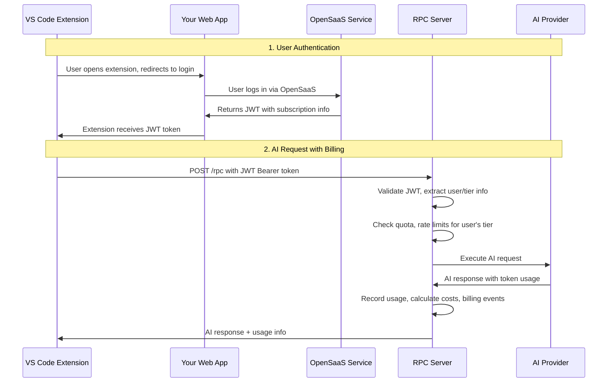
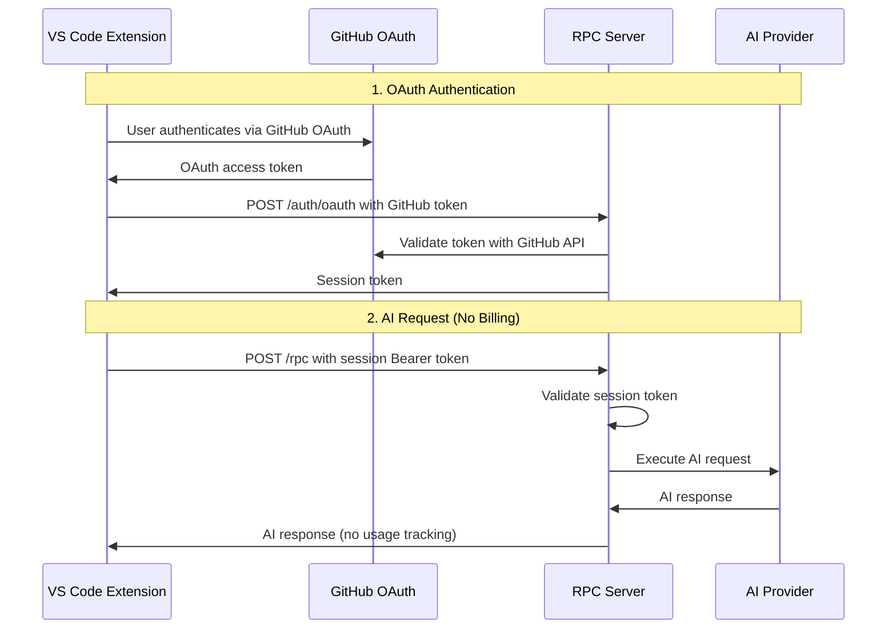

# Authentication Flows and Security

This document clarifies the **three different authentication systems** in simple-rpc-ai-backend and when to use each one.

## 🔐 Authentication Systems Overview

| Authentication Type | Purpose | Use Case | Billing Support |
|-------------------|---------|----------|----------------|
| **OpenSaaS JWT** | Monetization & billing | Production SaaS with subscriptions | ✅ **Required for billing** |
| **GitHub/Microsoft OAuth** | Basic RPC protection | Development & simple protection | ❌ No billing integration |
| **Extension-Only Access** | VS Code extension security | Prevent unauthorized API access | Works with either |

---

## 1. 🏢 OpenSaaS JWT Authentication (Production Monetization)

### **When to Use**
- ✅ Production SaaS application with subscription billing
- ✅ Need usage tracking, quotas, and platform fees
- ✅ Want configurable subscription tiers
- ✅ Require organization/team billing

### **How It Works**



### **JWT Token Structure**
```typescript
interface OpenSaaSJWTPayload {
  userId: string;
  email: string;
  organizationId?: string;
  subscriptionTier: string; // 'free', 'pro', 'enterprise', or any custom tier
  monthlyTokenQuota: number;
  rpmLimit: number;
  tpmLimit: number;
  features: string[];
  iat: number;
  exp: number;
  iss: string; // Your OpenSaaS issuer
  aud: string; // Your service identifier
}
```

### **VS Code Extension Integration**
```typescript
// In your VS Code extension
class OpenSaaSAuthProvider {
  async getAuthToken(): Promise<string> {
    // 1. Check if user is already authenticated
    let token = this.context.globalState.get('opensaas_token');
    
    if (!token || this.isTokenExpired(token)) {
      // 2. Redirect user to your web app for authentication
      const authUrl = `https://yourapp.com/auth/vscode?extension=${this.extensionId}`;
      await vscode.env.openExternal(vscode.Uri.parse(authUrl));
      
      // 3. Wait for token via callback or manual entry
      token = await this.waitForToken();
      this.context.globalState.update('opensaas_token', token);
    }
    
    return token;
  }
  
  async makeAIRequest(content: string, promptId: string) {
    const token = await this.getAuthToken();
    
    const response = await fetch('https://your-rpc-server.com/rpc', {
      method: 'POST',
      headers: {
        'Content-Type': 'application/json',
        'Authorization': `Bearer ${token}`, // OpenSaaS JWT
        'X-Extension-ID': this.extensionId // Additional security
      },
      body: JSON.stringify({
        jsonrpc: '2.0',
        method: 'executeAIRequest',
        params: { content, promptId },
        id: Date.now()
      })
    });
    
    const result = await response.json();
    
    // Handle quota exceeded, upgrade prompts, etc.
    if (result.error?.code === -32001) {
      this.showUpgradePrompt(result.error.data.upgradeUrl);
    }
    
    return result;
  }
}
```

### **Server Configuration**
```typescript
import { createMonetizedAIServer, createOpenSaaSConfig } from 'simple-rpc-ai-backend';

const server = await createMonetizedAIServer({
  opensaasMonetization: createOpenSaaSConfig({
    opensaasPublicKey: process.env.OPENSAAS_PUBLIC_KEY,
    audience: 'your-ai-service',
    issuer: 'https://auth.yourcompany.com',
    customTiers: {
      free: {
        name: 'Free',
        monthlyTokenQuota: 1000,
        rpmLimit: 5,
        tpmLimit: 100,
        features: ['basic_ai']
      },
      pro: {
        name: 'Professional',
        monthlyTokenQuota: 100000,
        rpmLimit: 100,
        tpmLimit: 10000,
        features: ['basic_ai', 'advanced_ai', 'priority_support']
      }
    },
    platformFeePercentage: 20
  })
});
```

---

## 2. 🔧 GitHub/Microsoft OAuth (Legacy Development Protection)

### **When to Use**
- ✅ Development and testing environments
- ✅ Simple RPC endpoint protection without billing
- ✅ Internal tools that don't need monetization
- ❌ **Cannot be used with billing features**

### **How It Works**



### **VS Code Extension Integration**
```typescript
// In your VS Code extension (existing legacy system)
const authProvider = vscode.authentication.getSession('github', ['user:email'], { createIfNone: true });
const githubToken = authProvider.accessToken;

// Authenticate with RPC server
const authResponse = await fetch('https://your-rpc-server.com/auth/oauth', {
  method: 'POST',
  headers: { 'Content-Type': 'application/json' },
  body: JSON.stringify({
    extensionId: 'your-extension-id',
    provider: 'github',
    accessToken: githubToken,
    deviceId: vscode.env.machineId
  })
});

const { sessionToken } = await authResponse.json();

// Use session token for AI requests
const aiResponse = await fetch('https://your-rpc-server.com/rpc', {
  method: 'POST',
  headers: {
    'Content-Type': 'application/json',
    'Authorization': `Bearer ${sessionToken}` // Session token, not JWT
  },
  body: JSON.stringify({
    jsonrpc: '2.0',
    method: 'executeAIRequest',
    params: { content: 'Hello', systemPrompt: 'You are helpful' },
    id: 1
  })
});
```

### **Server Configuration**
```typescript
import { createAIServer } from 'simple-rpc-ai-backend';

const server = createAIServer({
  oauthAuth: {
    allowedProviders: ['github', 'microsoft'],
    allowedUsers: ['your-email@company.com'], // Optional whitelist
    requireVerifiedEmail: true
  },
  serviceProviders: {
    anthropic: { apiKey: process.env.ANTHROPIC_API_KEY }
  }
});
```

---

## 3. 🛡️ Extension-Only Access Security

### **Problem: Preventing Unauthorized API Access**

Even with authentication, you want to ensure only your VS Code extension can access your RPC API, not random web requests.

### **Solution: Multi-Layer Security**

#### **Layer 1: Extension ID Validation**
```typescript
// Server-side middleware
app.use('/rpc', (req, res, next) => {
  const extensionId = req.headers['x-extension-id'];
  const allowedExtensions = [
    'your-company.your-extension',
    'your-company.your-other-extension'
  ];
  
  if (!allowedExtensions.includes(extensionId)) {
    return res.status(403).json({
      error: { code: -32001, message: 'Unknown extension' }
    });
  }
  
  next();
});
```

#### **Layer 2: User-Agent Validation**
```typescript
// Validate VS Code user agent
app.use('/rpc', (req, res, next) => {
  const userAgent = req.headers['user-agent'];
  
  if (!userAgent?.includes('VSCode')) {
    return res.status(403).json({
      error: { code: -32001, message: 'Invalid client' }
    });
  }
  
  next();
});
```

#### **Layer 3: Request Signature (Advanced)**
```typescript
// In VS Code extension
import crypto from 'crypto';

class SecureRPCClient {
  private extensionSecret = 'your-shared-secret'; // From extension package
  
  private signRequest(body: string): string {
    return crypto
      .createHmac('sha256', this.extensionSecret)
      .update(body)
      .digest('hex');
  }
  
  async makeRequest(method: string, params: any) {
    const body = JSON.stringify({
      jsonrpc: '2.0',
      method,
      params,
      id: Date.now()
    });
    
    const signature = this.signRequest(body);
    
    return fetch('https://your-rpc-server.com/rpc', {
      method: 'POST',
      headers: {
        'Content-Type': 'application/json',
        'Authorization': `Bearer ${await this.getAuthToken()}`,
        'X-Extension-ID': this.extensionId,
        'X-Request-Signature': signature
      },
      body
    });
  }
}

// Server-side signature validation
app.use('/rpc', (req, res, next) => {
  const signature = req.headers['x-request-signature'];
  const expectedSignature = crypto
    .createHmac('sha256', process.env.EXTENSION_SECRET)
    .update(JSON.stringify(req.body))
    .digest('hex');
    
  if (signature !== expectedSignature) {
    return res.status(403).json({
      error: { code: -32001, message: 'Invalid signature' }
    });
  }
  
  next();
});
```

---

## 🤔 Which Authentication Should I Use?

### **For Production SaaS Applications**
```typescript
// ✅ Use OpenSaaS JWT for full monetization
const server = await createMonetizedAIServer({
  opensaasMonetization: createOpenSaaSConfig({
    opensaasPublicKey: process.env.OPENSAAS_PUBLIC_KEY,
    audience: 'your-service',
    issuer: 'https://auth.yourcompany.com',
    customTiers: yourTiers
  })
});
```

### **For Development/Internal Tools**
```typescript
// ✅ Use GitHub/Microsoft OAuth for simple protection
const server = createAIServer({
  oauthAuth: {
    allowedProviders: ['github'],
    allowedUsers: ['dev@company.com']
  }
});
```

### **For Public Extensions (No Billing)**
```typescript
// ✅ No authentication, just extension security
const server = createAIServer({
  // Add extension-only security middleware
  // No authentication required
});
```

---

## ⚠️ Important Security Notes

### **1. OpenSaaS JWT vs OAuth Sessions**
- **OpenSaaS JWT**: Contains user subscription/billing info, validated cryptographically
- **OAuth Sessions**: Server-side sessions, no billing info, stored in memory/database

### **2. Token Storage in VS Code**
```typescript
// ✅ Secure token storage
await this.context.globalState.update('auth_token', token);

// ❌ Never store in plain text files
// fs.writeFileSync('token.txt', token); // Don't do this!
```

### **3. HTTPS Only in Production**
```typescript
// ✅ Always use HTTPS for production
const server = 'https://your-api.com/rpc';

// ❌ Never use HTTP for auth tokens
// const server = 'http://your-api.com/rpc'; // Insecure!
```

### **4. Extension ID Spoofing Protection**
Extension IDs can be spoofed, so combine with other security layers:
- User authentication (JWT/OAuth)
- Request signatures
- Rate limiting
- IP whitelisting (if applicable)

---

## 📋 Summary

| Feature | OpenSaaS JWT | GitHub/Microsoft OAuth | Extension-Only |
|---------|-------------|------------------------|----------------|
| **Billing & Quotas** | ✅ Full support | ❌ Not supported | ❌ Not supported |
| **Subscription Tiers** | ✅ Configurable | ❌ Not supported | ❌ Not supported |
| **Usage Tracking** | ✅ Real-time | ❌ Basic logging | ❌ Basic logging |
| **VS Code Integration** | ✅ Custom flow | ✅ Built-in API | ✅ Headers only |
| **Production Ready** | ✅ Yes | ✅ Simple cases | ⚠️ Needs additional security |
| **Setup Complexity** | 🔶 Medium | 🟢 Easy | 🟢 Easy |

**Recommendation**: Use **OpenSaaS JWT** for production SaaS applications that need billing. Use **GitHub OAuth** for development and simple protection without billing needs.