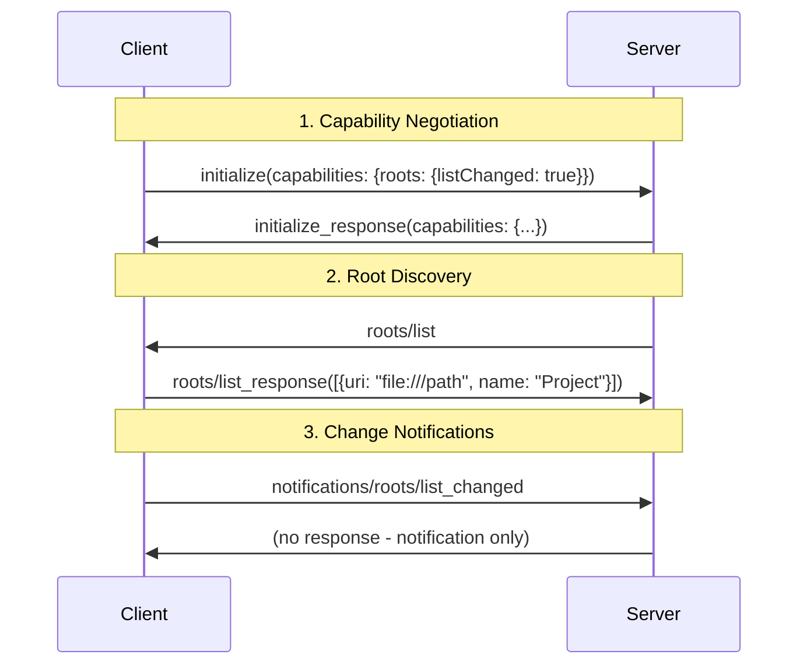

# Server Workspaces vs MCP Roots: Complete Guide

## Overview

This guide explains the fundamental distinction between **Server Workspaces** (server-managed file access) and **MCP Roots** (client-managed file exposure) in the Simple RPC AI Backend. Understanding this separation is crucial for proper MCP protocol compliance and secure file access patterns.

## Table of Contents

1. [Architecture Overview](#architecture-overview)
2. [Server Workspaces (Server-Managed)](#server-workspaces-server-managed)
3. [MCP Roots (Client-Managed)](#mcp-roots-client-managed)
4. [Configuration Examples](#configuration-examples)
5. [Security Considerations](#security-considerations)
6. [Migration Guide](#migration-guide)
7. [Troubleshooting](#troubleshooting)

## Architecture Overview

```
                  Model Context Protocol (MCP)

 ┌─────────────────────────────────────────────────────────────┐
 │                         CLIENT                              │
 │                                                             │
 │   User's local or mounted folders                           │
 │   (e.g. ~/projects, /mnt/shared/projectX)                   │
 │                                                             │
 │   • Client controls what to expose                          │
 │   • Advertises via MCP roots                                │
 │                                                             │
 │   roots/list  ────────────────────────────►                 │
 │                                                             │
 └─────────────────────────────────────────────────────────────┘
                 ▲
                 │
                 │ (MCP spec: server queries roots/list)
                 ▼
 ┌─────────────────────────────────────────────────────────────┐
 │                         SERVER                              │
 │                                                             │
 │   Server-managed directories                                │
 │   (e.g. /opt/templates, /srv/data, /home/server/project)    │
 │                                                             │
 │   • Configured in server config                             │
 │   • Exposed through tools (listFiles, readFile, etc.)       │
 │   • Not part of MCP roots                                   │
 │                                                             │
 │   serverWorkspaces / managedDirectories                     │
 │   (internal server concept)                                 │
 │                                                             │
 └─────────────────────────────────────────────────────────────┘
```

### 🔑 Key Differences

| Aspect | Server Workspaces | MCP Roots |
|--------|------------------|-----------|
| **Owner** | Server | Client |
| **Configuration** | Server config file | Client capability + registration |
| **Purpose** | Server resources & templates | User workspace folders |
| **Access Control** | Server administrator | End user |
| **MCP Protocol** | Not part of MCP roots/list | Part of MCP roots/list |
| **Tools** | `getServerWorkspaces`, `listFiles` | `registerClientWorkspace`, `roots/list` |

## Server Workspaces (Server-Managed)

Server Workspaces are directories that the **server administrator** configures to provide access to server-controlled resources.

### 🎯 Use Cases

- **Templates & Examples**: `/opt/templates`, `/usr/share/examples`
- **Reference Data**: `/srv/data`, `/var/app-data`
- **Shared Resources**: `/shared/docs`, `/company/policies`
- **Server Projects**: `/home/server/projects`

### ⚙️ Configuration

```typescript
const server = createRpcAiServer({
  // Server-managed directories (not MCP roots)
  serverWorkspaces: {
    enabled: true,  // Enable workspace tools

    additionalWorkspaces: {
      templates: {
        path: '/opt/templates',
        name: 'Server Templates',
        description: 'Pre-built project templates',
        readOnly: true,
        allowedExtensions: ['.js', '.ts', '.json', '.md']
      },
      sharedDocs: {
        path: '/shared/documentation',
        name: 'Shared Documentation',
        description: 'Company-wide documentation',
        readOnly: true
      },
      workArea: {
        path: '/tmp/workspace',
        name: 'Temporary Work Area',
        description: 'Temporary file operations',
        readOnly: false,
        maxFileSize: 10485760  // 10MB limit
      }
    }
  }
});
```

### 🛠️ Available Tools

When `serverWorkspaces` is configured, these tRPC/MCP tools become available:

- **`getServerWorkspaces`**: List all configured server workspaces
- **`listFiles`**: List files in a server workspace
- **`readFile`**: Read file content from a server workspace
- **`writeFile`**: Write files to a server workspace (if not readOnly)
- **`pathExists`**: Check if a path exists in a server workspace
- **`addServerWorkspace`**: Dynamically add new server workspaces
- **`removeServerWorkspace`**: Remove server workspaces

### 🔐 Security Features

```typescript
serverWorkspaces: {
  myWorkspace: {
    path: '/safe/directory',
    readOnly: false,

    // Path restrictions
    allowedPaths: ['docs/*', 'src/**/*.js'],      // Only these patterns
    blockedPaths: ['**/node_modules', '**/.git'], // Never these patterns

    // File restrictions
    allowedExtensions: ['.js', '.ts', '.md'],     // Only these file types
    blockedExtensions: ['.exe', '.sh'],           // Never these file types
    maxFileSize: 1048576,                         // 1MB file size limit

    // Symlink handling
    followSymlinks: false,                        // Don't follow symlinks (security)

    // File watching
    enableWatching: true                          // Watch for file changes
  }
}
```

## MCP Roots (Client-Managed)

MCP Roots are directories that the **client/user** exposes to the server through the Model Context Protocol.

### 🎯 Use Cases

- **IDE Workspaces**: VS Code workspace folders
- **Project Directories**: User's active development projects
- **Document Folders**: User's personal documents
- **Custom Locations**: Any folder the user wants to share

### 🔗 MCP Protocol Flow



### 🛠️ Available Tools

For MCP client roots, these tools are available:

- **`registerClientWorkspace`**: Register a client workspace with the server
- **`unregisterClientWorkspace`**: Remove a registered client workspace
- **`listClientWorkspaces`**: List all registered client workspaces
- **`roots/list`** (MCP protocol): Server queries client for exposed roots

### 📋 Client Root Registration

```typescript
// Client can register their workspace folders
await client.registerClientWorkspace({
  id: 'my-project',
  uri: 'file:///home/user/projects/my-project',
  name: 'My Project',
  description: 'Active development project'
});
```

### 🔐 Client Security

According to MCP specification, clients **MUST**:

- Only expose roots with appropriate permissions
- Validate all root URIs to prevent path traversal
- Implement proper access controls
- Monitor root accessibility
- Prompt users for consent before exposing roots to servers

## Configuration Examples

### Basic Server Setup

```typescript
import { createRpcAiServer } from 'simple-rpc-ai-backend';

const server = createRpcAiServer({
  ai: {
    providers: {
      anthropic: { apiKey: process.env.ANTHROPIC_API_KEY }
    }
  },

  // Server-managed directories
  serverWorkspaces: {
    templates: {
      path: './templates',
      name: 'Project Templates',
      readOnly: true
    },
    work: {
      path: './workspace',
      name: 'Work Area',
      readOnly: false
    }
  },

  // MCP configuration for client roots
  mcp: {
    enableMCP: true,
    auth: {
      requireAuthForToolsList: false,
      requireAuthForToolsCall: false
    }
  }
});

await server.start();
```

### Production Security Setup

```typescript
const server = createRpcAiServer({
  // Restricted server workspaces
  serverWorkspaces: {
    enabled: true,

    additionalWorkspaces: {
      publicTemplates: {
        path: '/opt/secure-templates',
        name: 'Approved Templates',
        readOnly: true,
        allowedExtensions: ['.md', '.json', '.js'],
        maxFileSize: 1048576  // 1MB
      },

      userScratch: {
        path: '/tmp/user-workspace',
        name: 'User Scratch Area',
        readOnly: false,
        allowedPaths: ['**/*.txt', '**/*.md'],
        blockedPaths: ['**/*.exe', '**/*.sh'],
        maxFileSize: 5242880  // 5MB
      }
    }
  },

  // Secure MCP configuration
  mcp: {
    enableMCP: true,
    auth: {
      requireAuthForToolsList: true,   // Require auth
      requireAuthForToolsCall: true,   // Require auth
      publicTools: []                  // No public tools
    }
  }
});
```

### Development Setup with Both

```typescript
const server = createRpcAiServer({
  // Development server workspaces
  serverWorkspaces: {
    enabled: true,
    additionalWorkspaces: {
      examples: {
        path: './examples',
        name: 'Code Examples',
        readOnly: true
      },
      playground: {
        path: './playground',
        name: 'Development Playground',
        readOnly: false,
        enableWatching: true
      }
    }
  },

  // Liberal MCP settings for development
  mcp: {
    enableMCP: true,
    auth: {
      requireAuthForToolsList: false,
      requireAuthForToolsCall: false,
      publicTools: [
        'getServerWorkspaces',
        'listFiles',
        'readFile',
        'registerClientWorkspace'
      ]
    }
  }
});
```

## Security Considerations

### 🛡️ Server Workspace Security

**Server administrators must consider:**

1. **Path Traversal Protection**
   ```typescript
   serverWorkspaces: {
     restricted: {
       path: '/safe/directory',
       // Prevent access outside this directory
       allowedPaths: ['**/*'],  // Only within this workspace
       blockedPaths: ['../**']  // Block parent directory access
     }
   }
   ```

2. **File Type Restrictions**
   ```typescript
   serverWorkspaces: {
     documents: {
       path: './docs',
       allowedExtensions: ['.md', '.txt', '.json'],
       blockedExtensions: ['.exe', '.sh', '.bat']  // Block executables
     }
   }
   ```

3. **Size Limits**
   ```typescript
   serverWorkspaces: {
     uploads: {
       path: './uploads',
       maxFileSize: 10485760  // 10MB per file
     }
   }
   ```

### 🔒 MCP Root Security

**Clients should implement:**

1. **User Consent**: Always prompt before exposing directories
2. **Path Validation**: Validate URIs to prevent malicious paths
3. **Permission Checks**: Verify read/write permissions
4. **Monitoring**: Watch for unauthorized access attempts

### 🚨 Common Security Mistakes

❌ **DON'T DO THIS:**
```typescript
// WRONG: Exposing system directories
serverWorkspaces: {
  system: {
    path: '/',          // ❌ Root filesystem access
    readOnly: false     // ❌ Write access to system
  }
}

// WRONG: No restrictions
serverWorkspaces: {
  anything: {
    path: '/home/user',
    // ❌ No file type restrictions
    // ❌ No size limits
    // ❌ No path restrictions
  }
}
```

✅ **DO THIS:**
```typescript
// CORRECT: Restricted access
serverWorkspaces: {
  userDocuments: {
    path: '/home/user/documents',
    readOnly: true,                           // ✅ Read-only
    allowedExtensions: ['.md', '.txt'],       // ✅ Limited file types
    maxFileSize: 1048576,                     // ✅ Size limit
    allowedPaths: ['**/*.md', '**/*.txt'],    // ✅ Path restrictions
    followSymlinks: false                     // ✅ No symlink following
  }
}
```

## Migration Guide

### From Legacy `rootFolders` to `serverWorkspaces`

The `rootFolders` configuration is deprecated. Here's how to migrate:

**Old Configuration (Deprecated):**
```typescript
const server = createRpcAiServer({
  rootFolders: {
    enableAPI: true,
    defaultFolder: {
      path: './workspace'
    },
    additionalFolders: {
      templates: {
        path: './templates',
        readOnly: true
      }
    }
  }
});
```

**New Configuration:**
```typescript
const server = createRpcAiServer({
  serverWorkspaces: {
    enabled: true,
    defaultWorkspace: {
      path: './workspace',
      name: 'Default Workspace'
    },
    additionalWorkspaces: {
      templates: {
        path: './templates',
        name: 'Templates',
        readOnly: true
      }
    }
  }
});
```

### Backward Compatibility

The server maintains backward compatibility:
- Old `rootFolders` configuration still works
- New `serverWorkspaces` takes precedence if both are defined
- Deprecation warnings are logged for `rootFolders`

## Troubleshooting

### Common Issues

1. **"No workspaces available" error**
   ```typescript
   // Problem: serverWorkspaces not configured
   const server = createRpcAiServer({
     // Missing serverWorkspaces configuration
   });

   // Solution: Add serverWorkspaces
   const server = createRpcAiServer({
     serverWorkspaces: {
       work: {
         path: './workspace',
         name: 'Work Area'
       }
     }
   });
   ```

2. **"Access denied" errors**
   ```typescript
   // Problem: Restrictive path/extension rules
   serverWorkspaces: {
     docs: {
       path: './docs',
       allowedExtensions: ['.md'],  // Only .md files allowed
       readOnly: true               // No write access
     }
   }

   // Solution: Adjust restrictions as needed
   ```

3. **MCP roots not working**
   ```typescript
   // Problem: Client doesn't support roots capability
   // Check client initialization:
   {
     "method": "initialize",
     "params": {
       "capabilities": {
         "roots": {
           "listChanged": true  // ← Must be present
         }
       }
     }
   }
   ```

### Debugging

Enable debug logging:
```typescript
const server = createRpcAiServer({
  monitoring: {
    logging: {
      level: 'debug'  // Enable debug logs
    }
  }
});
```

Look for these log messages:
- `🗂️ MCP roots/list: Client supports roots capability`
- `📋 Server workspace registered: workspaceId`
- `🔍 MCP Initialize: clientSupportsRoots: true`

### Testing Configuration

Test your workspace configuration:
```bash
# Test server workspace access
curl -X POST http://localhost:8001/trpc/system.getServerWorkspaces

# Test MCP roots capability
curl -X POST http://localhost:8001/mcp \
  -H "Content-Type: application/json" \
  -d '{"jsonrpc": "2.0", "id": 1, "method": "roots/list"}'
```

## Best Practices

### 🎯 Server Workspace Best Practices

1. **Principle of Least Privilege**: Only expose necessary directories
2. **Read-Only by Default**: Use `readOnly: true` unless write access is required
3. **File Type Restrictions**: Always specify `allowedExtensions`
4. **Size Limits**: Set reasonable `maxFileSize` limits
5. **Path Validation**: Use `allowedPaths` and `blockedPaths`

### 🎯 MCP Root Best Practices

1. **User Consent**: Always get explicit user permission
2. **Capability Declaration**: Properly declare roots capability
3. **Change Notifications**: Send `notifications/roots/list_changed` when roots change
4. **Error Handling**: Handle cases where roots become unavailable

### 🎯 Security Best Practices

1. **Defense in Depth**: Use multiple security layers
2. **Input Validation**: Validate all file paths and names
3. **Monitoring**: Log all file operations
4. **Regular Audits**: Review workspace configurations regularly
5. **Update Promptly**: Keep dependencies updated

## Reference

- **MCP Specification**: [Model Context Protocol - Roots](https://modelcontextprotocol.io/docs/concepts/roots)
- **Server Workspace Types**: See `ServerWorkspaceConfig` in `src/services/workspace-manager.ts`
- **MCP Tools**: See system router in `src/trpc/routers/system/index.ts`
- **Configuration Types**: See `RpcAiServerConfig` in `src/rpc-ai-server.ts`

---

**Next Steps:**
- Review your current configuration against security best practices
- Test both server workspaces and MCP root functionality
- Set up monitoring and logging for file operations
- Consider implementing user authentication for sensitive workspaces
