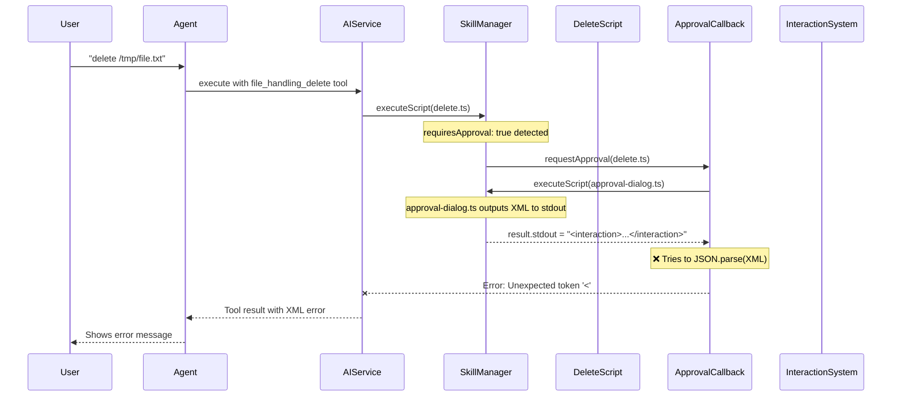
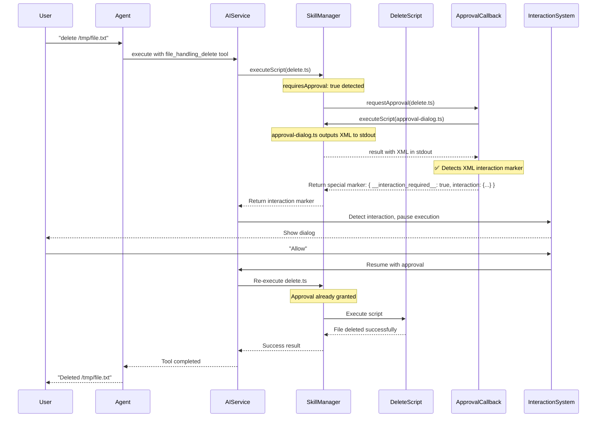

# Approval Flow - Current vs Desired

## Current Flow (Broken)



## Desired Flow (Fixed)



## Key Differences

### Current (Broken)
1. ❌ `ApprovalCallback` tries to `JSON.parse()` XML output from approval-dialog.ts
2. ❌ XML is treated as an error instead of interaction signal
3. ❌ Interaction never reaches the InteractionSystem

### Desired (Fixed)
1. ✅ `ApprovalCallback` detects XML and converts it to `__interaction_required__` marker
2. ✅ XML flows through as interaction data, not parsed as JSON
3. ✅ InteractionSystem receives interaction and shows dialog
4. ✅ After user approves, execution resumes without re-triggering approval

## Implementation Requirements

### Fix 1: ApprovalCallback should detect XML instead of parsing as JSON

**File**: `src/services/agents/skills/utils/interactive-approval-callback.ts:124`

**Current**:
```typescript
const output = JSON.parse(result.stdout);
```

**Should be**:
```typescript
// Check if stdout contains XML interaction marker
if (result.stdout && result.stdout.trim().startsWith('<interaction')) {
  // Return interaction marker to propagate up
  return {
    __interaction_required__: true,
    interaction: parseInteractionXML(result.stdout),
    originalRequest: request
  } as any;
}

// Otherwise parse as JSON (for normal approval responses)
const output = JSON.parse(result.stdout);
```

### Fix 2: ApprovalManager should handle interaction markers

**File**: `src/services/agents/skills/utils/approval-manager.ts`

The approval manager needs to recognize when callback returns interaction marker and propagate it up the chain.

### Fix 3: SkillManager should propagate interaction from approval

**File**: `src/services/agents/skills/manager.ts:242`

When approval callback returns interaction marker, SkillManager should return it as the script result so AIService can detect it.

## Benefits of requiresApproval: true

1. ✅ **Safety layer intact** - Dangerous operations always require approval
2. ✅ **Consistent UI** - All approvals go through user-interaction dialogs
3. ✅ **Single source of truth** - SKILL.md defines what needs approval
4. ✅ **No AI bypass** - Agent can't skip approval by not calling user_interaction_confirm
5. ✅ **Defense in depth** - Even if agent misbehaves, safety system catches it
