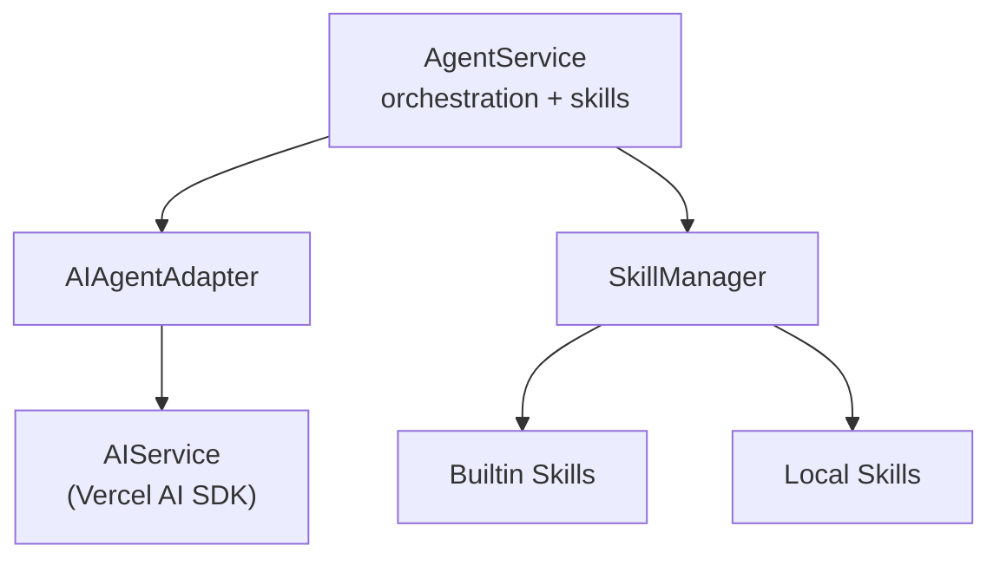

# Agent System with Skills

The agent system provides agentic AI capabilities with a progressive disclosure skills system, enabling modular and context-aware AI interactions.

## Overview

The agent system provides:
- **Skills System**: Progressive disclosure model (Level 1/2/3) for modular capabilities
- **AI Provider Support**: Anthropic Claude (tested); OpenAI, Google, and OpenRouter integrations are planned
- **Sandbox Execution**: Local Node sandbox (tested locally); remote providers (Fly Machines, Cloudflare Workers, Vercel) planned and not yet validated
- **MCP Integration** *(planned, not implemented yet)*: expose skills as MCP tools once the transport is wired up
- **Type Safety**: Full TypeScript support with Zod validation

## Architecture



## Quick Start

### 1. Enable Agents in Server Config

```typescript
import { createRpcAiServer } from 'simple-rpc-ai-backend';

const server = createRpcAiServer({
  providers: {
    anthropic: {
      apiKey: process.env.ANTHROPIC_API_KEY,
      enabled: true
    }
  },

  // Enable agents with skills
  agents: {
    enabled: true,
    skills: {
      enabled: true,
      sources: [
        // Built-in skills
        { type: 'builtin', name: 'main-agent' },
        { type: 'builtin', name: 'file-handling' },

        // Local custom skills
        { type: 'local', path: './custom-skills/my-skill' }
      ],
      sandbox: {
        allowedPaths: ['/workspace', '/tmp'],
        timeout: 30000,
        maxMemory: 512 * 1024 * 1024
      }
    }
  }
});

await server.start();
```

### 2. Use Agents via tRPC

```typescript
import { createTypedAIClient } from 'simple-rpc-ai-backend';
import { httpBatchLink } from '@trpc/client';

const client = createTypedAIClient({
  links: [httpBatchLink({ url: 'http://localhost:8000/trpc' })]
});

// Execute agent request
const result = await client.agents.execute.mutate({
  prompt: 'What skills do you have available?',
  provider: 'anthropic',
  model: 'claude-3-7-sonnet-20250219'
});

console.log(result.content);
```

> Skills configured on the server are auto-loaded; no additional context payload is required for typical requests.

### 3. Use via simple-agent CLI

```bash
# Start simple-agent with skills
simple-agent chat

# Ask about skills
You: What skills do you have?
Agent: I have these skills loaded:
  - main-agent: Core agentic behavior
  - file-handling: File operations
  - hello-world: Test skill

# Execute skill functionality
You: Execute the greet script with name "Alice"
Agent: [Executes skill script and returns result]
```

## Skills System

### What are Skills?

Skills are modular capabilities that extend the agent's knowledge and abilities using **progressive disclosure** (Level 1, 2, 3):

- **Level 1**: Metadata only (name, description, capabilities) - <100 tokens
- **Level 2**: + Instructions for using the skill - <5000 tokens
- **Level 3**: + Resources (examples, documentation) - unlimited

This prevents context bloat by only loading what's needed.

### Skill Structure

A skill is defined by a `SKILL.md` file. The minimum frontmatter you need is:

```markdown
---
name: my-custom-skill
description: Brief description of what this skill does
scripts:
  - path: scripts/my-script.ts
    runtime: typescript
---
```

Add optional fields (capabilities, allowedPaths, etc.) as needed. For deeper guidance on progressive disclosure and best practices, refer to [Anthropic's skill documentation](https://docs.claude.com/en/docs/agents-and-tools/agent-skills/overview).

### Built-in Skills

#### main-agent
Core agentic behavior for reasoning, planning, and task coordination.

**Capabilities**: `agent-coordination`, `reasoning`, `planning`

#### file-handling
Safe file system operations with permission-based safeguards.

**Capabilities**: `file-read`, `file-write`, `file-search`, `directory-operations`

**Scripts**:
- `safe-read.ts` - Read files with size limits
- `search-files.ts` - Search for files by pattern
- `validate-path.ts` - Validate file paths

### Creating Custom Skills

1. **Create skill directory**:
```bash
mkdir -p custom-skills/my-skill
cd custom-skills/my-skill
```

2. **Create `SKILL.md`:**

   ```markdown
   ---
   name: my-skill
   description: My custom skill
   scripts:
     - path: scripts/my-action.ts
       runtime: typescript
   ---
   ```

3. **Optional: Add scripts**:
```bash
mkdir scripts
```

```typescript
// scripts/my-action.ts
const args = process.argv.slice(2);
console.log(`Hello from my-skill: ${args.join(' ')}`);
```

4. **Load in server config**:
```typescript
agents: {
  skills: {
    enabled: true,
    sources: [
      { type: 'local', path: './custom-skills/my-skill' }
    ]
  }
}
```

## Anthropic Integration

The agent system is optimized for Anthropic's Claude models and follows Anthropic's best practices.

### Tool Use

Skills registered on the server surface as tools automatically:

```typescript
const result = await client.agents.execute.mutate({
  prompt: 'Read the file README.md',
  provider: 'anthropic'
});
```

To inspect the available tools/skills programmatically, use `agents.skills.list` or `agents.skills.executeScript`.

### Best Practices

**From Anthropic's documentation** ([anthropic.com/docs](https://docs.anthropic.com/en/docs/build-with-claude/prompt-engineering)):

1. **Clear Instructions**: Skills provide focused, task-specific instructions
2. **Examples**: Level 3 resources include working examples
3. **Chain of Thought**: main-agent skill promotes step-by-step reasoning
4. **Role Prompting**: Skills define specific roles/expertise areas

## Sandbox Security

Skills run inside a local Node.js sandbox today (validated in local development). Remote sandboxes (Fly Machines, Cloudflare Workers, Vercel Edge Functions) are on the roadmap.

Current configuration surface:

```typescript
sandbox: {
  // Paths scripts can access
  allowedPaths: ['/workspace', '/tmp'],

  // Script timeout (ms)
  timeout: 30000,

  // Memory limit (bytes)
  maxMemory: 512 * 1024 * 1024,

  // Environment variables
  env: {
    NODE_ENV: 'production'
  }
}
```

Security features:
- ✅ Path validation prevents traversal attacks
- ✅ Timeout prevents infinite loops
- ✅ Memory limits prevent resource exhaustion
- ✅ Isolated process execution

> Status: remote sandboxes are planned but not yet implemented or tested.

## MCP Integration *(Planned)*

🚧 Exposing skills as MCP (Model Context Protocol) tools is on the roadmap. Configuration examples will be published once the transport wiring lands.

## API Reference

### agents.execute

Execute an agent with skills:

```typescript
{
  prompt: string;              // User's request
  systemPrompt?: string;       // Optional system context
  provider?: string;           // AI provider (default: anthropic)
  model?: string;              // Model name
  maxTokens?: number;          // Override token limit
  temperature?: number;        // Override sampling temperature
  context?: {                  // Optional advanced configuration
    tools?: Tool[];            // Additional custom tools
    skills?: AgentSkill[];     // Provide explicit skills (defaults to all)
  };
}
```

> By default all configured skills are exposed automatically; only pass `context` when you need to limit or augment the toolset.

### agents.skills.list

List available skills:

```typescript
const result = await client.agents.skills.list.query({});
// Returns: { skills: Skill[] }
```

### agents.skills.executeScript

Execute a skill script directly:

```typescript
const result = await client.agents.skills.executeScript.mutate({
  skillId: 'file-handling',
  scriptName: 'scripts/safe-read.ts',
  args: ['README.md']
});
```

## Backlog & Planned Enhancements

- Extended thinking toggle for Claude models
- Prompt caching controls for skill metadata and resources
- Remote sandbox providers (Fly Machines, Cloudflare Workers, Vercel Edge)
- MCP tool export pipeline

## Related Documentation

- [Anthropic Claude Documentation](https://docs.anthropic.com/)
- [Anthropic Prompt Engineering](https://docs.anthropic.com/en/docs/build-with-claude/prompt-engineering)
- [Skills System Overview](#skills-system)
- [Simple Agent CLI]({{ site.baseurl }})
