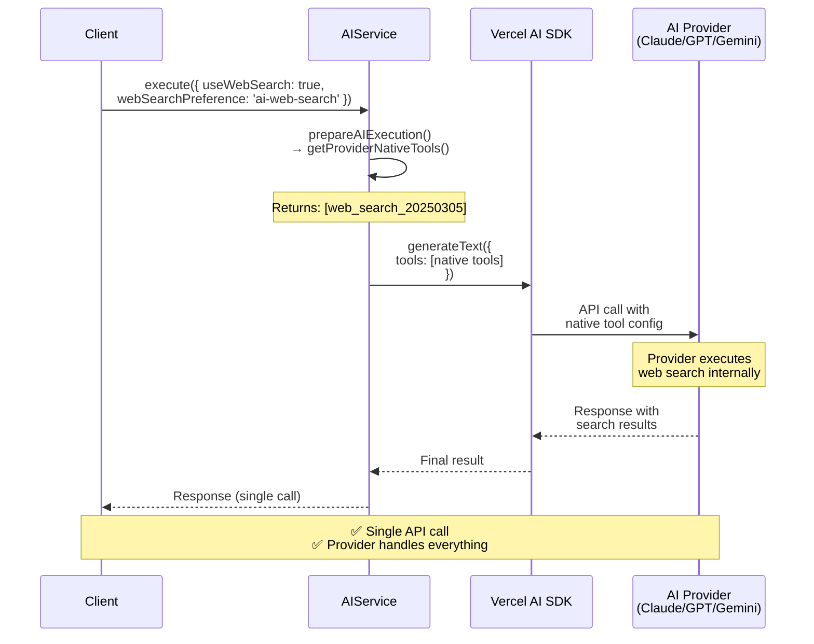
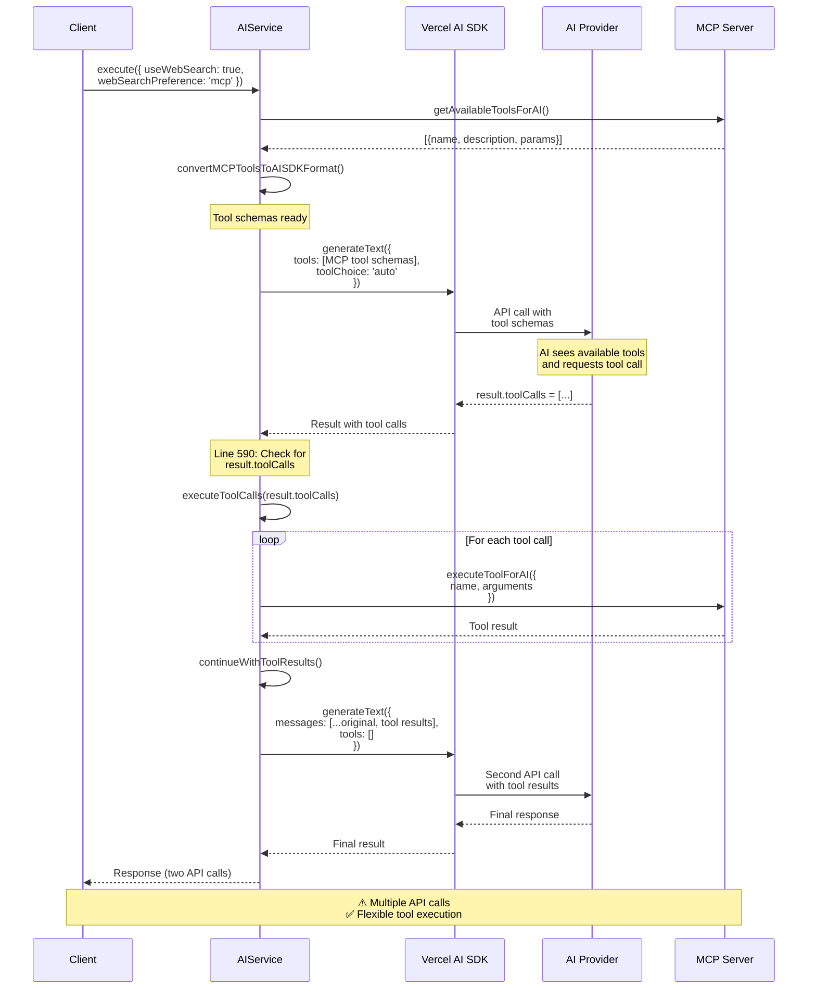
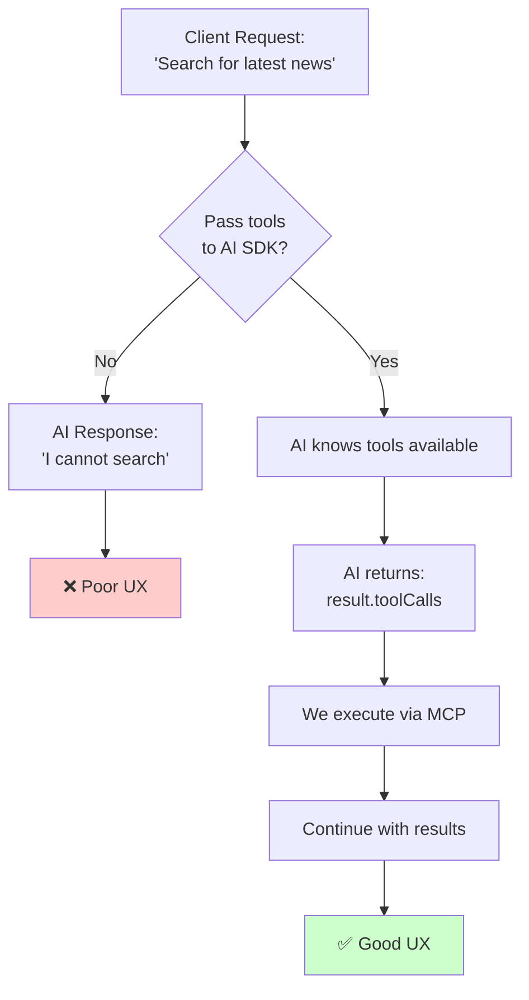
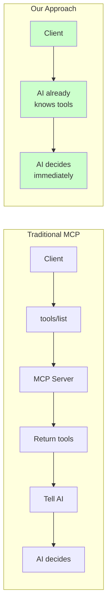
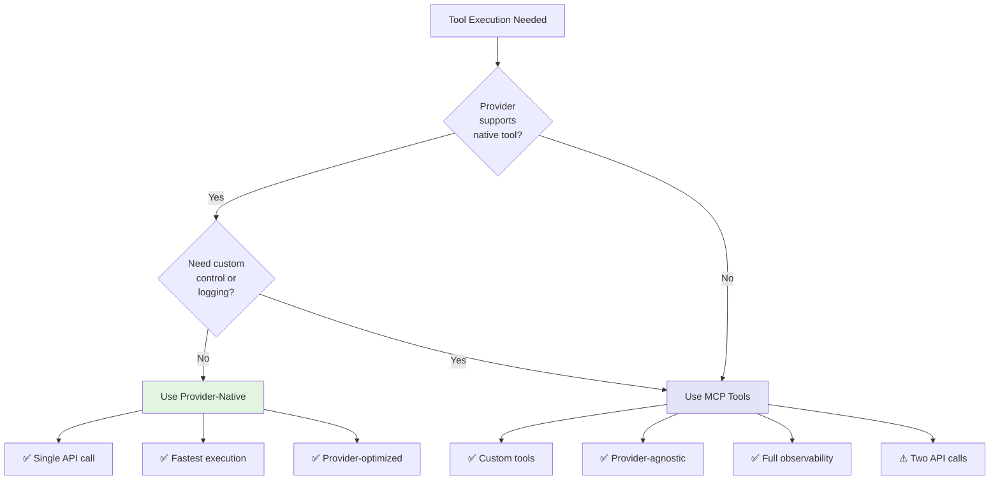
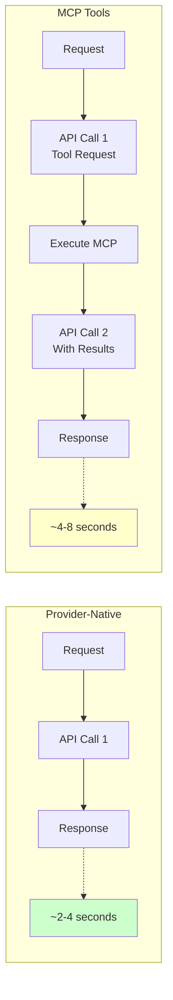

# Tool Execution Flow Architecture
{: .no_toc }

<details open markdown="block">
  <summary>
    Table of contents
  </summary>
  {: .text-delta }
- TOC
{:toc}
</details>

## Overview

The AIService supports two fundamentally different approaches to tool execution:
1. **Provider-Native Tools** - Executed directly by the AI provider
2. **MCP Tools** - Executed by our MCP server after AI requests them

## Provider-Native Tools Flow (`ai-web-search`)



## MCP Tools Flow (`mcp` / `duckduckgo`)



## Proactive Tool Discovery

### Why Pass MCP Tools to AI SDK?



### Benefit: No Separate Discovery Call



## Code Flow Reference

### Line 560-574: Tool Configuration Decision

```typescript
if (availableTools.length > 0) {
  if (executionConfig.webSearchPreference === 'ai-web-search') {
    // Provider-native: AI SDK passes to provider for native execution
    generateOptions.tools = availableTools;
  } else {
    // MCP: AI SDK gets schemas, we execute after AI requests
    generateOptions.tools = availableTools;
    generateOptions.toolChoice = 'auto';
    // executeToolCalls() at line 590 intercepts and executes via MCP
  }
}
```

### Line 590-604: MCP Tool Execution Interception

```typescript
// Only for MCP tools (not ai-web-search)
if (result.toolCalls && result.toolCalls.length > 0
    && executionConfig.webSearchPreference !== 'ai-web-search') {

  // Execute via MCP server
  const toolResults = await this.executeToolCalls(result.toolCalls);

  // Continue conversation with results
  const finalResult = await this.continueWithToolResults(
    generateOptions, result, toolResults
  );

  return this.formatExecuteResult(finalResult, executionConfig);
}
```

### Line 1084-1126: MCP Tool Execution Implementation

```typescript
private async executeToolCalls(toolCalls: any[]): Promise<any[]> {
  const toolResults: any[] = [];

  for (const toolCall of toolCalls) {
    if (this.mcpService) {
      const mcpResult = await this.mcpService.executeToolForAI({
        name: toolCall.toolName,
        arguments: toolCall.args
      });

      toolResults.push({
        toolCallId: toolCall.toolCallId,
        result: mcpResult.success ? mcpResult.result : { error: mcpResult.error }
      });
    }
  }

  return toolResults;
}
```

## Architecture Decision Matrix



## Configuration Examples

### Provider-Native Tools

```typescript
const service = new AIService({
  serviceProviders: [
    { name: 'anthropic', apiKey: process.env.ANTHROPIC_API_KEY }
  ]
  // No mcpConfig needed
});

await service.execute({
  content: 'Search for latest AI news',
  metadata: {
    useWebSearch: true,
    webSearchPreference: 'ai-web-search'  // Native execution
  }
});
```

### MCP Tools

```typescript
const service = new AIService({
  serviceProviders: [
    { name: 'anthropic', apiKey: process.env.ANTHROPIC_API_KEY }
  ],
  mcpConfig: {
    enableWebSearch: true  // Enable MCP tools
  }
});

await service.execute({
  content: 'Search for latest AI news',
  metadata: {
    useWebSearch: true,
    webSearchPreference: 'mcp'  // MCP execution
  }
});
```

## Performance Comparison



| Aspect | Provider-Native | MCP Tools |
|--------|----------------|-----------|
| **Latency** | ~2-4 seconds | ~4-8 seconds |
| **API Calls** | 1 | 2 |
| **Token Usage** | Standard | Standard + Continuation |
| **Customization** | Limited | Full |
| **Observability** | Provider-level | Full control |

## When to Use Each Approach

### Use Provider-Native (`ai-web-search`) When:

✅ Provider supports native tool (Claude, GPT-4, Gemini)
✅ Performance is critical (single API call)
✅ Want provider-optimized execution
✅ Don't need custom tool control

### Use MCP (`mcp`/`duckduckgo`) When:

✅ Need custom tool implementations
✅ Want provider-agnostic tools
✅ Need audit/logging of tool calls
✅ Want centralized tool management
✅ Provider doesn't support native tools

## Summary

The current architecture is **correct and intentional**:

1. **Both approaches use `generateOptions.tools = availableTools`**
   - For native: Provider executes during initial API call
   - For MCP: We intercept `result.toolCalls` and execute via MCP

2. **Proactive Tool Discovery**
   - AI knows available tools upfront (no separate `tools/list` call)
   - Better UX - single user request triggers everything
   - AI can intelligently decide to use tools

3. **Clean Separation**
   - Line 560-574: Configure tools
   - Line 590-604: Intercept and execute MCP tools
   - Line 1084-1126: Execute via MCP server

This design provides:
- ✅ **Flexibility** - Support both native and MCP tools
- ✅ **Transparency** - AI knows available tools
- ✅ **Control** - Full observability for MCP tools
- ✅ **Performance** - Native tools execute in one call
