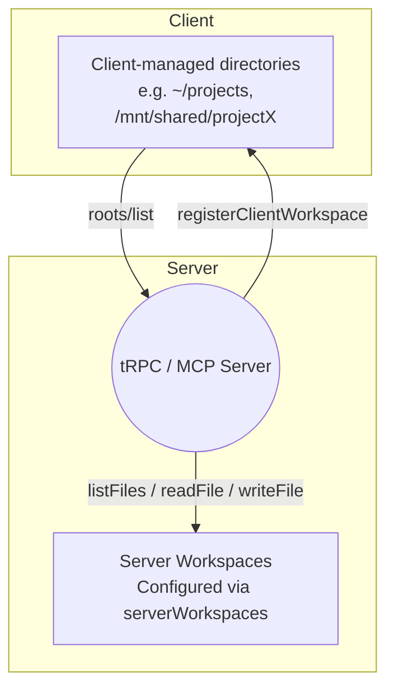

# Workspaces

Understand the distinction between server-managed workspaces and client-supplied MCP roots to configure access safely.

## Concepts at a Glance

| Aspect | Server Workspaces | MCP Roots |
| --- | --- | --- |
| Owner | Server administrator | Client / end user |
| Configuration | Server config (`serverWorkspaces`) | MCP capability negotiation |
| Purpose | Templates, shared resources, sandbox directories | User project folders |
| Access Control | Enforced by server policies | Granted by the client |
| MCP Role | Not part of `roots/list` | Exposed via `roots/list` |

## Architecture Overview



## Server Workspaces

Server workspaces are directories registered by the server to expose curated content. They are available via tRPC and MCP tools like `getServerWorkspaces`, `listFiles`, and `readFile`.

### Use Cases

- **Templates & examples** – expose curated sample projects or onboarding kits.
- **Reference data** – serve static catalogues, project manifests, or SQL migrations.
- **Shared resources** – provide compliance documents or knowledge-base exports.
- **Scratch space** – give users a temporary area for uploads with quotas.

### Example Configuration

```typescript
const server = createRpcAiServer({
  serverWorkspaces: {
    enableAPI: true,
    templates: {
      path: '/opt/templates',
      name: 'Server Templates',
      description: 'Pre-built project templates',
      readOnly: true,
      allowedExtensions: ['.js', '.ts', '.json', '.md']
    },
    sandbox: {
      path: '/tmp/workspace',
      name: 'Sandbox',
      readOnly: false,
      allowedPaths: ['**/*.txt', '**/*.json'],
      blockedPaths: ['**/node_modules', '**/.git'],
      maxFileSize: 5 * 1024 * 1024,
      followSymlinks: false
    }
  }
});
```

### Security Checklist

- Default to `readOnly: true` unless write access is essential.
- Restrict file types with `allowedExtensions` and `blockedExtensions`.
- Limit path traversal with `allowedPaths` and `blockedPaths`.
- Set `followSymlinks: false` to avoid symlink escapes.
- Impose `maxFileSize` limits for uploads or writes.
- Set up monitoring to log high-risk operations (delete/write).

### Available Tools

When `serverWorkspaces` is configured, these tRPC/MCP tools become available:

- `getServerWorkspaces`
- `listFiles`, `readFile`, `writeFile`, `pathExists`
- `addServerWorkspace`, `removeServerWorkspace`

## MCP Roots

MCP roots represent client-controlled folders. Clients register them with the server and expose them via the MCP `roots/list` exchange.

```typescript
await client.registerClientWorkspace({
  id: 'project',
  uri: 'file:///home/user/projects/sample',
  name: 'Sample Project'
});

const roots = await server.mcpCall('roots/list');
// Returns client-advertised directories
```

### Best Practices

- Prompt users for explicit consent before sharing directories.
- Validate incoming `file://` URIs on the client side.
- Monitor access patterns and audit when sensitive files are involved.
- Ensure MCP clients advertise the `roots` capability (`{"roots": {"listChanged": true}}`).
- Send `notifications/roots/list_changed` when the client's workspace list changes.
- Handle missing roots gracefully—clients may revoke them at any time.

## Configuration Scenarios

```ts
const server = createRpcAiServer({
  serverWorkspaces: {
    templates: {
      path: '/opt/templates',
      readOnly: true,
      allowedExtensions: ['.md', '.json']
    },
    sandbox: {
      path: '/tmp/workspace',
      readOnly: false,
      maxFileSize: 10 * 1024 * 1024,
      allowedPaths: ['**/*.json', '**/*.md'],
      blockedPaths: ['**/node_modules/**', '**/.git/**']
    }
  },
  mcp: {
    enabled: true,
    auth: { requireAuthForToolsCall: true }
  }
});
```

On the MCP client side:

```jsonc
{
  "method": "initialize",
  "params": {
    "capabilities": {
      "roots": { "listChanged": true }
    }
  }
}
```

## Security Considerations

- **Principle of least privilege** – expose the smallest directory possible.
- **Readonly first** – flip `readOnly` to `false` only when you truly need write access.
- **File type allowlists** – set `allowedExtensions` rather than relying on defaults.
- **Symlink protection** – keep `followSymlinks: false` unless you trust the tree.
- **Audit trails** – enable structured logging for file operations and review regularly.

## Troubleshooting

| Symptom | Likely Cause | Resolution |
| --- | --- | --- |
| `No workspaces available` | `serverWorkspaces` missing | Add at least one workspace configuration. |
| `writeFile` returns `ACCESS_DENIED` | Workspace is read-only or path blocked | Toggle `readOnly` or adjust path rules. |
| MCP client cannot see roots | Client did not advertise `roots` capability | Ensure `initialize` payload includes `roots`. |
| Unexpected files exposed | `allowedPaths` too broad | Tighten glob patterns or add `blockedPaths`. |

Enable debug logging to inspect decisions:

```ts
const server = createRpcAiServer({
  monitoring: {
    logging: { level: 'debug' }
  }
});
```

## Best Practices Recap

- Keep server workspaces curated and audited.
- Require explicit user consent before registering MCP roots.
- Combine server and client workspaces for a complete experience.
- Review configurations periodically—especially before enabling write access.
