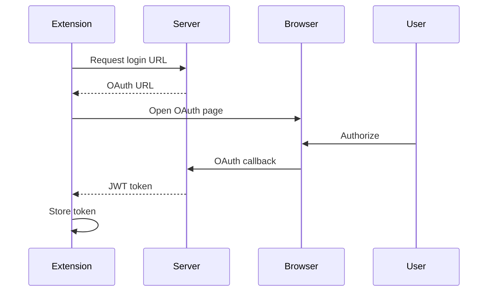

# Example 3: VS Code Extension with MCP

Complete VS Code extension demonstrating MCP integration with AI capabilities.

## Features
- ✅ VS Code extension with AI commands
- ✅ MCP tool discovery and execution
- ✅ OAuth2 authentication flow
- ✅ System prompt protection
- ✅ Token usage tracking
- ✅ Multiple AI providers
- ✅ **Uses production server from Example 2**

## Project Structure

```
03-vscode-extension/
├── extension/           # VS Code extension code
│   ├── src/
│   │   ├── extension.ts # Main extension entry
│   │   ├── client.ts    # MCP/tRPC client
│   │   └── auth.ts      # Authentication handler
│   ├── package.json
│   └── README.md
├── server -> ../02-mcp-server  # Symbolic link to production server
└── README.md          # This file
```

> **Important**: This example uses the same production server as Example 2 via a symbolic link (`server -> ../02-mcp-server`). This demonstrates how multiple client applications can connect to a single backend server.

## Setup Instructions

### 1. Configure and Start the Backend Server

> **Note**: The server is shared with Example 2. Configure it there first if you haven't already.

```bash
# First, build the main package (from project root)
cd ../../..
pnpm build

# Configure the production server (shared with Example 2)
cd examples/02-mcp-server
cp .env.example .env
# Edit .env with your OAuth credentials and API keys

# Install dependencies and start the server
npm install
npm start

# Server runs at http://localhost:8000
```

> **⚠️ Important**: You must run `pnpm build` from the project root before running examples.

### 2. Build the Extension

```bash
# From the extension directory
cd extension
npm install
npm run compile

# For development with watch mode
npm run watch
```

### 3. Run the Extension

1. Open the `extension` folder in VS Code
2. Press `F5` to launch a new VS Code window with the extension
3. The extension will be active in the new window

## Extension Commands

The extension provides these commands:

- **AI: Ask Question** - Ask AI a question about your code
- **AI: Explain Selection** - Explain selected code
- **AI: Refactor Selection** - Suggest refactoring for selected code
- **AI: Generate Tests** - Generate tests for selected code
- **AI: Login** - Authenticate with OAuth2
- **AI: Check Token Usage** - View your token usage

## Using the Extension

### First Time Setup
1. Run command: `AI: Login`
2. Choose provider (GitHub/Google)
3. Complete OAuth flow in browser
4. Extension stores auth token securely

### Ask Questions
1. Open any file
2. Run command: `AI: Ask Question`
3. Type your question
4. AI response appears in output panel

### Code Explanation
1. Select code in editor
2. Run command: `AI: Explain Selection`
3. Explanation appears in new panel

## MCP Integration

The extension discovers and uses MCP tools dynamically:

```typescript
// Extension automatically discovers available tools
const tools = await client.listTools();

// Execute any discovered tool
const result = await client.callTool('executeAI', {
  content: 'Explain this code',
  context: selectedText
});
```

## Authentication Flow



## Configuration

Extension settings (in VS Code settings):

```json
{
  "aiAssistant.serverUrl": "http://localhost:8000",
  "aiAssistant.defaultProvider": "anthropic",
  "aiAssistant.showTokenUsage": true,
  "aiAssistant.maxTokens": 4096
}
```

## Development

### Running Tests
```bash
cd extension
npm test
```

### Debugging
1. Set breakpoints in VS Code
2. Press F5 to start debugging
3. Use Debug Console for inspection

### Publishing
```bash
# Package the extension
vsce package

# Publish to marketplace
vsce publish
```

## Extension API

The extension exposes an API for other extensions:

```typescript
// In another extension
const aiApi = vscode.extensions.getExtension('your-publisher.ai-assistant')?.exports;
if (aiApi) {
  const result = await aiApi.askQuestion('How do I use async/await?');
}
```

## Security

- OAuth tokens stored in VS Code SecretStorage
- System prompts never exposed to client
- All AI requests go through backend
- Token usage tracked per user

## Troubleshooting

### Extension not activating
- Check Output panel for errors
- Ensure server is running
- Verify server URL in settings

### Authentication fails
- Check OAuth credentials
- Verify redirect URLs
- Check server logs

### No AI response
- Verify API keys configured
- Check token quota
- Review server logs