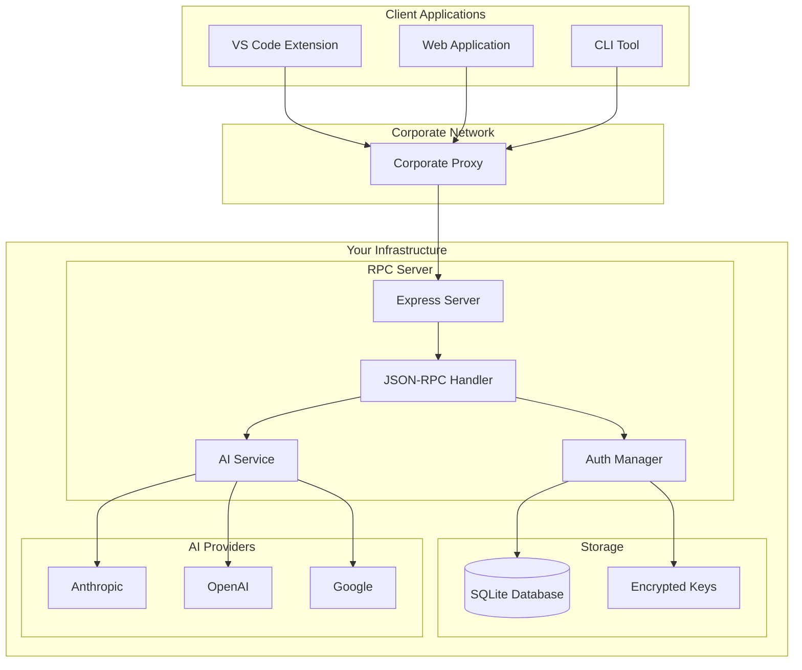

# Simple RPC AI Backend - Architecture

## Overview

The **Simple RPC AI Backend** is a platform-agnostic JSON-RPC server designed for AI integration in VS Code extensions, web applications, and CLI tools. It provides secure, corporate-friendly AI communication with system prompt protection and multi-provider support.

## Core Principles

### <¯ **Simplicity First**
- Clean JSON-RPC 2.0 protocol
- Minimal dependencies 
- Standard HTTP transport
- Clear separation of concerns

### = **Security by Design**
- System prompts stay server-side
- Corporate proxy bypass architecture
- Zero client-side secrets
- Secure session management

### < **Platform Agnostic**
- Works in Node.js, browsers, CLI tools
- No VS Code-specific dependencies in core
- Standard web technologies (HTTP, JSON)

## System Architecture



## Component Architecture

### 1. **JSON-RPC Client (`src/client.ts`)**

**Purpose**: Platform-agnostic communication with backend servers.

```typescript
// Clean, minimal API
const client = new RPCClient('http://localhost:8000');
const result = await client.request('executeAIRequest', params);
```

**Key Features**:
- Uses `json-rpc-2.0` library (zero dependencies)
- Automatic error handling and retries
- Support for notifications
- Protocol-agnostic transport

**Design Decisions**:
-  Removed app-specific methods (`analyzeCode`) to keep generic
-  Uses proven `json-rpc-2.0` library vs custom implementation
-  HTTP-only (no WebSocket complexity for AI use cases)

### 2. **Express Server (`src/server.ts`)**

**Purpose**: HTTP server with JSON-RPC endpoint and security middleware.

```typescript
const server = createAIServer({
  serviceProviders: ['anthropic', 'openai'],
  requirePayment: { enabled: false }
});
```

**Middleware Stack**:
1. **Helmet** - Security headers
2. **CORS** - Cross-origin support (VS Code webviews)
3. **Rate Limiting** - DOS protection
4. **JSON Parser** - Request parsing

**Endpoints**:
- `POST /rpc` - JSON-RPC 2.0 requests
- `GET /health` - Health check
- `GET /config` - Server discovery

### 3. **Authentication System (`src/auth/`)**

**Purpose**: Progressive authentication with device linking and BYOK support.

**Architecture**:
```
Anonymous Session ’ OAuth Upgrade ’ Pro Features
      “               “              “
   Device ID      GitHub/Google   Payment Required
```

**Components**:
- **AuthManager** - Session lifecycle
- **UserManager** - User data persistence  
- **KeyManager** - Encrypted API key storage
- **SQLiteAdapter** - Database abstraction

**Security Features**:
- AES-256-GCM key encryption
- Device-based session management
- OAuth integration (GitHub, Google, Microsoft)

### 4. **AI Service (`src/ai-service.ts`)**

**Purpose**: Multi-provider AI request handling with fallback strategies.

**Provider Support**:
- **Anthropic** (Claude models)
- **OpenAI** (GPT models)
- **Google** (Gemini models)

**Configuration Flexibility**:
```typescript
// Simple array
serviceProviders: ['anthropic', 'openai']

// Complex objects with fallbacks
serviceProviders: [
  { provider: 'anthropic', model: 'claude-3-5-sonnet-20241022' },
  { provider: 'openai' }  // Fallback
]
```

**Fallback Strategies**:
- **Priority** - Try providers in order
- **Round Robin** - Distribute load
- **Fastest First** - Performance optimization

## Security Architecture

### = **System Prompt Protection**

**Problem**: Traditional approaches expose valuable prompts to:
- Corporate network monitoring
- Client-side inspection
- Extension marketplace reverse engineering

**Solution**: Server-side prompt storage
```typescript
// L Client-side prompt (exposed)
const prompt = "You are a senior security engineer...";
const result = await aiProvider.generate(userCode + prompt);

//  Server-side prompt (protected)
const result = await client.request('executeAIRequest', {
  content: userCode,
  systemPrompt: 'security_review' // Reference only
});
```

### <â **Corporate Proxy Bypass**

**Challenge**: Corporate firewalls block AI provider APIs.

**Solution**: Backend proxy architecture
```
VS Code Extension ’ Corporate Proxy ’ Your RPC Server ’ AI Providers
   (User code)      (Monitors only)    (System prompts)    (Full context)
```

**Benefits**:
-  Corporate proxies see user code only
-  System prompts never traverse corporate network
-  Single point of AI provider management

### = **BYOK (Bring Your Own Key) Support**

**User Key Flow**:
1. User stores encrypted API keys
2. Server decrypts for AI requests
3. Payment verification (optional)
4. Fallback to service provider keys

**Service Provider Flow**:
1. Server uses configured provider keys
2. Payment/usage tracking
3. Rate limiting and quotas

## Data Flow Patterns

### 1. **Simple AI Request**
```
Client ’ POST /rpc ’ JSON-RPC Parser ’ AI Service ’ Provider ’ Response
```

### 2. **BYOK AI Request**
```
Client ’ POST /rpc ’ Auth Check ’ User Key Decrypt ’ AI Service ’ Response
```

### 3. **Progressive Authentication**
```
Anonymous Device ’ Generate Session ’ OAuth Upgrade ’ Store Credentials
```

## Database Schema

### **Users Table**
```sql
CREATE TABLE users (
  id TEXT PRIMARY KEY,
  email TEXT UNIQUE,
  created_at TIMESTAMP DEFAULT CURRENT_TIMESTAMP,
  updated_at TIMESTAMP DEFAULT CURRENT_TIMESTAMP
);
```

### **User Devices Table**
```sql
CREATE TABLE user_devices (
  device_id TEXT PRIMARY KEY,
  user_id TEXT,
  device_name TEXT,
  auth_level TEXT CHECK(auth_level IN ('anonymous', 'oauth', 'pro')),
  created_at TIMESTAMP DEFAULT CURRENT_TIMESTAMP,
  FOREIGN KEY (user_id) REFERENCES users (id)
);
```

### **User Keys Table**
```sql
CREATE TABLE user_keys (
  id INTEGER PRIMARY KEY AUTOINCREMENT,
  user_id TEXT NOT NULL,
  provider TEXT NOT NULL,
  encrypted_key TEXT NOT NULL,
  created_at TIMESTAMP DEFAULT CURRENT_TIMESTAMP,
  FOREIGN KEY (user_id) REFERENCES users (id),
  UNIQUE(user_id, provider)
);
```

## Configuration Patterns

### **Server Configuration**
```typescript
interface AIServerConfig {
  port?: number;
  database?: {
    type?: 'sqlite' | 'postgresql';
    path?: string; // SQLite file path
  };
  masterEncryptionKey?: string;
  oauth?: {
    github?: { clientId: string; clientSecret: string };
    google?: { clientId: string; clientSecret: string };
  };
  mode?: 'simple' | 'byok' | 'hybrid';
  serviceProviders?: ServiceProvidersConfig;
  requirePayment?: {
    enabled?: boolean;
    checkFunction?: (userId: string) => Promise<boolean>;
  };
}
```

### **Service Provider Configuration**
```typescript
// Flexible configuration patterns
type ServiceProvidersConfig = 
  | string[]  // ['anthropic', 'openai']
  | ProviderConfig[]  // [{ provider: 'anthropic', model: '...' }]
  | MixedConfig[];  // ['anthropic', { provider: 'openai', model: '...' }]
```

## Deployment Patterns

### **Development Setup**
```bash
# Local development
npm start
# Server: http://localhost:8000
# VS Code extension connects automatically
```

### **Production Deployment**
```bash
# Docker deployment
docker build -t ai-backend .
docker run -p 8000:8000 -e ANTHROPIC_API_KEY=$KEY ai-backend

# Cloud deployment (Vercel, Railway, etc.)
# Environment variables for AI provider keys
```

### **Corporate Deployment**
```bash
# Behind corporate firewall
# Internal server with AI provider access
# VS Code extensions connect to internal endpoint
```

## Testing Strategy

### **Unit Tests**
- JSON-RPC client functionality
- Authentication flows
- AI service provider switching
- Database operations

### **Integration Tests**
- End-to-end request flows
- VS Code extension integration
- Multi-provider fallbacks
- Error handling scenarios

### **Security Tests**
- Key encryption/decryption
- Session management
- SQL injection prevention
- CORS policy validation

## Performance Considerations

### **Response Times**
- **Target**: < 500ms for AI requests
- **Caching**: Provider responses where appropriate
- **Connection Pooling**: Reuse HTTP connections

### **Scalability**
- **Stateless Design**: Horizontal scaling friendly
- **Database**: SQLite for simple deployments, PostgreSQL for scale
- **Rate Limiting**: Per-user and global limits

### **Memory Management**
- **Key Storage**: Encrypted at rest, decrypted in memory only during use
- **Session Cleanup**: Automatic cleanup of expired sessions
- **Connection Management**: Proper cleanup of AI provider connections

## Extension Points

### **Custom AI Providers**
```typescript
// Add new provider to AI service
const customProvider = {
  name: 'custom',
  generateText: async (prompt: string) => { ... }
};
```

### **Authentication Plugins**
```typescript
// Custom OAuth providers
const customAuth = {
  provider: 'corporate-sso',
  authenticate: async (token: string) => { ... }
};
```

### **Billing Integration**
```typescript
// Custom billing verification
const checkPayment = async (userId: string) => {
  return await corporateBilling.hasValidSubscription(userId);
};
```

## Future Considerations

### **Planned Enhancements**
- WebSocket support for streaming responses
- Plugin system for custom providers
- Advanced caching strategies
- Monitoring and observability

### **Scalability Roadmap**
- Redis session storage
- Kubernetes deployment configs
- Load balancer configurations
- Multi-region deployments

---

This architecture balances simplicity with flexibility, providing a solid foundation for AI-powered applications while maintaining security and corporate compliance requirements.