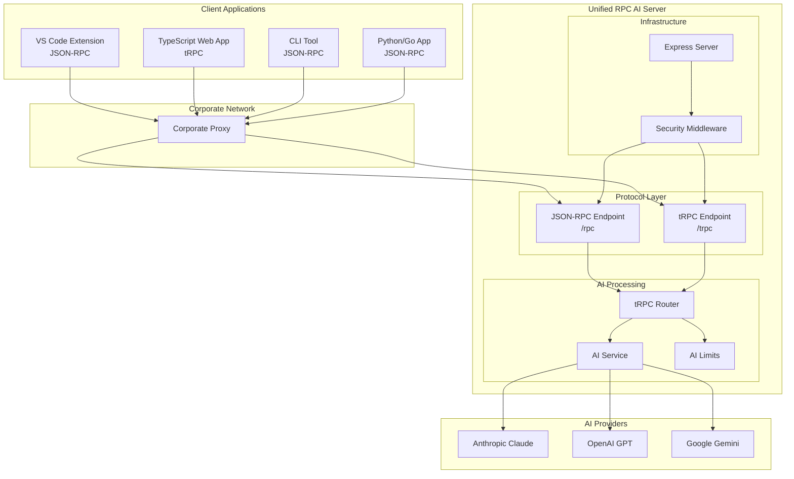

# Simple RPC AI Backend - Architecture

## Overview

The **Simple RPC AI Backend** is a unified TypeScript server that provides both JSON-RPC and tRPC endpoints for AI integration. It's designed for VS Code extensions, web applications, and CLI tools with a focus on simplicity, type safety, and corporate-friendly deployment.

## Core Principles

### 🎯 **Simplicity First**
- One unified server for all needs
- Minimal configuration required
- Sensible defaults for everything
- Clear, opinionated architecture

### ⚡ **Protocol Flexibility**
- JSON-RPC for universal compatibility
- tRPC for TypeScript projects with type safety
- Configurable protocol selection
- Shared AI processing backend

### 🔒 **Corporate Friendly**
- System prompts stay server-side
- Works behind corporate proxies
- No complex authentication required
- Client-managed API keys supported

## Unified Server Architecture



## Component Architecture

### 1. **Unified Server (`src/rpc-ai-server.ts`)**

**Purpose**: Single server supporting both JSON-RPC and tRPC protocols.

```typescript
import { createRpcAiServer, AI_LIMIT_PRESETS } from 'simple-rpc-ai-backend';

// Default: JSON-RPC only (simple, universal)
const server = createRpcAiServer();

// TypeScript projects: tRPC only (better DX)
const server = createRpcAiServer({
  protocols: { tRpc: true }  // Auto-disables JSON-RPC
});
```

**Key Features**:
- **Protocol Selection**: Choose JSON-RPC, tRPC, or both
- **Opinionated Defaults**: Zero config for common use cases
- **AI Limit Presets**: Conservative, standard, generous, maximum
- **Auto-Configuration**: Smart protocol enabling/disabling

### 2. **Protocol Endpoints**

#### **JSON-RPC Endpoint (`/rpc`)**
- **Target**: Universal compatibility (any language)
- **Transport**: Standard HTTP POST with JSON
- **Use Cases**: VS Code extensions, CLI tools, Python/Go clients
- **Authentication**: Client-managed API keys

```bash
POST /rpc
Content-Type: application/json

{
  "jsonrpc": "2.0",
  "method": "executeAIRequest",
  "params": {
    "content": "code to analyze",
    "systemPrompt": "security_review",
    "apiKey": "user-provided-key"
  },
  "id": 1
}
```

#### **tRPC Endpoint (`/trpc`)**
- **Target**: TypeScript applications with type safety
- **Transport**: HTTP with TypeScript client
- **Use Cases**: React/Vue apps, TypeScript VS Code extensions, monorepos
- **Type Safety**: End-to-end TypeScript inference

```typescript
const result = await client.ai.executeAIRequest.mutate({
  content: code,           // TypeScript knows this is required
  systemPrompt: 'review',  // Auto-complete available prompts
  options: {
    maxTokens: 4096,       // Type-checked at compile time
    temperature: 0.1
  }
});
```

### 3. **AI Processing Core (`src/trpc/routers/ai.ts`)**

**Purpose**: Unified AI request processing for both protocols.

**Features**:
- **Multi-Provider Support**: Anthropic, OpenAI, Google
- **Configurable Limits**: Content size, token limits, system prompt size
- **Input Validation**: Zod schemas for type safety
- **Error Handling**: Standardized error responses

**AI Limit Presets**:
```typescript
export const AI_LIMIT_PRESETS = {
  conservative: {
    content: { maxLength: 100_000 },    // 100KB
    tokens: { defaultMaxTokens: 2048, maxTokenLimit: 8_192 }
  },
  standard: {
    content: { maxLength: 500_000 },    // 500KB  
    tokens: { defaultMaxTokens: 4096, maxTokenLimit: 32_000 }
  },
  generous: {
    content: { maxLength: 2_000_000 },  // 2MB
    tokens: { defaultMaxTokens: 8192, maxTokenLimit: 100_000 }
  }
};
```

### 4. **Client Libraries**

#### **Platform-Agnostic JSON-RPC Client (`src/client.ts`)**
```typescript
import { RPCClient } from 'simple-rpc-ai-backend';

const client = new RPCClient('http://localhost:8000');
const result = await client.request('executeAIRequest', {
  content: 'code',
  systemPrompt: 'security_review',
  apiKey: 'user-key'
});
```

#### **TypeScript tRPC Client (External)**
```typescript
import { createTRPCProxyClient, httpBatchLink } from '@trpc/client';
import type { AppRouter } from './server';

const client = createTRPCProxyClient<AppRouter>({
  links: [httpBatchLink({ url: 'http://localhost:8000/trpc' })]
});
```

## Configuration Architecture

### **Server Configuration Interface**
```typescript
export interface RpcAiServerConfig {
  port?: number;                    // Default: 8000
  
  protocols?: {
    jsonRpc?: boolean;              // Default: true
    tRpc?: boolean;                 // Default: false
  };
  
  aiLimits?: AIRouterConfig;        // Default: standard preset
  
  cors?: {
    origin?: string | string[];     // Default: '*'
    credentials?: boolean;          // Default: false
  };
  
  rateLimit?: {
    windowMs?: number;              // Default: 15 minutes
    max?: number;                   // Default: 1000
  };
  
  paths?: {
    jsonRpc?: string;               // Default: '/rpc'
    tRpc?: string;                  // Default: '/trpc'
    health?: string;                // Default: '/health'
  };
}
```

### **Opinionated Configuration Logic**
```typescript
// Default: JSON-RPC only
createRpcAiServer() 
// → { jsonRpc: true, tRpc: false }

// TypeScript projects: tRPC only
createRpcAiServer({ protocols: { tRpc: true } })
// → { jsonRpc: false, tRpc: true }

// Explicit control: enable both
createRpcAiServer({ 
  protocols: { jsonRpc: true, tRpc: true } 
})
```

## Security Architecture

### 🔒 **System Prompt Protection**
- **Server-Side Storage**: Prompts never leave the server
- **Reference-Only**: Clients send prompt names, not content
- **Corporate Bypass**: Proxies see user code, not proprietary prompts

### 🔑 **Client-Managed API Keys**
- **Pass-Through**: API keys provided in request parameters
- **No Storage**: Server doesn't store or manage keys
- **User Control**: Users manage their own AI provider accounts

### 🌐 **CORS & Security**
- **Development**: Permissive CORS for easy setup
- **Production**: Configurable origin restrictions
- **Rate Limiting**: Configurable per-IP limits
- **Security Headers**: Helmet.js middleware

## Data Flow Patterns

### **JSON-RPC Request Flow**
```
Client → HTTP POST → Express → JSON-RPC Parser → tRPC Router → AI Service → Provider
```

### **tRPC Request Flow**
```
Client → tRPC Client → HTTP → Express → tRPC Middleware → tRPC Router → AI Service → Provider
```

### **Shared AI Processing**
Both protocols use the same underlying AI processing:
```
Request → Input Validation → AI Limits Check → Provider Selection → AI Request → Response
```

## Deployment Patterns

### **Development Setup**
```bash
# Simple setup
import { createRpcAiServer } from 'simple-rpc-ai-backend';
const server = createRpcAiServer();
await server.start();
```

### **Production Deployment**
```typescript
const server = createRpcAiServer({
  aiLimits: AI_LIMIT_PRESETS.conservative,
  cors: { origin: 'https://yourapp.com' },
  rateLimit: { max: 100 }
});
```

### **Monorepo TypeScript Project**
```
project/
├── packages/
│   ├── backend/          # tRPC server
│   └── extension/        # VS Code extension with shared types
└── package.json          # npm workspaces
```

## Testing Strategy

### **Protocol Testing**
- JSON-RPC endpoint compatibility
- tRPC type safety and validation
- Cross-protocol AI processing consistency

### **AI Integration Testing**
- Multi-provider fallback logic
- Limit enforcement testing
- Error handling validation

### **Security Testing**
- Rate limiting effectiveness
- CORS policy validation
- Input sanitization testing

## Protocol Decision Matrix

| Use Case | Recommended Protocol | Reasoning |
|----------|---------------------|-----------|
| **VS Code extension (standalone)** | JSON-RPC | Simple, universal, minimal bundle |
| **VS Code extension (monorepo)** | tRPC | Shared types, better DX |
| **React/Vue web app** | tRPC | Type safety, auto-completion |
| **CLI tools** | JSON-RPC | Universal compatibility |
| **Python/Go clients** | JSON-RPC | Language agnostic |
| **Multi-language project** | JSON-RPC | Works with any language |
| **Full TypeScript stack** | tRPC | End-to-end type safety |

## Future Considerations

### **Planned Enhancements**
- Streaming response support
- Additional AI provider integrations
- Performance monitoring and metrics
- Plugin system for custom providers

### **Architecture Evolution**
- WebSocket support for real-time features
- Redis caching for high-scale deployments
- Kubernetes deployment configurations
- Multi-region deployment support

---

This architecture provides a simple, unified approach to AI backend services while maintaining flexibility for different client types and deployment scenarios. The dual-protocol design allows universal compatibility while providing enhanced developer experience for TypeScript projects.