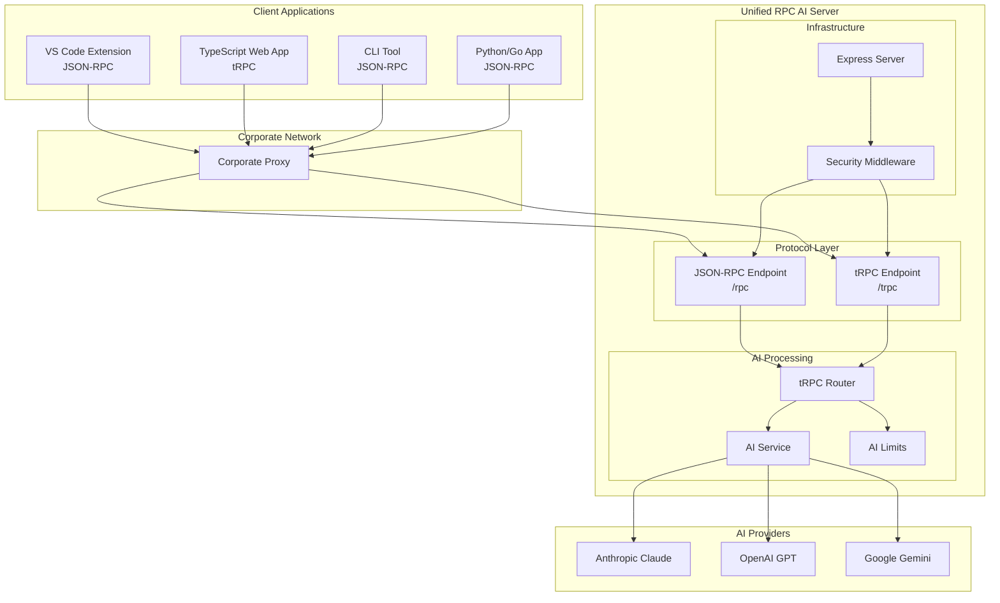
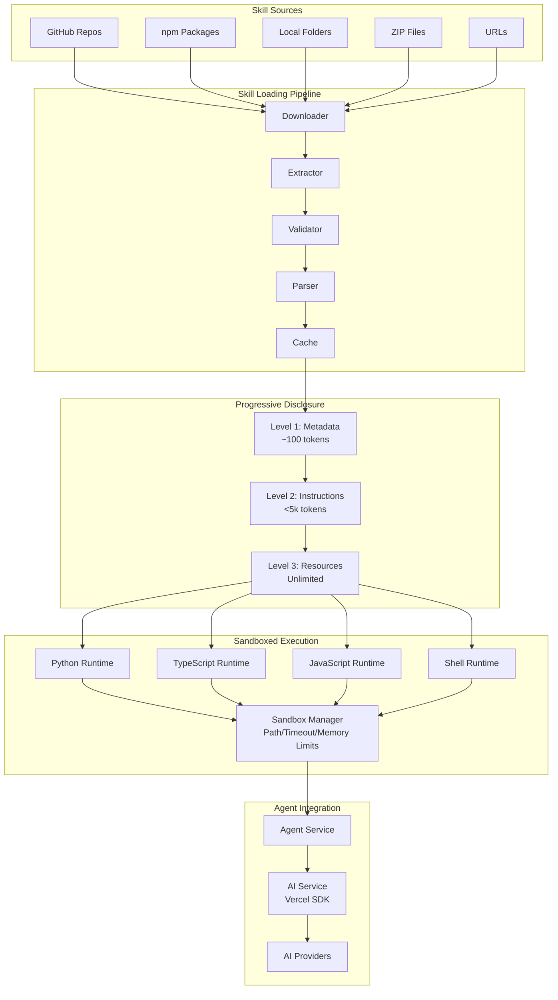

# Simple RPC AI Backend - Architecture

## Overview

The **Simple RPC AI Backend** is a unified TypeScript server that provides both JSON-RPC and tRPC endpoints for AI integration. It's designed for VS Code extensions, web applications, and CLI tools with a focus on simplicity, type safety, and corporate-friendly deployment.

## Core Principles

### 🎯 **Simplicity First**
- One unified server for all needs
- Minimal configuration required
- Sensible defaults for everything
- Clear, opinionated architecture

### ⚡ **Protocol Flexibility**
- JSON-RPC for universal compatibility
- tRPC for TypeScript projects with type safety
- Configurable protocol selection
- Shared AI processing backend

### 🔒 **Corporate Friendly**
- System prompts stay server-side
- Works behind corporate proxies
- No complex authentication required
- Client-managed API keys supported

## Unified Server Architecture


```mermaid
graph TB
    subgraph "Client Applications"
        A1[VS Code Extension<br/>JSON-RPC]
        A2[TypeScript Web App<br/>tRPC]
        A3[CLI Tool<br/>JSON-RPC]
        A4[Python/Go App<br/>JSON-RPC]
    end
    
    subgraph "Corporate Network"
        P[Corporate Proxy]
    end
    
    subgraph "Unified RPC AI Server"
        subgraph "Protocol Layer"
            JSONRPC[JSON-RPC Endpoint<br/>/rpc]
            TRPC[tRPC Endpoint<br/>/trpc]
        end
        
        subgraph "AI Processing"
            ROUTER[tRPC Router]
            AI[AI Service]
            LIMITS[AI Limits]
        end
        
        subgraph "Infrastructure"
            EXPRESS[Express Server]
            MIDDLEWARE[Security Middleware]
        end
    end
    
    subgraph "AI Providers"
        ANT[Anthropic Claude]
        OAI[OpenAI GPT]
        GOO[Google Gemini]
    end
    
    A1 --> P
    A2 --> P
    A3 --> P
    A4 --> P
    P --> JSONRPC
    P --> TRPC
    JSONRPC --> ROUTER
    TRPC --> ROUTER
    ROUTER --> AI
    ROUTER --> LIMITS
    AI --> ANT
    AI --> OAI
    AI --> GOO
    
    EXPRESS --> MIDDLEWARE
    MIDDLEWARE --> JSONRPC
    MIDDLEWARE --> TRPC
```

## Component Architecture

### 1. **Unified Server (`src/rpc-ai-server.ts`)**

**Purpose**: Single server supporting both JSON-RPC and tRPC protocols.

```typescript
import { createRpcAiServer, AI_LIMIT_PRESETS } from 'simple-rpc-ai-backend';

// Default: JSON-RPC only (simple, universal)
const server = createRpcAiServer();

// TypeScript projects: tRPC only (better DX)
const server = createRpcAiServer({
  protocols: { tRpc: true }  // Auto-disables JSON-RPC
});
```

**Key Features**:
- **Protocol Selection**: Choose JSON-RPC, tRPC, or both
- **Opinionated Defaults**: Zero config for common use cases
- **AI Limit Presets**: Conservative, standard, generous, maximum
- **Auto-Configuration**: Smart protocol enabling/disabling

### 2. **Protocol Endpoints**

#### **JSON-RPC Endpoint (`/rpc`)**
- **Target**: Universal compatibility (any language)
- **Transport**: Standard HTTP POST with JSON
- **Use Cases**: VS Code extensions, CLI tools, Python/Go clients
- **Authentication**: Client-managed API keys

```bash
POST /rpc
Content-Type: application/json

{
  "jsonrpc": "2.0",
  "method": "ai.generateText",
  "params": {
    "content": "code to analyze",
    "systemPrompt": "security_review",
    "apiKey": "user-provided-key"
  },
  "id": 1
}
```

#### **tRPC Endpoint (`/trpc`)**
- **Target**: TypeScript applications with type safety
- **Transport**: HTTP with TypeScript client
- **Use Cases**: React/Vue apps, TypeScript VS Code extensions, monorepos
- **Type Safety**: End-to-end TypeScript inference

```typescript
const result = await client.ai.generateText.mutate({
  content: code,           // TypeScript knows this is required
  systemPrompt: 'review',  // Auto-complete available prompts
  options: {
    maxTokens: 4096,       // Type-checked at compile time
    temperature: 0.1
  }
});
```

### 3. **AI Processing Core (`src/trpc/routers/ai.ts`)**

**Purpose**: Unified AI request processing for both protocols.

**Features**:
- **Multi-Provider Support**: Anthropic, OpenAI, Google
- **Configurable Limits**: Content size, token limits, system prompt size
- **Input Validation**: Zod schemas for type safety
- **Error Handling**: Standardized error responses

**AI Limit Presets**:
```typescript
export const AI_LIMIT_PRESETS = {
  conservative: {
    content: { maxLength: 100_000 },    // 100KB
    tokens: { defaultMaxTokens: 2048, maxTokenLimit: 8_192 }
  },
  standard: {
    content: { maxLength: 500_000 },    // 500KB  
    tokens: { defaultMaxTokens: 4096, maxTokenLimit: 32_000 }
  },
  generous: {
    content: { maxLength: 2_000_000 },  // 2MB
    tokens: { defaultMaxTokens: 8192, maxTokenLimit: 100_000 }
  }
};
```

### 4. **Client Libraries**

#### **Platform-Agnostic JSON-RPC Client (`src/client.ts`)**
```typescript
import { RPCClient } from 'simple-rpc-ai-backend';

const client = new RPCClient('http://localhost:8000');
const result = await client.request('ai.generateText', {
  content: 'code',
  systemPrompt: 'security_review',
  apiKey: 'user-key'
});
```

#### **TypeScript tRPC Client (External)**
```typescript
import { createTRPCProxyClient, httpBatchLink } from '@trpc/client';
import type { AppRouter } from './server';

const client = createTRPCProxyClient<AppRouter>({
  links: [httpBatchLink({ url: 'http://localhost:8000/trpc' })]
});
```

## Configuration Architecture

### **Server Configuration Interface**
```typescript
export interface RpcAiServerConfig {
  port?: number;                    // Default: 8000
  
  protocols?: {
    jsonRpc?: boolean;              // Default: true
    tRpc?: boolean;                 // Default: false
  };
  
  aiLimits?: AIRouterConfig;        // Default: standard preset
  
  cors?: {
    origin?: string | string[];     // Default: '*'
    credentials?: boolean;          // Default: false
  };
  
  rateLimit?: {
    windowMs?: number;              // Default: 15 minutes
    max?: number;                   // Default: 1000
  };
  
  paths?: {
    jsonRpc?: string;               // Default: '/rpc'
    tRpc?: string;                  // Default: '/trpc'
    health?: string;                // Default: '/health'
  };
}
```

### **Opinionated Configuration Logic**
```typescript
// Default: JSON-RPC only
createRpcAiServer() 
// → { jsonRpc: true, tRpc: false }

// TypeScript projects: tRPC only
createRpcAiServer({ protocols: { tRpc: true } })
// → { jsonRpc: false, tRpc: true }

// Explicit control: enable both
createRpcAiServer({ 
  protocols: { jsonRpc: true, tRpc: true } 
})
```

## Security Architecture

### 🔒 **System Prompt Protection**
- **Server-Side Storage**: Prompts never leave the server
- **Reference-Only**: Clients send prompt names, not content
- **Corporate Bypass**: Proxies see user code, not proprietary prompts

### 🔑 **Client-Managed API Keys**
- **Pass-Through**: API keys provided in request parameters
- **No Storage**: Server doesn't store or manage keys
- **User Control**: Users manage their own AI provider accounts

### 🌐 **CORS & Security**
- **Development**: Permissive CORS for easy setup
- **Production**: Configurable origin restrictions
- **Rate Limiting**: Configurable per-IP limits
- **Security Headers**: Helmet.js middleware

## Data Flow Patterns

### **JSON-RPC Request Flow**
```
Client → HTTP POST → Express → JSON-RPC Parser → tRPC Router → AI Service → Provider
```

### **tRPC Request Flow**
```
Client → tRPC Client → HTTP → Express → tRPC Middleware → tRPC Router → AI Service → Provider
```

### **Shared AI Processing**
Both protocols use the same underlying AI processing:
```
Request → Input Validation → AI Limits Check → Provider Selection → AI Request → Response
```

## Deployment Patterns

### **Development Setup**
```bash
# Simple setup
import { createRpcAiServer } from 'simple-rpc-ai-backend';
const server = createRpcAiServer();
await server.start();
```

### **Production Deployment**
```typescript
const server = createRpcAiServer({
  aiLimits: AI_LIMIT_PRESETS.conservative,
  cors: { origin: 'https://yourapp.com' },
  rateLimit: { max: 100 }
});
```

### **Monorepo TypeScript Project**
```
project/
├── packages/
│   ├── backend/          # tRPC server
│   └── extension/        # VS Code extension with shared types
└── package.json          # npm workspaces
```

## Testing Strategy

### **Protocol Testing**
- JSON-RPC endpoint compatibility
- tRPC type safety and validation
- Cross-protocol AI processing consistency

### **AI Integration Testing**
- Multi-provider fallback logic
- Limit enforcement testing
- Error handling validation

### **Security Testing**
- Rate limiting effectiveness
- CORS policy validation
- Input sanitization testing

## Protocol Decision Matrix

| Use Case | Recommended Protocol | Reasoning |
|----------|---------------------|-----------|
| **VS Code extension (standalone)** | JSON-RPC | Simple, universal, minimal bundle |
| **VS Code extension (monorepo)** | tRPC | Shared types, better DX |
| **React/Vue web app** | tRPC | Type safety, auto-completion |
| **CLI tools** | JSON-RPC | Universal compatibility |
| **Python/Go clients** | JSON-RPC | Language agnostic |
| **Multi-language project** | JSON-RPC | Works with any language |
| **Full TypeScript stack** | tRPC | End-to-end type safety |

## Agent Skills System Architecture

### **Overview**

The Agent Skills System extends the AI backend with modular, reusable capabilities through a progressive disclosure model. Built entirely on Vercel AI SDK (no Anthropic proprietary code), it provides Claude Code-compatible functionality with multi-provider support.

### **Core Architecture**


```mermaid
graph TB
    subgraph "Skill Sources"
        S1[GitHub Repos]
        S2[npm Packages]
        S3[Local Folders]
        S4[ZIP Files]
        S5[URLs]
    end

    subgraph "Skill Loading Pipeline"
        DL[Downloader]
        EX[Extractor]
        VA[Validator]
        PA[Parser]
        CA[Cache]
    end

    subgraph "Progressive Disclosure"
        L1[Level 1: Metadata<br/>~100 tokens]
        L2[Level 2: Instructions<br/><5k tokens]
        L3[Level 3: Resources<br/>Unlimited]
    end

    subgraph "Sandboxed Execution"
        PY[Python Runtime]
        TS[TypeScript Runtime]
        JS[JavaScript Runtime]
        SH[Shell Runtime]
        SB[Sandbox Manager<br/>Path/Timeout/Memory Limits]
    end

    subgraph "Agent Integration"
        AG[Agent Service]
        AI[AI Service<br/>Vercel SDK]
        PR[AI Providers]
    end

    S1 --> DL
    S2 --> DL
    S3 --> DL
    S4 --> DL
    S5 --> DL

    DL --> EX
    EX --> VA
    VA --> PA
    PA --> CA

    CA --> L1
    L1 --> L2
    L2 --> L3

    L3 --> PY
    L3 --> TS
    L3 --> JS
    L3 --> SH

    PY --> SB
    TS --> SB
    JS --> SB
    SH --> SB

    SB --> AG
    AG --> AI
    AI --> PR
```

### **Skill Structure**

```
skill-name/
├── SKILL.md           # Frontmatter + Instructions (Level 2)
├── references/        # Documentation (Level 3)
├── scripts/          # Executable code (Level 3)
├── commands/         # Slash commands (Level 3)
├── templates/        # File templates (Level 3)
└── examples/         # Usage examples (Level 3)
```

### **Progressive Disclosure Levels**

| Level | Content | Tokens | Loading |
|-------|---------|--------|---------|
| **L1** | YAML frontmatter (name, description) | ~100 | Always (startup) |
| **L2** | SKILL.md body content | <5k | On skill match |
| **L3** | References, scripts, templates | Unlimited | On-demand only |

### **Multi-Source Loading**

```typescript
const server = createRpcAiServer({
  agents: {
    enabled: true,
    skills: {
      enabled: true,
      sources: [
        // Built-in core skills
        { type: 'builtin', name: 'file-handling' },
        { type: 'builtin', name: 'code-analysis' },

        // GitHub repository
        {
          type: 'github',
          url: 'https://github.com/org/skills',
          path: 'skills',
          ref: 'main'
        },

        // npm package
        {
          type: 'npm',
          package: '@org/skills',
          version: 'latest'
        },

        // Local development
        { type: 'local', path: './skills' },

        // Remote ZIP
        { type: 'url', url: 'https://cdn.example.com/skills.zip' }
      ]
    }
  }
});
```

### **Sandboxed Script Execution**

```typescript
interface SandboxConfig {
  allowedPaths: string[];     // ['/workspace', '/tmp']
  timeout: number;            // 30000ms (30s)
  maxMemory: number;          // 512MB
  networkAccess: false;       // Always disabled
  environmentVars: Record<string, string>;
}
```

**Supported Runtimes**:
- **Python**: `python3` (stdlib only)
- **TypeScript**: `tsx`/`ts-node`
- **JavaScript**: `node`
- **Shell**: `bash`

**Security Model**:
1. Scripts must be within skill directory
2. Only workspace and temp paths accessible
3. Timeout enforcement (default 30s)
4. Memory limits (default 512MB)
5. No network access
6. Only stdout/stderr enters context

### **Built-In Core Skills**

Shipped with library in `src/services/agents/skills/builtin/`:

1. **file-handling**: Read, write, search files
2. **code-analysis**: Syntax, dependencies, metrics
3. **git-operations**: Status, diff, commit, branch
4. **testing**: Test execution, coverage, generation
5. **documentation**: Doc generation, API extraction

### **Skill Validation & Dev Panel**

**Validation Features** (`http://localhost:8080/skills/validate`):
- Structure compliance (SKILL.md, frontmatter)
- Token usage analysis (L1: ~100, L2: <5k)
- Best practices checks (file organization, naming)
- Security audit (paths, runtimes, network attempts)

**Validation API**:
```typescript
await client.agents.validateSkill.query({
  skillId: 'brand-guidelines'
});

// Response:
{
  valid: true,
  metrics: {
    level1Tokens: 87,
    level2Tokens: 3421,
    level3Files: 8,
    scripts: [
      {
        path: 'scripts/validate.ts',
        runtime: 'typescript',
        safe: true
      }
    ]
  },
  recommendations: [
    'Consider moving examples to Level 3'
  ]
}
```

### **Agent Configuration**

```typescript
const server = createRpcAiServer({
  agents: {
    enabled: true,
    skills: {
      enabled: true,
      sources: [...],

      sandbox: {
        allowedPaths: ['/workspace', '/tmp'],
        timeout: 30000,
        maxMemory: 512 * 1024 * 1024,
        networkAccess: false
      },

      validation: {
        enabled: true,
        maxTokens: {
          level1: 100,
          level2: 5000
        },
        requireLicense: false,
        allowedLicenses: ['MIT', 'Apache-2.0', 'BSD-3-Clause']
      }
    }
  }
});
```

### **Token Optimization**

- **Metadata**: ~100 tokens (name + description)
- **Instructions**: <5k tokens (~500 lines recommended)
- **References**: Zero until accessed
- **Scripts**: Only output enters context, not code

### **SKILL.md Example**

```yaml
---
name: brand-guidelines
description: Apply consistent brand guidelines to content
version: 1.0.0
author: Team
license: MIT
capabilities: [content-validation, style-checking]
scripts:
  - path: scripts/validate-colors.ts
    runtime: typescript
    description: Validate brand colors
allowedPaths: [/workspace]
---

# Brand Guidelines Skill

## Instructions
Check: colors, fonts, tone (see references/)

Run: `tsx scripts/validate-colors.ts <file>`
```

### **Data Flow: Skill Execution**

```
User Request → Skill Matching (L1 metadata)
             → Load Instructions (L2 SKILL.md)
             → Agent Reasoning (Vercel AI SDK)
             → Load Resources (L3 on-demand)
             → Execute Scripts (sandboxed)
             → Capture Output
             → Include in Context
             → Generate Response
```

### **Security Guarantees**

1. **No Network**: Scripts cannot make HTTP requests
2. **Path Isolation**: Only workspace/temp accessible
3. **Timeout Protection**: Auto-terminate after 30s
4. **Memory Limits**: Prevent resource exhaustion
5. **Pre-Validation**: All skills validated before load
6. **Sandbox Isolation**: OS-level process isolation

### **Performance Characteristics**

- **Lazy Loading**: Resources loaded only when needed
- **Caching**: Parsed skills cached in memory
- **Parallel Loading**: Multiple skills loaded concurrently
- **Streaming**: Large files streamed, not fully loaded
- **Token Efficiency**: Progressive disclosure minimizes context

### **Integration with AI Service**

```typescript
// Agent execution with skills
const result = await client.agents.execute.mutation({
  prompt: 'Analyze this code',
  skills: ['code-analysis', 'file-handling'],
  context: {
    workspace: '/project',
    files: ['src/index.ts']
  }
});

// Skill-aware response
{
  content: "Analysis complete...",
  skillsTriggered: ['code-analysis'],
  usage: { promptTokens: 3240, ... }
}
```

### **Migration from Claude Code**

Existing Claude Code skills work with minimal changes:

1. **Compatible**: SKILL.md format identical
2. **Enhanced**: Add sandbox config via frontmatter
3. **Flexible**: Use any AI provider (not just Anthropic)
4. **Portable**: Skills work across different backends

For full specification, see: `specs/features/agent-skills-system.md`

## Future Considerations

### **Planned Enhancements**
- Streaming response support
- Additional AI provider integrations
- Performance monitoring and metrics
- Plugin system for custom providers
- **Skill Marketplace**: Central repository of community skills
- **Skill Analytics**: Usage tracking and optimization

### **Architecture Evolution**
- WebSocket support for real-time features
- Redis caching for high-scale deployments
- Kubernetes deployment configurations
- Multi-region deployment support
- **Skill Composition**: Combine multiple skills into workflows
- **Hot Reload**: Update skills without server restart

---

This architecture provides a simple, unified approach to AI backend services while maintaining flexibility for different client types and deployment scenarios. The dual-protocol design allows universal compatibility while providing enhanced developer experience for TypeScript projects. The Agent Skills System extends this with modular, reusable capabilities compatible with Claude Code patterns but built entirely on Vercel AI SDK for vendor independence.