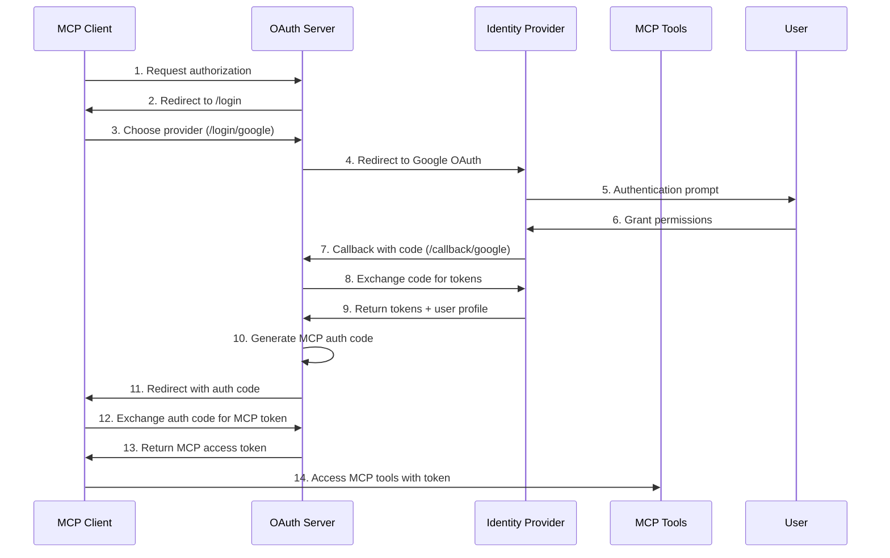

# MCP OAuth2 Authentication Feature Specification

**Feature ID**: `mcp-oauth-auth`  
**Version**: 1.0  
**Status**: ✅ Implemented  
**Created**: 2025-09-03  

## Overview

This specification documents the federated OAuth2 authentication system for Model Context Protocol (MCP) servers, enabling secure AI model deployment with seamless user authentication via external identity providers (Google, GitHub, Microsoft).

## Business Requirements

### Primary Use Cases

1. **Internal AI Model Deployment**: Employee authentication via corporate identity providers
2. **Customer-facing AI Applications**: User identity management for personalized AI interactions  
3. **Multi-tenant AI Services**: User isolation and access control
4. **Enterprise AI Platforms**: Role-based access control and audit trails

### Key Benefits

- **Robust Security**: Battle-tested OAuth 2.0 + PKCE implementation
- **User Experience**: Seamless federated authentication (no password management)
- **Corporate Integration**: Works with existing identity providers
- **Standards Compliance**: Full OAuth 2.0, OIDC, and MCP protocol adherence
- **Scalability**: Foundation for enterprise AI deployments

## Technical Architecture

### Authentication Flow Overview



### Core Components

#### 1. Federated OAuth2 Server

**File**: `src/auth/oauth-middleware.ts`

**Key Features**:
- Multi-provider support (Google OIDC, GitHub OAuth2, Microsoft OIDC)
- PKCE (Proof Key for Code Exchange) support for enhanced security
- Dynamic client registration
- File-based session persistence
- Authorization code generation and validation

**Identity Provider Configuration**:
```typescript
const getIdentityProviders = (): Record<string, IdentityProviderConfig> => ({
  google: {
    type: 'oidc',
    clientId: process.env.GOOGLE_CLIENT_ID || '',
    clientSecret: process.env.GOOGLE_CLIENT_SECRET || '',
    discoveryUrl: 'https://accounts.google.com/.well-known/openid-configuration',
    scopes: ['openid', 'email', 'profile'],
    redirectUri: `${baseUrl}/callback/google`
  },
  github: {
    type: 'oauth2',
    clientId: process.env.GITHUB_CLIENT_ID || '',
    clientSecret: process.env.GITHUB_CLIENT_SECRET || '',
    authUrl: 'https://github.com/login/oauth/authorize',
    tokenUrl: 'https://github.com/login/oauth/access_token',
    userInfoUrl: 'https://api.github.com/user',
    scopes: ['user:email'],
    redirectUri: `${baseUrl}/callback/github`
  }
});
```

#### 2. Session Storage System

**File**: `src/auth/session-storage.ts`

**Implementation Types**:
- **Memory Storage**: Fast, development-friendly (data lost on restart)
- **File Storage**: Persistent, production-ready for single instances
- **Redis Storage**: Distributed, enterprise-ready for multi-instance deployments

**Key Methods**:
```typescript
interface SessionStorage {
  // Client Management
  setClient(clientId: string, client: any): Promise<void>;
  getClient(clientId: string): Promise<any | null>;
  
  // User Management  
  setUser(userId: string, user: any): Promise<void>;
  getUser(userId: string): Promise<any | null>;
  
  // Authorization Code Management
  setAuthCode(code: string, authCode: any): Promise<void>;
  getAuthCode(code: string): Promise<any | null>;
  deleteAuthCode(code: string): Promise<boolean>;
  
  // Generic Item Storage (for OAuth state, etc.)
  setItem(key: string, value: string, ttlSeconds?: number): Promise<void>;
  getItem(key: string): Promise<string | null>;
  deleteItem(key: string): Promise<boolean>;
}
```

#### 3. OAuth Route Handlers

**Endpoints**:
- `GET /oauth/authorize` - OAuth authorization endpoint
- `POST /oauth/token` - Token exchange endpoint
- `POST /oauth/register` - Dynamic client registration
- `GET /login/:provider` - Federated login initiation
- `GET /callback/:provider` - Identity provider callbacks

**Discovery Endpoints** (MCP Jam compatible):
- `GET /.well-known/oauth-authorization-server` - OAuth server metadata
- `GET /.well-known/oauth-authorization-server/mcp` - MCP-specific metadata

### Security Implementation

#### PKCE (Proof Key for Code Exchange)

**Purpose**: Protects against authorization code interception attacks, especially important for public clients.

**Implementation**:
```typescript
import { randomPKCECodeVerifier, calculatePKCECodeChallenge } from 'openid-client';

// Generate PKCE parameters
const codeVerifier = randomPKCECodeVerifier();
const codeChallenge = await calculatePKCECodeChallenge(codeVerifier);

// Store for validation during token exchange
await sessionStorage.setItem(`oauth_state_${state}`, JSON.stringify({
  provider,
  codeVerifier,
  originalQuery
}), 600); // 10 minutes
```

**Token Exchange Validation**:
- Code challenge verification using SHA256
- State parameter validation for CSRF protection
- Authorization code expiration handling
- Redirect URI validation

#### State Parameter Protection

**CSRF Prevention**: Each OAuth flow uses cryptographically secure state parameters:
```typescript
const state = crypto.randomBytes(32).toString('hex');
```

**State Validation**: Server validates state parameters before processing callbacks.

#### Token Abstraction Layer

**Dual-layer Security**:
1. **External Tokens**: Provider-specific tokens (Google, GitHub) for API access
2. **Internal Tokens**: MCP-specific tokens for tool access
3. **Token Mapping**: Internal system maps MCP tokens to provider tokens

**Benefits**:
- Provider tokens never exposed to MCP clients
- Centralized token lifecycle management
- Enhanced audit capabilities
- Provider-agnostic token interface

### User Profile Normalization

**Standardized User Object**:
```typescript
interface User {
  id: string;           // Provider-specific ID with prefix (e.g., "google:123")
  username: string;     // Email address
  email: string;        // Verified email
  name: string;         // Display name
  provider: string;     // Identity provider (google, github, etc.)
}
```

**Provider-specific Normalization**:
```typescript
function normalizeUserProfile(provider: string, profile: any): User {
  switch (provider) {
    case 'google':
      return {
        id: profile.sub,
        username: profile.email,
        email: profile.email,
        name: profile.name,
        provider: 'google'
      };
    case 'github':
      return {
        id: profile.id.toString(),
        username: profile.login,
        email: profile.email,
        name: profile.name || profile.login,
        provider: 'github'
      };
  }
}
```

## Configuration

### Environment Variables

**Required for Google OAuth**:
```bash
GOOGLE_CLIENT_ID=your-google-client-id
GOOGLE_CLIENT_SECRET=your-google-client-secret
```

**Required for GitHub OAuth**:
```bash
GITHUB_CLIENT_ID=your-github-client-id  
GITHUB_CLIENT_SECRET=your-github-client-secret
```

**Server Configuration**:
```bash
PORT=8000
OAUTH_BASE_URL=http://localhost:8000  # Optional, defaults to http://localhost:${PORT}
```

### Server Setup

**OAuth Configuration**:
```typescript
const server = createRpcAiServer({
  port: 8000,
  protocols: { tRpc: true, jsonRpc: true },
  
  oauth: {
    enabled: true,
    sessionStorage: {
      type: 'file',
      filePath: './data/oauth-sessions.json'
    }
  }
});
```

### MCP Client Configuration

**Discovery URL**: `http://localhost:8000/.well-known/oauth-authorization-server`

**Client Registration**: Dynamic registration via `POST /oauth/register`

**Supported Flows**:
- Authorization Code with PKCE
- Standard OAuth 2.0 flows
- Refresh token support (where available)

## Implementation Status

### ✅ Completed Features

1. **Federated OAuth2 Server**
   - Multi-provider support (Google, GitHub, Microsoft)
   - PKCE implementation using `openid-client`
   - Dynamic client registration
   - Authorization code generation and validation

2. **Session Management**
   - File-based persistence (`data/oauth-sessions.json`)
   - Memory and Redis storage options
   - Automatic cleanup and expiration

3. **Security Features**
   - CSRF protection via state parameters
   - PKCE for public clients
   - Token abstraction layer
   - Authorization code expiration

4. **MCP Integration**
   - MCP-compatible discovery endpoints
   - OAuth 2.0 compliant token exchange
   - Standard HTTP status codes and error responses

5. **User Profile Management**
   - Provider-agnostic user normalization
   - Persistent user storage
   - Email-based user identification

### 🔧 Known Issues

1. **Date Serialization**: Fixed issue where `expiresAt` timestamps were being serialized as strings instead of Date objects
2. **MCP Jam Compatibility**: Some MCP clients may have PKCE validation issues (client-side bug)
3. **Error Handling**: OAuth errors return proper HTTP status codes

### 📋 Future Enhancements

1. **Database Storage**: PostgreSQL/SQLite backend for production deployments
2. **Refresh Tokens**: Full refresh token lifecycle management
3. **Token Revocation**: Comprehensive token revocation support
4. **Role-based Access**: User roles and permission scoping
5. **Rate Limiting**: Per-user and per-client rate limiting
6. **Audit Logging**: Comprehensive authentication audit trails

## Authentication Methods Comparison

Our system currently implements **two distinct authentication methods** for different use cases:

### 1. MCP OAuth2 Authentication (This Feature)

**Purpose**: MCP client authentication via federated identity providers  
**Use Cases**: Interactive AI tools, desktop applications, web applications  
**Flow**: OAuth 2.0 Authorization Code with PKCE  
**Token Type**: Bearer tokens for MCP tool access  
**User Identity**: Federated (Google, GitHub, Microsoft)  

**Key Characteristics**:
- User-centric authentication
- Interactive login flows
- Long-lived sessions
- Tool-level authorization
- Provider-agnostic user profiles

### 2. OpenSaaS JWT Authentication

**Purpose**: API authentication for SaaS applications  
**File**: `src/auth/jwt-middleware.ts`  
**Use Cases**: Subscription-based AI services, API access  
**Flow**: JWT token validation  
**Token Type**: Signed JWT tokens with subscription metadata  
**User Identity**: OpenSaaS user accounts  

**Key Characteristics**:
- Subscription-tier enforcement
- Token-based quotas and rate limiting
- API-centric authentication
- Stateless validation
- Organization-based access control

**JWT Payload Structure**:
```typescript
interface OpenSaaSJWTPayload {
  userId: string;
  email: string;
  organizationId?: string;
  subscriptionTier: string;
  monthlyTokenQuota: number;
  rpmLimit: number;
  tpmLimit: number;
  features: string[];
  iat: number;
  exp: number;
  iss: string; // OpenSaaS issuer
  aud: string; // Our service identifier
}
```

### Unified Authentication Proposal

**Future Enhancement**: Combine both authentication methods into a unified system:

#### Phase 1: Authentication Bridge

**Goal**: Allow OAuth-authenticated users to access subscription-based features

**Implementation**:
```typescript
interface UnifiedAuthContext {
  // OAuth Identity
  identity: {
    provider: 'google' | 'github' | 'microsoft';
    providerId: string;
    email: string;
    name: string;
  };
  
  // Subscription Context (optional)
  subscription?: {
    tier: string;
    organization?: string;
    quotas: {
      monthlyTokens: number;
      rpm: number;
      tpm: number;
    };
    features: string[];
  };
  
  // Access Scope
  scope: {
    mcpTools: string[];
    apiAccess: boolean;
    adminAccess: boolean;
  };
}
```

#### Phase 2: Subscription Integration

**User Journey**:
1. User authenticates via OAuth (Google/GitHub)
2. System checks for linked subscription
3. If no subscription: redirect to subscription signup
4. If subscription exists: apply subscription-based limits
5. Grant access to both MCP tools and API features

**Database Schema**:
```sql
-- Link OAuth users to OpenSaaS subscriptions
CREATE TABLE user_subscriptions (
  oauth_user_id VARCHAR(255) PRIMARY KEY,  -- e.g., "google:123456"
  opensaas_user_id VARCHAR(255),           -- OpenSaaS user ID
  subscription_tier VARCHAR(100),
  created_at TIMESTAMP,
  updated_at TIMESTAMP
);
```

#### Phase 3: Unified Token System

**Hybrid Tokens**: JWT tokens containing both OAuth identity and subscription data:

```typescript
interface UnifiedJWTPayload extends OpenSaaSJWTPayload {
  // OAuth Identity
  oauthProvider: string;
  oauthProviderId: string;
  
  // MCP Access
  mcpScopes: string[];
  toolAccess: string[];
}
```

**Benefits**:
- Single authentication system
- Seamless user experience
- Subscription-aware MCP tools
- Unified audit trail
- Simplified client integration

### Implementation Recommendations

**Current State**: Keep both systems separate for now
- OAuth for MCP client authentication
- JWT for API authentication
- Clear separation of concerns

**Migration Path**: 
1. Implement authentication bridge (Phase 1)
2. Add subscription integration UI (Phase 2)  
3. Develop unified token system (Phase 3)
4. Gradual migration of existing integrations

This approach ensures backward compatibility while providing a path toward a unified, enterprise-ready authentication system.

## Testing and Validation

### Manual Testing

**OAuth Flow Testing**:
1. Start OAuth server: `node test-oauth-server.js`
2. Visit authorization endpoint: `http://localhost:8000/oauth/authorize?client_id=...`
3. Complete federated login via Google
4. Verify authorization code generation
5. Test token exchange

**MCP Client Testing**:
- Use MCP Jam for interactive testing
- Configure discovery URL
- Test dynamic client registration
- Validate tool access with Bearer tokens

### Known Client Compatibility

**✅ Working**: 
- Manual OAuth flows
- Standard OAuth 2.0 clients
- cURL-based testing

**⚠️ Issues**:
- MCP Jam: PKCE validation bug ("b must be a Uint8Array")
- Some MCP clients may have OAuth implementation issues

### Production Deployment

**Requirements**:
- Configure identity provider credentials
- Set up persistent session storage (file or Redis)
- Configure HTTPS and security headers
- Set appropriate CORS policies
- Monitor authentication logs

**Scaling Considerations**:
- Use Redis for multi-instance deployments
- Implement database storage for large user bases
- Add authentication caching for performance
- Consider token refresh strategies

## Conclusion

This OAuth2 authentication system provides a robust, standards-compliant foundation for securing MCP servers. The federated approach enables seamless integration with existing identity infrastructure while maintaining the flexibility to evolve toward a unified authentication system combining both OAuth and subscription-based access control.

The implementation successfully addresses the core requirements for enterprise AI deployment: security, usability, scalability, and standards compliance.