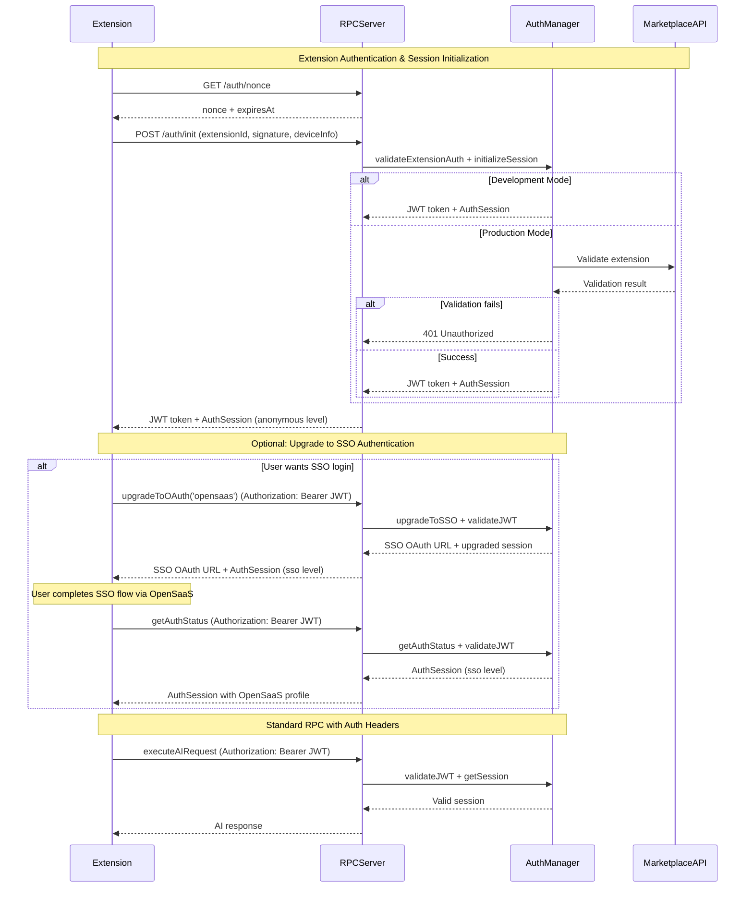
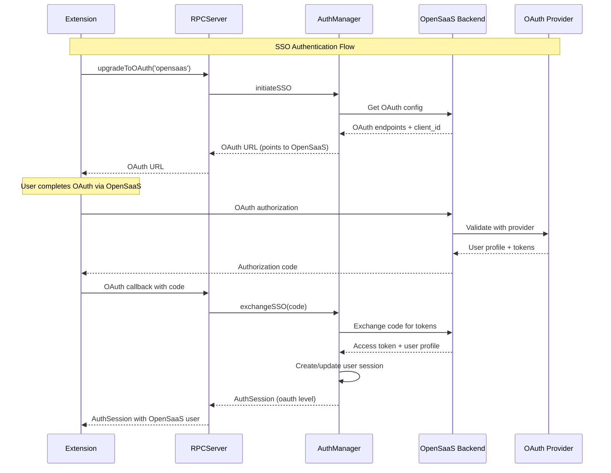

# Progressive Authentication with Extension Detection

**Status:** 📝 Draft  
**Priority:** High  
**Component:** Authentication System  
**Estimated Effort:** 2-3 days  

## Overview

Enhanced progressive authentication system that combines our existing anonymous → OAuth → Pro flow with VS Code extension ID verification and signed payload authentication. This ensures only whitelisted extensions and CLI apps can access the server while maintaining our corporate-friendly architecture.

## Current State Analysis

### ✅ Existing Progressive Authentication (src/auth/auth-manager.ts)
- **Anonymous Sessions**: Device-based session initialization 
- **OAuth Upgrade**: GitHub/Google/Microsoft provider support
- **Multi-device Linking**: Device codes and session sharing
- **Pro Plan Upgrade**: Premium feature access
- **Session Management**: Active session tracking with cleanup

### ✅ Current JSON-RPC Methods Available
- `initializeSession` - Create device session
- `upgradeToOAuth` - Upgrade to OAuth authentication  
- `getAuthStatus` - Get current auth level and features
- `shouldSuggestUpgrade` - Check upgrade recommendations
- `linkDeviceWithCode` - Link new devices to authenticated users

### 🚫 Missing Extension Authentication
- No VS Code extension ID verification
- No signed payload validation
- No CLI app whitelisting
- No nonce-based challenge/response flow

## Requirements from Extension Auth Spec

### Core Authentication Flow
1. **Nonce Request** (`GET /auth/nonce`)
   - Server generates short-lived nonce (30s expiration)
   - Returns random string for signature verification

2. **Extension Initialization** (`POST /auth/init`)
   - Extension provides: extensionId, version, signature of nonce, deviceInfo
   - Server validates signature using public key
   - Optional Marketplace API verification (disabled in dev mode)
   - Creates anonymous session and issues JWT access token (10 minutes expiry)
   - Returns both JWT token and AuthSession in single response

3. **Authenticated RPC Requests**
   - All RPC calls require `Authorization: Bearer <jwt>` header
   - Token validation before processing requests

### Security Features
- **Private Key Obfuscation**: Extension embeds obfuscated private key
- **Marketplace Verification**: Production mode validates extension against VS Code Marketplace
- **Development Bypass**: `DISABLE_EXTENSION_ID_CHECK=true` for testing
- **Short-lived Tokens**: JWT tokens expire in 10 minutes
- **Progressive Authentication**: Anonymous → SSO → Pro upgrade path
- **Single Sign-On (SSO)**: Seamless integration with OpenSaaS accounts

## Proposed Integration Architecture

### Enhanced Authentication Flow



### New Authentication Manager Extensions

```typescript
// Enhanced AuthSession with extension info
export interface AuthSession {
  userId: string;
  deviceId: string;
  authLevel: 'anonymous' | 'sso' | 'pro';
  isValid: boolean;
  expiresAt?: Date;
  lastActivity: Date;
  
  // NEW: Extension authentication
  extensionId?: string;
  extensionVersion?: string;
  jwtToken?: string;
  tokenExpiresAt?: Date;
}

// NEW: Extension initialization data
export interface ExtensionInitData {
  extensionId: string;
  version: string;
  signature: string;
  nonce: string;
  deviceInfo: {
    deviceId: string;
    deviceName?: string;
    platform?: string;
  };
}
```

### New JSON-RPC Methods

```typescript
// Simplified Extension Authentication & Session Init
'auth/init': (params: ExtensionInitData) => Promise<{ token: string; session: AuthSession }>

// Progressive Auth Upgrade Methods (all require JWT header)
'upgradeToOAuth': (provider: 'opensaas') => Promise<{ oauthUrl: string; session: AuthSession }>
'getAuthStatus': () => Promise<AuthSession>
'shouldSuggestUpgrade': () => Promise<{ suggest: boolean; reason?: string }>

// Legacy method (still supported)
'initializeSession': (deviceId: string, deviceName?: string) => Promise<AuthSession>
```

### Server Configuration Extensions

```typescript
export interface AIServerConfig {
  // ... existing config ...
  
  // NEW: Extension authentication
  extensionAuth?: {
    publicKey: string;  // For signature verification
    allowedExtensions?: string[];  // Whitelist of extensionId patterns
    allowedPublishers?: string[];  // Whitelist of publisher names
    disableMarketplaceCheck?: boolean;  // Development mode
    nonceExpirationMs?: number;  // Default: 30000
    jwtExpirationMs?: number;    // Default: 600000 (10 minutes)
    jwtSecret: string;           // For JWT signing
  };
}
```

## Implementation Plan

### Phase 1: Extension Authentication Infrastructure
1. **Nonce Management Service** (`src/auth/nonce-manager.ts`)
   - Generate and validate time-limited nonces
   - In-memory storage with cleanup (Redis in production)

2. **JWT Token Service** (`src/auth/jwt-manager.ts`)
   - Sign and validate JWT tokens
   - Extract extension claims and deviceId

3. **Extension Validator** (`src/auth/extension-validator.ts`)
   - Verify cryptographic signatures using public key
   - Optional VS Code Marketplace API integration
   - Publisher and extension ID whitelist validation

### Phase 2: AuthManager Integration
1. **Enhanced Session Initialization**
   - Accept optional JWT token during `initializeSession`
   - Link extension authentication to device sessions
   - Maintain backward compatibility with existing flows

2. **Middleware Integration**
   - JWT validation middleware for all RPC requests
   - Extract extension context for audit logging
   - Rate limiting per extension ID

### Phase 3: Server Route Implementation
1. **Authentication Endpoints**
   - `GET /auth/nonce` - Generate challenge nonce
   - `POST /auth/register` - Validate extension and issue JWT

2. **Enhanced RPC Endpoint**
   - JWT header validation before method dispatch
   - Extension context passing to method handlers
   - Enhanced error responses for auth failures

### Phase 4: CLI App Support
1. **CLI Authentication Flow**
   - Similar signed payload approach for CLI apps
   - Separate public key and whitelist for CLI tools
   - Machine-to-machine token exchange

## Security Considerations

### Production Security
- **Private Key Protection**: Extension developers must obfuscate embedded keys
- **Marketplace Verification**: Prevents unauthorized extension distribution
- **Short Token Lifetime**: 10-minute JWT expiration reduces compromise risk
- **Signature Validation**: Cryptographic proof of extension authenticity

### Development Flexibility
- **Bypass Mode**: `DISABLE_EXTENSION_ID_CHECK=true` for development
- **Test Key Pairs**: Separate dev/prod key pairs for testing
- **Local Validation**: No network calls required in bypass mode

### Corporate Compatibility
- **System Prompt Protection**: Extension auth doesn't expose prompts
- **Proxy Friendly**: Standard HTTPS with JWT headers
- **Audit Trail**: Extension ID logging for compliance
- **Zero Client Config**: Extensions handle all auth complexity

## Testing Strategy

### Unit Tests
```bash
# Extension authentication components
pnpm test -- nonce-manager.test.ts
pnpm test -- jwt-manager.test.ts  
pnpm test -- extension-validator.test.ts

# Enhanced auth manager
pnpm test -- auth-manager-extensions.test.ts
```

### Integration Tests
```bash
# End-to-end extension auth flow
pnpm test -- extension-auth-flow.test.ts

# Progressive auth with extensions
pnpm test -- progressive-auth-integration.test.ts
```

### Security Tests
```bash
# Signature validation edge cases
pnpm test -- extension-security.test.ts

# JWT token handling and expiration
pnpm test -- jwt-security.test.ts
```

## Migration Strategy

### Backward Compatibility
- **Existing Sessions**: Continue to work without JWT tokens
- **Optional JWT**: JWT validation only when token provided
- **Graceful Degradation**: Missing extension auth falls back to device-only auth

### Deployment Phases
1. **Server Deployment**: Deploy with extension auth disabled by default
2. **Extension Updates**: Update extensions to use new auth flow
3. **Gradual Rollout**: Enable extension auth for specific extension versions
4. **Full Enforcement**: Require extension auth for all requests

## Environment Variables

```bash
# Extension Authentication
EXTENSION_AUTH_PUBLIC_KEY="-----BEGIN PUBLIC KEY-----..."
EXTENSION_AUTH_JWT_SECRET="your-jwt-secret-key"
DISABLE_EXTENSION_ID_CHECK=false
NONCE_EXPIRATION_MS=30000
JWT_EXPIRATION_MS=600000

# Optional: Extension Whitelisting
ALLOWED_EXTENSIONS="publisher1.extension1,publisher2.*"
ALLOWED_PUBLISHERS="microsoft,github,anthropic"
```

## Success Metrics

### Security Metrics
- **Extension Validation Rate**: >99% signature validation success
- **Token Expiration Handling**: Graceful re-authentication flows
- **Marketplace Verification**: <500ms average response time

### Integration Metrics  
- **Backward Compatibility**: Zero breaking changes for existing flows
- **Performance Impact**: <50ms additional latency per request
- **Error Handling**: Clear error messages for auth failures

## Single Sign-On (SSO) Integration

### OpenSaaS SSO Flow



### SSO Configuration

```typescript
// Server configuration for SSO
export interface SSOConfig {
  opensaas: {
    enabled: boolean;
    baseUrl: string;  // https://your-opensaas-app.com
    clientId: string;
    clientSecret: string;
    scopes: string[];  // ['openid', 'profile', 'email']
    
    // Optional: Custom user mapping
    userMapping?: {
      userId: string;      // 'sub' or 'id'
      email: string;       // 'email'
      name: string;        // 'name' or 'display_name'
      avatar?: string;     // 'picture' or 'avatar_url'
    };
  };
}

// Enhanced AuthSession with SSO info
export interface AuthSession {
  userId: string;
  deviceId: string;
  authLevel: 'anonymous' | 'sso' | 'pro';
  isValid: boolean;
  expiresAt?: Date;
  lastActivity: Date;
  
  // Extension authentication
  extensionId?: string;
  extensionVersion?: string;
  jwtToken?: string;
  tokenExpiresAt?: Date;
  
  // NEW: SSO integration
  ssoProvider?: 'opensaas' | 'github' | 'google' | 'microsoft';
  ssoUserId?: string;
  userProfile?: {
    email: string;
    name: string;
    avatar?: string;
    opensaasSubscription?: {
      plan: string;
      status: 'active' | 'canceled' | 'past_due';
      features: string[];
    };
  };
}
```

### SSO JSON-RPC Methods

```typescript
// SSO-specific authentication methods
'upgradeToOAuth': (provider: 'opensaas' | 'github' | 'google' | 'microsoft') => Promise<{
  oauthUrl: string; 
  session: AuthSession;
  ssoEnabled?: boolean;
}>;

'exchangeSSO': (code: string, provider: string) => Promise<AuthSession>;

'getSSOProfile': () => Promise<{
  provider: string;
  profile: UserProfile;
  subscription?: SubscriptionInfo;
}>;

'unlinkSSO': () => Promise<{ success: boolean; session: AuthSession }>;
```

### OpenSaaS Integration Points

```typescript
// 1. OAuth Provider Setup in OpenSaaS
// Add to your OpenSaaS OAuth providers:
{
  name: 'RPC Backend',
  clientId: 'your-rpc-backend-client-id',
  redirectUri: 'http://localhost:8000/auth/callback',
  scopes: ['openid', 'profile', 'subscription']
}

// 2. Subscription Sync
// RPC backend can check OpenSaaS subscription status
export interface SubscriptionSync {
  syncUserSubscription(userId: string): Promise<{
    plan: string;
    features: string[];
    status: 'active' | 'canceled' | 'past_due';
    expiresAt?: Date;
  }>;
  
  validateFeatureAccess(userId: string, feature: string): Promise<boolean>;
}

// 3. Billing Integration
// Users can upgrade to Pro via OpenSaaS billing
'upgradeToProSSO': () => Promise<{
  billingUrl: string;  // Points to OpenSaaS billing portal
  session: AuthSession;
}>;
```

### Environment Variables for SSO

```bash
# OpenSaaS SSO Configuration
OPENSAAS_SSO_ENABLED=true
OPENSAAS_BASE_URL=https://your-opensaas-app.com
OPENSAAS_CLIENT_ID=your-opensaas-oauth-client-id
OPENSAAS_CLIENT_SECRET=your-opensaas-oauth-client-secret
OPENSAAS_SCOPES=openid,profile,email,subscription

# Optional: Custom endpoints
OPENSAAS_AUTH_ENDPOINT=/oauth/authorize
OPENSAAS_TOKEN_ENDPOINT=/oauth/token
OPENSAAS_USER_ENDPOINT=/api/user
OPENSAAS_SUBSCRIPTION_ENDPOINT=/api/subscription
```

### Benefits of SSO Integration

1. **Single Account**: Users log in once to OpenSaaS, automatically authenticated to RPC backend
2. **Subscription Sync**: RPC backend knows user's subscription status and features
3. **Unified Billing**: All payments go through OpenSaaS billing system
4. **User Management**: Centralized user profiles and settings
5. **Feature Gates**: RPC backend can enforce subscription-based feature access

### Implementation Example

```typescript
// Extension code
import { setupVSCodeWebviewAuth } from 'simple-rpc-ai-backend/ui';

const { client, session } = await setupVSCodeWebviewAuth({
  serverUrl: 'http://localhost:8000',
  extensionId: 'publisher.extension-name',
  vscode: acquireVsCodeApi(),
  sso: {
    provider: 'opensaas',
    autoUpgrade: true  // Automatically suggest SSO login
  }
});

// Check if user should upgrade via SSO
if (session.authLevel === 'anonymous') {
  const { suggest, reason } = await client.shouldSuggestUpgrade();
  if (suggest && reason === 'sso_available') {
    // Show SSO login button
    showSSOLoginButton();
  }
}

// Handle SSO login
const handleSSOLogin = async () => {
  const { oauthUrl } = await client.upgradeToOAuth('opensaas');
  vscode.postMessage({ command: 'openExternal', url: oauthUrl });
};
```

## UI Components & Setup Helpers

### Authentication UI Components

```typescript
// Pre-built React/Vue/Vanilla JS components
export interface AuthUIComponents {
  // Anonymous session indicator
  AnonymousUserBadge: ComponentType<{ session: AuthSession }>;
  
  // SSO upgrade button
  SSOUpgradeButton: ComponentType<{
    provider: 'opensaas';
    onUpgrade: (oauthUrl: string) => void;
    session: AuthSession;
  }>;
  
  // Complete auth status panel
  AuthStatusPanel: ComponentType<{
    session: AuthSession;
    onUpgrade: (type: 'sso', data: any) => void;
    showUpgradeSuggestions?: boolean;
  }>;
  
  // Auth flow modal/dialog
  AuthFlowModal: ComponentType<{
    isOpen: boolean;
    onClose: () => void;
    client: AIClient;
    onAuthComplete: (session: AuthSession) => void;
  }>;
}
```

### Setup Helper Functions

```typescript
// Easy setup for web frontends
export function setupWebAuth(config: {
  serverUrl: string;
  containerId: string;
  theme?: 'light' | 'dark' | 'auto';
}): Promise<{ client: AIClient; session: AuthSession }>;

// Easy setup for VS Code webviews
export function setupVSCodeWebviewAuth(config: {
  serverUrl: string;
  extensionId: string;
  vscode: any; // VS Code API
}): Promise<{ client: AIClient; session: AuthSession }>;

// Universal auth hook for React
export function useAuth(client: AIClient): {
  session: AuthSession | null;
  upgradeToSSO: () => Promise<void>;
  isLoading: boolean;
  error: string | null;
};
```

### Platform-Specific Integration

#### Web Frontend Integration
```typescript
// Simple web setup
import { setupWebAuth, AuthStatusPanel } from 'simple-rpc-ai-backend/ui';

const { client, session } = await setupWebAuth({
  serverUrl: 'http://localhost:8000',
  containerId: 'auth-container',
  theme: 'auto'
});

// Render auth UI
<AuthStatusPanel 
  session={session}
  onUpgrade={(type, data) => {
    if (type === 'sso') window.open(data.oauthUrl);
  }}
  showUpgradeSuggestions={true}
/>
```

#### VS Code Webview Integration
```typescript
// VS Code extension webview
import { setupVSCodeWebviewAuth } from 'simple-rpc-ai-backend/ui';

const { client, session } = await setupVSCodeWebviewAuth({
  serverUrl: 'http://localhost:8000',
  extensionId: 'publisher.extension-name',
  vscode: acquireVsCodeApi()
});

// Handle SSO in VS Code context
const handleSSOUpgrade = async () => {
  const { oauthUrl } = await client.upgradeToOAuth('opensaas');
  vscode.postMessage({ 
    command: 'openExternal', 
    url: oauthUrl 
  });
};
```

### CSS Framework Support

```typescript
// Tailwind CSS classes
export const TailwindAuthComponents = {
  AnonymousUserBadge: 'bg-gray-100 text-gray-600 px-2 py-1 rounded text-sm',
  SSOButton: 'bg-blue-500 hover:bg-blue-600 text-white px-4 py-2 rounded',
  AuthPanel: 'border border-gray-200 rounded-lg p-4 bg-white shadow-sm'
};

// Bootstrap classes
export const BootstrapAuthComponents = {
  AnonymousUserBadge: 'badge badge-secondary',
  SSOButton: 'btn btn-primary',
  AuthPanel: 'card'
};

// VS Code webview classes (matches editor theme)
export const VSCodeAuthComponents = {
  AnonymousUserBadge: 'vscode-badge',
  SSOButton: 'vscode-button',
  AuthPanel: 'vscode-panel'
};
```

## Future Enhancements

### Advanced Authentication (Future)
- **Multi-Provider OAuth**: GitHub, Google, Microsoft authentication support
- **WebAuthn PassKeys**: Hardware-backed authentication for maximum security
- **Hardware Security Module (HSM)**: Production key storage
- **Certificate Pinning**: Enhanced marketplace verification
- **Mutual TLS**: Additional transport security layer

### Developer Experience
- **Auth SDK**: Helper library for extension developers
- **Debug Tools**: Auth flow visualization and troubleshooting
- **Documentation**: Comprehensive integration guides
- **UI Component Library**: Pre-built auth components for React/Vue/Vanilla JS
- **Theme System**: Support for light/dark/auto themes matching host environment

## Dependencies

### External Services
- **VS Code Marketplace API**: Extension metadata validation
- **JWT Libraries**: Token generation and validation
- **Crypto Libraries**: Signature verification

### Internal Components
- **Existing AuthManager**: Enhanced with extension support
- **Database Schema**: Optional extension auth logging tables
- **Configuration System**: Extended server config interface

---

**Next Steps:**
1. Review this spec with security team
2. Create proof-of-concept implementation
3. Test with sample VS Code extension
4. Validate Marketplace API integration
5. Plan phased rollout timeline